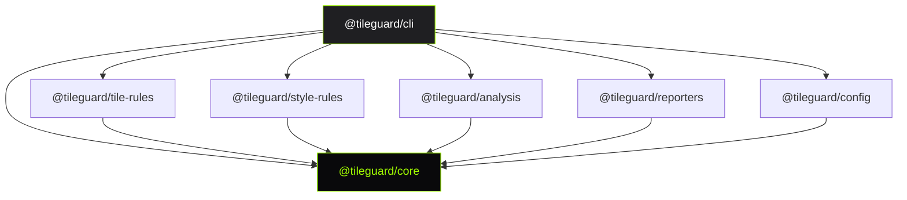

# API Reference

TileGuard's public API is distributed across 7 packages. Each has a focused responsibility and exports only what consumers need.

## Packages

| Package | Purpose | Install |
|:--------|:--------|:--------|
| [`@tileguard/core`](/api/core) | Framework contracts — Engine, Diagnostic, Rule, Plugin, Artifact | `npm i @tileguard/core` |
| [`@tileguard/tile-rules`](/api/tile-rules) | MVT provider + 12 tile validation rules | `npm i @tileguard/tile-rules` |
| [`@tileguard/style-rules`](/api/style-rules) | Style provider + 9 lint rules + parser/resolver/validator | `npm i @tileguard/style-rules` |
| [`@tileguard/analysis`](/api/analysis) | Comparison engine, regression detection, statistics | `npm i @tileguard/analysis` |
| [`@tileguard/reporters`](/api/reporters) | Text & JSON CLI reporters + engineering report engine | `npm i @tileguard/reporters` |
| [`@tileguard/config`](/api/config) | Config file discovery, loading, and validation | `npm i @tileguard/config` |
| [`@tileguard/cli`](/api/cli) | CLI with 12 commands (includes all packages) | `npm i -g @tileguard/cli` |

## Dependency Graph



## Quick Example

```typescript
import { createEngine } from '@tileguard/core';
import { tilePlugin } from '@tileguard/tile-rules';
import { stylePlugin } from '@tileguard/style-rules';

const engine = createEngine({
  plugins: [tilePlugin, stylePlugin],
  rules: {
    'tile/self-intersection': 'error',
    'tile/required-layers': ['error', { layers: ['water', 'roads'] }],
  },
});

const result = await engine.run(['./tiles/', './styles/']);

if (!result.summary.pass) {
  console.error(`${result.summary.errors} errors found`);
  process.exit(1);
}
```
