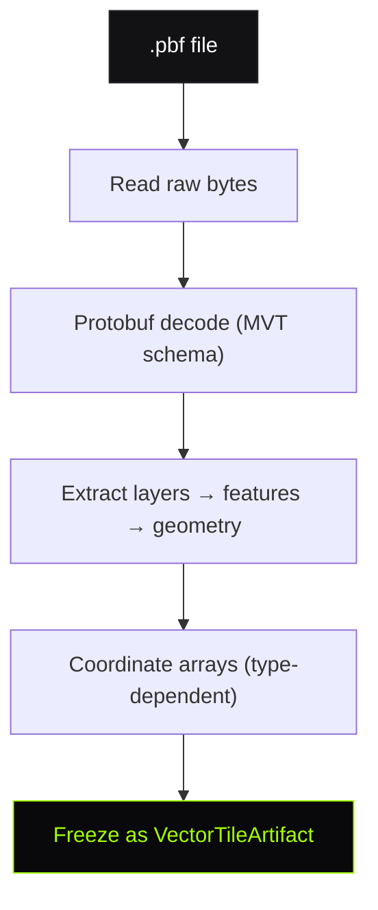
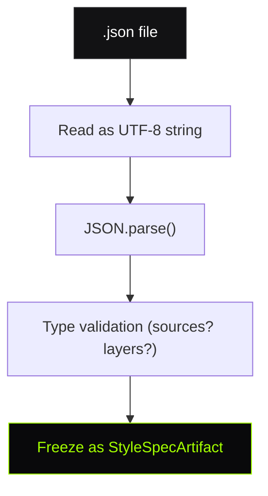
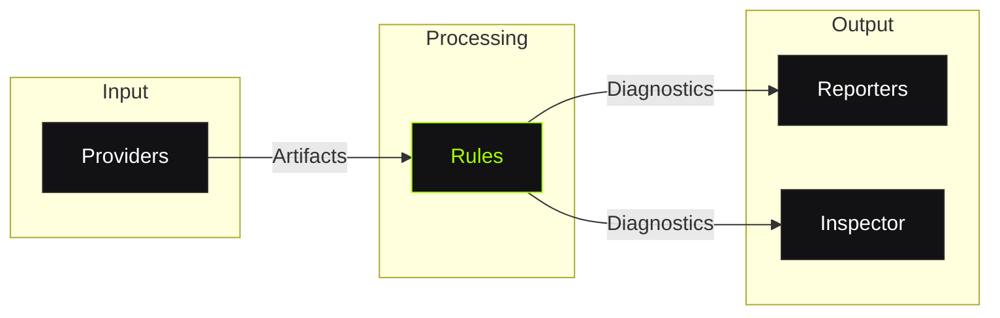

# Decoder & Diagnostics

Two foundational models drive TileGuard: **Artifacts** (decoded input) and **Diagnostics** (structured output). Understanding these two contracts is the key to understanding how every component communicates.

## The Artifact Model

An **Artifact** is a decoded, typed, immutable representation of a source file.

```typescript
interface Artifact {
  /** Discriminator for artifact type */
  type: string;
  /** Original file path */
  filePath: string;
  /** Decoded content (type-specific) */
  content: unknown;
}
```

### VectorTileArtifact

Produced by the tile Provider from `.pbf` files:

```typescript
interface VectorTileArtifact extends Artifact {
  type: 'VectorTile';
  content: {
    layers: Record<string, VectorTileLayer>;
  };
}

interface VectorTileLayer {
  name: string;
  extent: number;           // Usually 4096
  features: VectorTileFeature[];
}

interface VectorTileFeature {
  type: 1 | 2 | 3;         // Point, LineString, Polygon
  properties: Record<string, unknown>;
  geometry: Geometry;       // Type-dependent coordinate arrays
}
```

### StyleSpecArtifact

Produced by the style Provider from `.json` files:

```typescript
interface StyleSpecArtifact extends Artifact {
  type: 'StyleSpec';
  content: {
    version?: unknown;
    sources?: unknown;
    layers?: unknown[];
    [key: string]: unknown;
  };
}
```

### Immutability Contract

Artifacts are **frozen after decoding**. Rules receive them read-only. This guarantees:
- Multiple rules can safely read the same artifact concurrently
- No rule can corrupt data for another rule
- The artifact represents the true file content, unmodified

## Providers

A **Provider** decodes source files into Artifacts:

```typescript
interface Provider {
  /** File extensions this provider handles */
  extensions: string[];
  /** Decode a file into a typed Artifact */
  load(filePath: string): Promise<Artifact>;
}
```

### Tile Provider Pipeline



The tile provider handles:
- Protobuf deserialization
- MVT geometry command interpretation (MoveTo, LineTo, ClosePath)
- Coordinate delta decoding
- Layer/feature organization

### Style Provider Pipeline



If JSON parsing fails, the provider produces an `InvalidStyleArtifact` that only triggers `style/valid-json`.

## The Diagnostic Model

A **Diagnostic** is the universal output contract. Every finding from every rule produces exactly this structure:

```typescript
interface Diagnostic {
  /** Which rule produced this finding */
  ruleId: string;

  /** How serious it is */
  severity: 'error' | 'warning' | 'info';

  /** Human-readable description */
  message: string;

  /** Where in the source file */
  filePath: string;

  /** Where in the artifact (optional, type-specific) */
  location?: {
    layer?: string;
    featureIndex?: number;
    partIndex?: number;
  };

  /** How to fix it (optional) */
  suggestion?: string;

  /** Rule-specific metadata for tooling (optional) */
  data?: Record<string, unknown>;
}
```

### Why This Shape?

Every field serves a downstream consumer:

| Field | Used by |
|:------|:--------|
| `ruleId` | CLI (grouping), Inspector (overlay strategy lookup) |
| `severity` | CLI (exit code), Inspector (color), Reports (ranking) |
| `message` | CLI (display), Reports (findings list) |
| `filePath` | CLI (file header), Reports (source reference) |
| `location` | Inspector (feature selection, canvas zoom) |
| `suggestion` | CLI (help text), Inspector (rule panel), Reports (recommendations) |
| `data` | Inspector (overlay rendering — e.g., `segments: [1, 4]` for self-intersection) |

### Location Granularity

The `location` field provides progressive detail:

```typescript
// Tile-level (no specific feature)
{ }

// Layer-level
{ layer: 'buildings' }

// Feature-level
{ layer: 'buildings', featureIndex: 42 }

// Part-level (specific ring or segment)
{ layer: 'buildings', featureIndex: 42, partIndex: 0 }
```

This allows the Inspector to zoom to the exact geometry at whatever granularity the rule provides.

### The `data` Field

Rule-specific metadata that enables richer tooling:

```typescript
// tile/self-intersection
data: { segments: [1, 4] }
// → Inspector highlights both crossing segments + draws ✕ at intersection

// tile/coordinate-range
data: { x: 4200, y: -50, extent: 4096, buffer: 80 }
// → Inspector marks the out-of-range vertex
```

Rules are encouraged to include `data` but it's optional. The CLI ignores it; the Inspector uses it for precise visual overlays.

## The Separation



No component crosses these boundaries:
- Providers never validate
- Rules never format output
- Reporters never decode files
- The Inspector never runs rules (it consumes their output)

## What Next?

- [**Validation Pipeline ›**](/architecture/validation-pipeline)
The full execution flow
- [**Rule Engine ›**](/architecture/rule-engine)
How rules are structured
- [**Concepts ›**](/learn/concepts)
Simplified explanation
