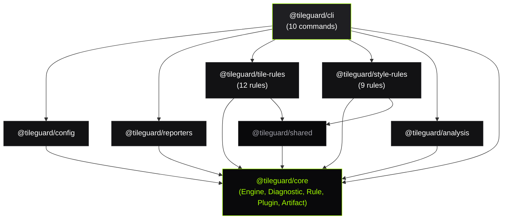

# Architecture Overview

TileGuard's architecture is built on three principles: **contracts before implementation**, **dependencies point inward**, and **separation of concerns**.

This section provides deep dives into each major subsystem:

## Pages

| Page | What it covers |
|:-----|:---------------|
| [**Validation Pipeline**](/architecture/validation-pipeline) | The Engine's execution stages: config resolution, file discovery, provider decoding, rule routing, diagnostic collection, reporting |
| [**Rule Engine**](/architecture/rule-engine) | The Rule interface, RuleContext, how to write rules, design principles (one concern, pure, independent) |
| [**Decoder & Diagnostics**](/architecture/decoder-diagnostics) | The Artifact model (decoded input), Provider contract, Diagnostic model (structured output), location granularity |

## Architecture Decisions

Key decisions that shaped the system:

| ADR | Decision |
|:----|:---------|
| [ADR-001](/decisions/adr-001-why-tileguard-exists) | Why a dedicated tile validation tool is needed |
| [ADR-002](/decisions/adr-002-local-first-processing) | Why all processing happens locally — no server |
| [ADR-003](/decisions/adr-003-rule-based-architecture) | Why validation is expressed as independent rules |
| [ADR-004](/decisions/adr-004-structured-diagnostics) | Why diagnostics are typed data structures, not strings |
| [ADR-005](/decisions/adr-005-validation-visualization-separation) | Why the Inspector consumes diagnostics rather than producing them |

## High-Level Diagram

Dependencies flow strictly inward. Core has zero runtime dependencies. Domain packages depend only on Core. The CLI depends on everything but nothing depends on the CLI.

## What Next?

- [**Validation Pipeline →**](/architecture/validation-pipeline) — Start with the engine's execution flow
- [**How It Works →**](/learn/how-it-works) — Simplified overview for newcomers
