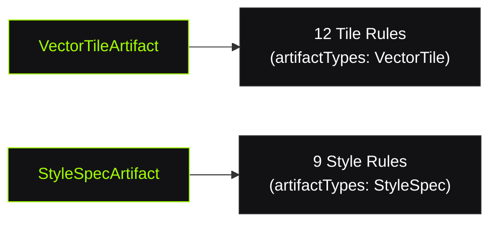

# Rule Engine

The Rule Engine is the design pattern at TileGuard's core — how validation logic is expressed, composed, configured, and executed.

## The Rule Interface

Every rule is a plain TypeScript object implementing this interface:

```typescript
interface Rule {
  /** Unique identifier: 'namespace/name' */
  id: string;

  /** Metadata for documentation and defaults */
  meta: {
    description: string;
    defaultSeverity: 'error' | 'warning' | 'info';
    recommended: boolean;
  };

  /** Which artifact types this rule validates */
  artifactTypes: string[];

  /** Factory that receives context and performs validation */
  create(context: RuleContext): void;
}
```

No base classes. No decorators. No magic. A rule is data + a function.

## RuleContext

The `create()` function receives a `RuleContext`:

```typescript
interface RuleContext {
  /** The decoded, immutable artifact to validate */
  artifact: Artifact;

  /** Rule-specific options from user configuration */
  options: Record<string, unknown>;

  /** Report a finding */
  report(diagnostic: Partial<Diagnostic>): void;
}
```

When you call `context.report()`, the engine:
1. Fills in `ruleId` and `severity` from the rule's metadata
2. Applies the user's severity override (if configured)
3. Pushes the complete Diagnostic into the results array

## Writing a Rule

A complete rule in ~20 lines:

```typescript
import type { Rule } from '@tileguard/core';

export const unclosedRingRule: Rule = {
  id: 'tile/unclosed-ring',
  meta: {
    description: 'Polygon rings must be closed.',
    defaultSeverity: 'error',
    recommended: true,
  },
  artifactTypes: ['VectorTile'],
  create(context) {
    const tile = context.artifact.content;
    for (const [layerName, layer] of Object.entries(tile.layers)) {
      for (let fi = 0; fi < layer.features.length; fi++) {
        const feature = layer.features[fi];
        if (feature.type !== 3) continue; // Only polygons
        for (let ri = 0; ri < feature.geometry.length; ri++) {
          const ring = feature.geometry[ri];
          const first = ring[0];
          const last = ring[ring.length - 1];
          if (first.x !== last.x || first.y !== last.y) {
            context.report({
              message: `Polygon ring in layer "${layerName}", feature ${fi} is not closed.`,
              location: { layer: layerName, featureIndex: fi, partIndex: ri },
              suggestion: 'Ensure every polygon ring ends with the same coordinate it starts with.',
            });
          }
        }
      }
    }
  },
};
```

## Design Principles

### One Rule = One Concern

Each rule checks exactly one thing. `tile/self-intersection` never checks winding order. `tile/winding-order` never checks area. This makes rules:
- Easy to understand (read one rule, know everything it does)
- Easy to configure (enable/disable one concern independently)
- Easy to test (one rule = one test suite)

### Rules Are Pure

Rules must not:
- Access the filesystem
- Make network requests
- Print to stdout/stderr
- Modify the artifact
- Access global state
- Depend on other rules' results

They receive an immutable artifact and emit diagnostics. Nothing else.

### Rules Are Independent

Rules don't know about each other. The engine runs them in any order — the output is deterministic regardless of execution order. This enables:
- Parallel execution (future)
- Selective rule loading (install only what you need)
- No cascading failures (one rule crashing doesn't affect others)

## Rule Configuration

Users configure rules in `tileguard.config.ts`:

```typescript
rules: {
  // Simple: just severity
  'tile/self-intersection': 'error',
  'tile/no-empty': 'off',

  // With options: [severity, options]
  'tile/required-layers': ['error', { layers: ['water', 'roads'] }],
  'tile/feature-count': ['warning', { max: 100000 }],
}
```

The engine resolves this into:
1. **Severity**: overrides the rule's `meta.defaultSeverity`
2. **Options**: passed as `context.options` to the rule's `create()` function
3. **Disabled**: `'off'` means the rule is never executed

## Plugin Registration

Rules are grouped into Plugins for distribution:

```typescript
interface Plugin {
  name: string;
  providers?: Provider[];
  rules: Rule[];
}
```

```typescript
// @tileguard/tile-rules exports a single plugin
export const tilePlugin: Plugin = {
  name: '@tileguard/tile-rules',
  providers: [tileProvider],
  rules: [
    requiredLayersRule,
    requiredPropertiesRule,
    selfIntersectionRule,
    windingOrderRule,
    // ... all 12 tile rules
  ],
};
```

Users compose plugins:

```typescript
const engine = createEngine({
  plugins: [tilePlugin, stylePlugin, myCustomPlugin],
});
```

## Artifact Routing

Not every rule applies to every file. The engine routes artifacts to matching rules:



A rule can support multiple artifact types (rare) or a single type (common).

## What Next?

- [**Validation Pipeline ›**](/architecture/validation-pipeline)
The full execution flow
- [**Decoder & Diagnostics ›**](/architecture/decoder-diagnostics)
Artifact and Diagnostic models
- [**Rules Reference ›**](/rules/)
All 21 built-in rules
