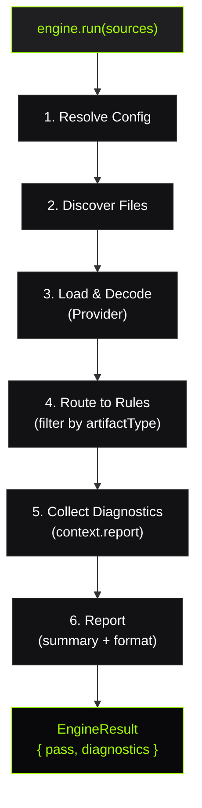
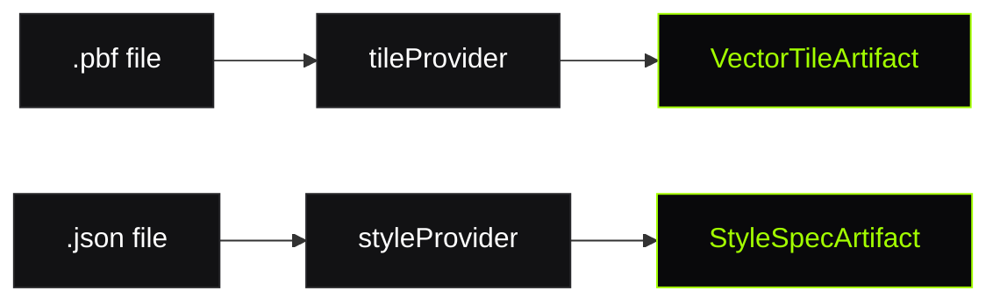

# Validation Pipeline

The validation pipeline is TileGuard's execution backbone — the sequence of operations from receiving file paths to producing structured diagnostics.

## Pipeline Stages



## The Engine

The `Engine` is the central orchestrator. It owns the pipeline but delegates every step:

```typescript
import { createEngine } from '@tileguard/core';
import { tilePlugin } from '@tileguard/tile-rules';
import { stylePlugin } from '@tileguard/style-rules';

const engine = createEngine({
  plugins: [tilePlugin, stylePlugin],
  rules: {
    'tile/self-intersection': 'error',
    'tile/no-empty': 'off',
  },
});

const result = await engine.run(['./tiles/', './styles/']);
```

### Engine Responsibilities

| Does | Does NOT |
|:-----|:---------|
| Orchestrate the pipeline | Decode files (Providers do) |
| Resolve configuration | Validate geometry (Rules do) |
| Route artifacts to matching rules | Format output (Reporters do) |
| Collect diagnostics | Access the filesystem directly |
| Compute pass/fail summary | Know about specific rules |

## Plugin Resolution

Plugins register Providers and Rules with the engine:

```typescript
interface Plugin {
  name: string;
  providers?: Provider[];
  rules: Rule[];
}
```

When `createEngine()` is called:
1. All plugin rules are merged into a flat registry
2. User config overrides severity for matching rule IDs
3. Rules set to `'off'` are excluded from execution
4. Duplicate rule IDs throw (no silent overwrites)

## Provider Selection

Each file is matched to a Provider based on artifact type:



Providers handle:
- File I/O (reading bytes from disk)
- Decoding (protobuf → typed layers/features, JSON → parsed object)
- Producing an immutable Artifact

## Rule Execution

For each Artifact, the engine:

1. **Filters** — only rules whose `artifactTypes` includes the artifact type
2. **Skips** — rules configured as `'off'`
3. **Executes** — calls `rule.create(context)` with a RuleContext

The RuleContext provides:
- `context.artifact` — the immutable decoded data
- `context.report(diagnostic)` — emit a finding
- `context.options` — rule-specific configuration from the user

```typescript
create(context) {
  const tile = context.artifact.content;
  for (const [layerName, layer] of Object.entries(tile.layers)) {
    for (let i = 0; i < layer.features.length; i++) {
      // validation logic...
      context.report({
        message: 'Something is wrong.',
        location: { layer: layerName, featureIndex: i },
        suggestion: 'Fix it.',
      });
    }
  }
}
```

### Error Isolation

If a rule throws, the engine catches the error and continues with the next rule. One broken rule never crashes the entire pipeline. The thrown error is logged but not surfaced as a diagnostic.

## EngineResult

```typescript
interface EngineResult {
  diagnostics: Diagnostic[];
  summary: {
    pass: boolean;         // true if zero errors
    errors: number;
    warnings: number;
    info: number;
    files: number;
    duration: number;      // ms
  };
}
```

`pass` is `true` only when `errors === 0`. Warnings and info findings do not affect the pass/fail status.

## Performance Characteristics

- **Single traversal per file** — each file is decoded once, then all matching rules execute against the same Artifact
- **No inter-rule dependencies** — rules cannot observe each other's results
- **Synchronous rule execution** — rules are CPU-bound geometry checks, not I/O
- **Streaming-friendly** — diagnostics are collected into an array but could be streamed in future

## What Next?

- [**Rule Engine ›**](/architecture/rule-engine) — How rules are structured
- [**Decoder & Diagnostics ›**](/architecture/decoder-diagnostics) — Artifact and Diagnostic models
- [**How It Works ›**](/learn/how-it-works) — High-level overview
