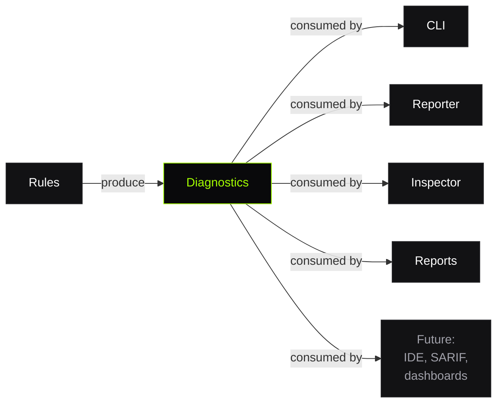

# ADR-004: Structured Diagnostics

**Status:** Accepted · **Date:** 2026-07-02

## Context

When a validator finds a problem, it needs to communicate that finding. Common approaches:

1. **Print to stdout**: `console.log("Error: polygon is invalid")`
2. **Throw exceptions**: `throw new Error("self-intersection at feature 42")`
3. **Return structured data**: `{ ruleId, severity, message, location, suggestion }`

The original prototype printed strings. This made output readable for humans but useless for:
- CI automation (can't parse structured data from formatted text)
- Visual debugging (can't locate the exact feature from a string)
- Report generation (can't aggregate by severity or rule)
- IDE integration (can't show inline markers)

## Decision

Every finding is a **Diagnostic**: a typed data structure with well-defined fields:

```typescript
interface Diagnostic {
  ruleId: string;
  severity: 'error' | 'warning' | 'info';
  message: string;
  filePath: string;
  location?: { layer?, featureIndex?, partIndex? };
  suggestion?: string;
  data?: Record<string, unknown>;
}
```

Rules produce Diagnostics. Reporters format Diagnostics. The Inspector visualizes Diagnostics. No component ever produces or consumes unstructured text.

## Consequences

**Positive:**
- **Multiple output formats** from the same source — text, JSON, HTML, Markdown reports
- **CI gates**: exit code derived from `diagnostics.filter(d => d.severity === 'error').length`
- **Visual debugging**: Inspector uses `location` to select features and `data` to render overlays
- **Aggregation**: reports can group by rule, severity, layer, or file
- **Forward-compatible**: new consumers (IDE plugins, SARIF export, dashboards) work without changing rules
- **Testable**: rule tests assert on structured objects, not string matching

**Negative:**
- **Rules must fill all fields**: more work than `console.log`
- **Location must be computed**: rules track layer/feature/part indices during traversal
- **`data` field is untyped**: consumers must know each rule's data schema

## Key Design Choices

### `location` is optional and progressive

```typescript
// Tile-level finding (no specific feature)
location: undefined

// Feature-level
location: { layer: 'buildings', featureIndex: 42 }

// Part-level (specific ring)
location: { layer: 'buildings', featureIndex: 42, partIndex: 0 }
```

This allows rules to provide as much detail as they can without requiring all rules to have ring-level precision.

### `suggestion` is separate from `message`

- `message` describes **what's wrong**
- `suggestion` describes **how to fix it**

This separation enables UIs to show them differently (error text vs help text) and allows tools to filter or hide suggestions.

### `data` enables rich tooling without bloating the interface

```typescript
// tile/self-intersection
data: { segments: [1, 4] }

// tile/coordinate-range
data: { x: 4200, y: -50, extent: 4096 }
```

The Inspector uses `data` to render precise overlays (highlight both crossing segments, mark the out-of-range vertex). The CLI ignores `data`. Both work fine — the structure supports multiple consumers at different fidelity levels.

### Diagnostics are the **universal interface contract**



Adding a new consumer never requires changing rules. Adding a new rule never requires changing consumers. The Diagnostic contract is the stable interface between the two sides.

## Prior Art

- **ESLint**: `LintMessage` with `ruleId`, `severity`, `message`, `line`, `column`, `fix`
- **TypeScript**: `Diagnostic` with `code`, `category`, `messageText`, `file`, `start`
- **Rust (rustc)**: JSON diagnostic with `code`, `level`, `message`, `spans[]`

TileGuard's model is closest to ESLint's but adds geospatial-specific `location` (layer/feature/part instead of line/column) and a `data` bag for tooling metadata.
