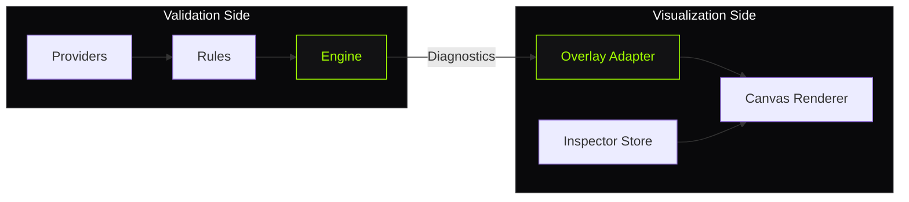

# ADR-005: Separate Validation from Visualization

**Status:** Accepted · **Date:** 2026-08-01

## Context

TileGuard has two major capabilities:
1. **Validation**: decode tiles, apply rules, produce diagnostics
2. **Visualization**: render geometry on canvas, show diagnostic overlays, enable investigation

A natural temptation is to combine them: have the Inspector run rules directly, or have rules produce visual annotations. Many GIS tools take this approach. Validation logic lives inside the GUI.

## Decision

Validation and visualization are **strictly separated**:

- The **validation engine** (core, tile-rules, style-rules) produces Diagnostics
- The **Inspector** (inspector package) consumes Diagnostics and renders them visually
- The Inspector **never runs rules**: it receives pre-computed diagnostics
- Rules **never produce visual output**: they return structured data

```text
┌─────────────────────┐         ┌─────────────────────┐
│   Validation Side   │         │  Visualization Side │
│                     │         │                     │
│  Providers          │         │  Canvas Renderer    │
│  Rules              │─────►   │  Overlay Adapter    │
│  Engine             │ Diag-   │  Inspector Store    │
│  Reporters          │ nostics │  Interaction        │
│                     │         │                     │
└─────────────────────┘         └─────────────────────┘
```



The **Diagnostic** is the only interface between the two sides.

## Consequences

**Positive:**
- **CLI works without the Inspector**: validation runs headless in CI with zero UI dependencies
- **Inspector works without re-running rules**: load diagnostics from JSON, no tile-rules needed
- **Independent deployment**: ship validation as `@tileguard/cli`, ship Inspector as a separate app
- **Independent evolution**: improve rendering without touching validation logic
- **Testable in isolation**: test rules without DOM/canvas, test rendering without rule logic
- **Multiple visualizers possible**: a future IDE plugin could consume the same diagnostics

**Negative:**
- **Two decode paths**: the CLI's Provider decodes for rules; the Inspector decodes for rendering (different but compatible)
- **Diagnostic must carry enough context**: the `location` and `data` fields must enable visualization without the Inspector knowing rule internals
- **No real-time validation in Inspector**: diagnostics are computed once at load time, not updated live

## The Overlay Bridge

The one place these two sides connect is the **OverlayAdapter**:

```text
Diagnostic (from rules)
    ↓
OverlayAdapter.toDescriptors(diagnostic, artifact)
    ↓
OverlayDescriptor (for renderer)
    ↓
Canvas Renderer draws the overlay
```

Each rule has an **OverlayStrategy** that knows how to convert that rule's diagnostic into visual markers:
- `tile/self-intersection` → two `segment-highlight` overlays + a `cross-marker`
- `tile/unclosed-ring` → `ring-highlight` with gap marker
- `tile/coordinate-range` → `point-marker` at the out-of-range vertex

The strategy reads the diagnostic's `data` field to produce precise overlays. This keeps rule-specific knowledge in a thin adapter layer rather than in the renderer.

## Design Principle

> **The Inspector is a diagnostic consumer, not a diagnostic producer.**

The Inspector's job is to help you *understand* findings that already exist — zoom to the feature, highlight the geometry, show the properties, explain the rule. It never decides what's an error. That's the engine's job.

This mirrors how Chrome DevTools relates to V8: the engine executes JavaScript and produces diagnostics; DevTools helps you understand them visually. They are separate systems communicating through a well-defined protocol.

## Prior Art

- **ESLint + VS Code**: ESLint produces diagnostics; VS Code's extension renders squiggly underlines. ESLint doesn't know about VS Code.
- **TypeScript + IDE**: tsc produces diagnostics; the IDE renders inline errors. The compiler has no UI code.
- **Rust + rust-analyzer**: rustc produces diagnostics; the language server presents them. Different processes, same diagnostic format.

TileGuard follows the same pattern applied to geospatial validation.
