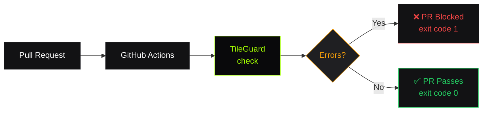

# CI / GitHub Actions

TileGuard is designed to run in CI pipelines as an automated quality gate. Fail pull requests when tile or style quality degrades.

## How It Works



## Basic Workflow

```yaml
# .github/workflows/tile-quality.yml
name: Tile Quality Gate
on:
  pull_request:
    branches: [main]

jobs:
  quality-gate:
    runs-on: ubuntu-latest
    steps:
      - uses: actions/checkout@v4
      - uses: actions/setup-node@v4
        with:
          node-version: 20

      - name: Validate tiles and styles
        run: npx @tileguard/cli check ./tiles/ ./styles/
```

That's it. If any rule reports an `error`-level diagnostic, the step fails and the PR is blocked.

## JSON Output for Automation

For structured output (dashboards, custom reporting):

```yaml
      - name: Validate with JSON output
        run: npx @tileguard/cli check ./tiles/ ./styles/ --reporter json > tileguard-results.json

      - name: Upload results
        uses: actions/upload-artifact@v4
        with:
          name: tileguard-results
          path: tileguard-results.json
```

The JSON output contains every diagnostic as a machine-readable object:

```json
{
  "summary": {
    "pass": false,
    "errors": 2,
    "warnings": 1,
    "info": 0,
    "files": 3,
    "duration": 142
  },
  "diagnostics": [
    {
      "ruleId": "tile/self-intersection",
      "severity": "error",
      "message": "Geometry has intersecting segments 1 and 4.",
      "file": "./tiles/14/8741/5476.pbf",
      "location": { "layer": "buildings", "featureIndex": 42 },
      "suggestion": "Simplify or repair this geometry."
    }
  ]
}
```

## SARIF Output for GitHub Code Scanning

Use `--reporter sarif` to get inline PR annotations via GitHub Code Scanning:

```yaml
      - name: Run TileGuard (SARIF)
        run: npx @tileguard/cli check ./tiles/ ./styles/ --reporter sarif

      - name: Upload SARIF to GitHub Code Scanning
        uses: github/codeql-action/upload-sarif@v3
        if: always()   # upload even on failure so findings appear on the PR
        with:
          sarif_file: tileguard-results.sarif
```

This surfaces every `error` and `warning` as an annotation directly on the diff,
without needing to read a JSON artifact.

::: tip SARIF vs JSON
Use **SARIF** when you want GitHub PR annotations. Use **JSON** when you want to
pipe results into a dashboard or custom tooling.
:::

## Comparison on Pull Request

Compare tiles between the PR branch and main to detect regressions:

```yaml
  regression-check:
    runs-on: ubuntu-latest
    steps:
      - uses: actions/checkout@v4
        with:
          fetch-depth: 0  # Need full history for comparison

      - uses: actions/setup-node@v4
        with:
          node-version: 20

      - name: Get baseline tile from main
        run: git show main:tiles/city.pbf > /tmp/baseline.pbf

      - name: Compare against PR tile
        run: npx @tileguard/cli compare /tmp/baseline.pbf ./tiles/city.pbf
```

## Full Production Workflow

A complete workflow that validates, compares, and generates a report:

```yaml
name: Tile Quality
on:
  pull_request:
    branches: [main]
    paths:
      - 'tiles/**'
      - 'styles/**'
      - 'tileguard.config.ts'

jobs:
  validate:
    runs-on: ubuntu-latest
    steps:
      - uses: actions/checkout@v4
      - uses: actions/setup-node@v4
        with:
          node-version: 20
          cache: 'npm'

      - name: Validate all tiles
        run: npx @tileguard/cli check ./tiles/ --reporter json > tile-results.json

      - name: Validate all styles
        run: npx @tileguard/cli check ./styles/ --reporter json > style-results.json

      - name: Upload diagnostics
        if: always()
        uses: actions/upload-artifact@v4
        with:
          name: quality-report
          path: |
            tile-results.json
            style-results.json

  compare:
    runs-on: ubuntu-latest
    if: github.event_name == 'pull_request'
    steps:
      - uses: actions/checkout@v4
        with:
          fetch-depth: 0

      - uses: actions/setup-node@v4
        with:
          node-version: 20

      - name: Compare tile versions
        run: |
          git show main:tiles/city.pbf > /tmp/baseline.pbf 2>/dev/null || exit 0
          npx @tileguard/cli compare /tmp/baseline.pbf ./tiles/city.pbf
```

## Exit Codes

| Code | Meaning |
|:-----|:--------|
| `0` | All rules passed (no errors) |
| `1` | One or more `error`-level diagnostics found |

Warnings do not affect the exit code by default. To fail on warnings too, set all your warning rules to `'error'` severity in your config.

## Path Filtering

Only trigger on relevant file changes to keep CI fast:

```yaml
on:
  pull_request:
    paths:
      - 'tiles/**'
      - 'styles/**'
      - 'tileguard.config.ts'
```

## Caching

TileGuard has no build step; it runs directly via `npx`. For faster execution, cache npm:

```yaml
      - uses: actions/setup-node@v4
        with:
          node-version: 20
          cache: 'npm'
```

## Configuration in CI

TileGuard automatically picks up `tileguard.config.ts` from your repository root. No special CI configuration is needed, the same rules run locally and in CI.

```typescript
// tileguard.config.ts
import type { TileGuardConfig } from '@tileguard/core';
import { tilePlugin } from '@tileguard/tile-rules';
import { stylePlugin } from '@tileguard/style-rules';

const config: TileGuardConfig = {
  plugins: [tilePlugin, stylePlugin],
  rules: {
    'tile/required-layers': ['error', { layers: ['water', 'roads', 'buildings'] }],
    'tile/self-intersection': 'error',
    'tile/winding-order': 'error',
    'style/known-source': 'error',
  },
  reporter: 'text', // CI uses --reporter json to override
};

export default config;
```

::: tip
The `--reporter` flag overrides the config file reporter. Use `--reporter json` in CI for machine-readable output while keeping `text` for local development.
:::

---

## What Next?

- [**Quick Start ›**](/getting-started/quick-start)
Run TileGuard locally first
- [**View All Rules ›**](/rules/)
See what's being validated
- [**How It Works ›**](/learn/how-it-works)
Understand the pipeline
