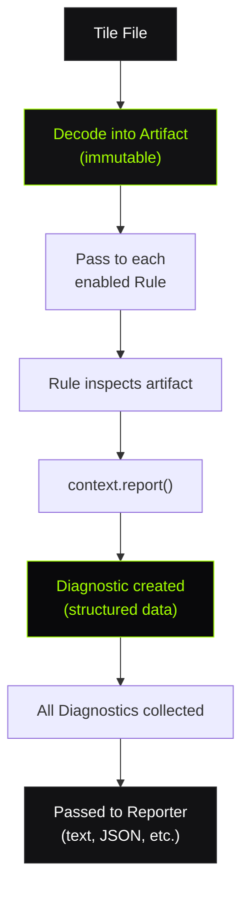

# Concepts

Understanding two core concepts (**Rules** and **Diagnostics**) gives you a mental model for everything TileGuard does.

## Rules

A **Rule** is a single validation concern. It checks exactly one thing about a tile or style file.

### Anatomy of a Rule

```typescript
{
  id: 'tile/self-intersection',       // Unique identifier
  meta: {
    description: 'Polygon edges must not cross themselves.',
    defaultSeverity: 'error',          // error | warning | info
    recommended: true,                 // Enabled by default
  },
  artifactTypes: ['VectorTile'],       // What it validates
  create(context) {
    // Receives decoded tile, reports findings
  },
}
```

### Rule Naming Convention

Rules follow a `namespace/name` pattern:

| Prefix | Package | Example |
|:-------|:--------|:--------|
| `tile/` | `@tileguard/tile-rules` | `tile/self-intersection` |
| `style/` | `@tileguard/style-rules` | `style/known-source` |

### Rule Categories

**Geometry rules** validate the shape of features:
- `tile/self-intersection`: edges that cross
- `tile/unclosed-ring`: open polygons
- `tile/winding-order`: ring direction
- `tile/hole-containment`: holes outside shells
- `tile/zero-area-ring`: collapsed polygons
- `tile/degenerate-geometry`: too few vertices
- `tile/coordinate-range`: vertices outside bounds

**Structural rules** validate tile-level properties:
- `tile/required-layers`: expected layers present
- `tile/required-properties`: feature metadata exists
- `tile/feature-count`: total feature budget
- `tile/layer-feature-count`: per-layer budget
- `tile/no-empty`: tile has content

**Style rules** validate MapLibre JSON:
- `style/valid-json`: parseable
- `style/version`: spec version 8
- `style/known-source`: sources declared
- _(and 6 more)_

### Rule Configuration

Every rule accepts three severity levels or a tuple with options:

```typescript
rules: {
  // Simple severity
  'tile/self-intersection': 'error',
  'tile/no-empty': 'off',

  // Severity + options
  'tile/required-layers': ['error', { layers: ['water', 'roads'] }],
  'tile/feature-count': ['warning', { max: 100000 }],
}
```

### Rule Independence

Rules are **independent**. They:
- Don't know about each other
- Don't share state
- Can't affect each other's results
- Run in any order with the same output

This means you can safely enable, disable, or add rules without side effects.

---

## Diagnostics

A **Diagnostic** is the structured output of a rule. When a rule finds a problem, it produces a diagnostic. Not a printed message, not an exception, but a typed data structure.

### Anatomy of a Diagnostic

```typescript
{
  ruleId: 'tile/self-intersection',
  severity: 'error',
  message: 'Geometry in layer "buildings", feature 42 has intersecting segments 1 and 4.',
  location: {
    layer: 'buildings',
    featureIndex: 42,
    partIndex: 0,
  },
  suggestion: 'Simplify or repair this geometry so non-adjacent segments do not cross.',
  data: {
    segments: [1, 4],
  },
}
```

### Fields

| Field | Type | Purpose |
|:------|:-----|:--------|
| `ruleId` | `string` | Which rule produced this finding |
| `severity` | `'error' \| 'warning' \| 'info'` | How serious it is |
| `message` | `string` | Human-readable description |
| `location` | `object` | Where in the artifact (layer, feature, part) |
| `suggestion` | `string?` | How to fix it |
| `data` | `object?` | Rule-specific metadata for tooling |

### Why Structured?

Diagnostics are data. Not strings. This single design decision enables:

| Consumer | Uses diagnostics to... |
|:---------|:-----------------------|
| **CLI (text)** | Print colored, formatted output |
| **CLI (JSON)** | Machine-readable CI output |
| **Inspector** | Highlight exact geometry on canvas |
| **Reports** | Aggregate by severity, layer, rule |
| **Custom tools** | Any programmatic analysis |

If diagnostics were just printed strings, none of this would be possible. The structure is the product.

### The Location Model

Every diagnostic pinpoints where the issue lives:

```typescript
interface Location {
  layer?: string;         // Which tile layer
  featureIndex?: number;  // Which feature in that layer
  partIndex?: number;     // Which ring/part of the geometry
}
```

This allows the Inspector to:
1. Find the exact layer in the decoded tile
2. Select the exact feature
3. Highlight the exact ring or segment on the canvas

### Severity Semantics

| Severity | Meaning | CI Effect |
|:---------|:--------|:----------|
| `error` | Incorrect data — must fix | Exit code `1` (fail) |
| `warning` | Suspicious — investigate | Exit code `0` (pass) |
| `info` | Informational — no action | Exit code `0` (pass) |

Severity is **configurable per-rule**. What's an error in one project might be a warning in another:

```typescript
// Strict: everything is an error
'tile/zero-area-ring': 'error',

// Lenient: only report for awareness
'tile/zero-area-ring': 'info',
```

---

## How They Work Together



The **Artifact** is immutable. Rules can't modify it.
The **Rules** only produce diagnostics. They never print.
The **Reporters** only format diagnostics. They never validate.

This separation is what makes TileGuard reliable and extensible.

## What Next?

- [**Validating Tiles ›**](/guides/validating-tiles)
Practical tile validation guide
- [**Rules Reference ›**](/rules/)
All 25 rules with configuration
- [**How It Works ›**](/learn/how-it-works)
Full architecture
