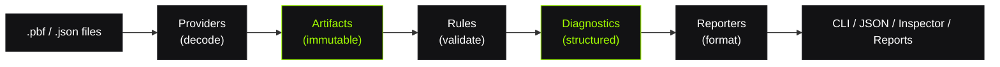
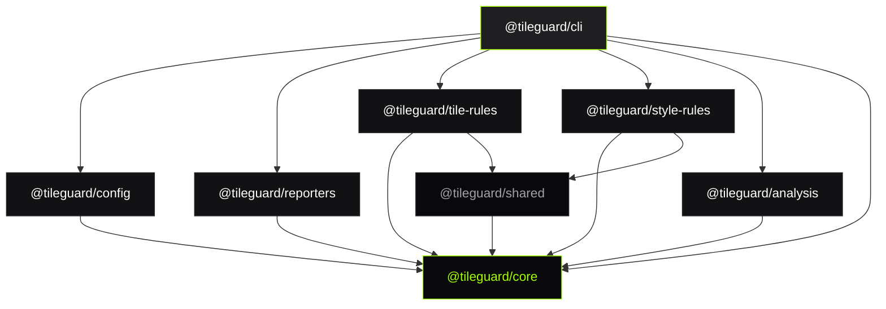

# How It Works

TileGuard's architecture follows a strict pipeline with clear separation of concerns. Understanding this pipeline is the key to understanding the entire system.

## The Pipeline



### Stage 1: Artifacts

An **Artifact** is a decoded, typed representation of source data. TileGuard supports:

| Artifact Type | Source | Format |
|:--------------|:-------|:-------|
| `VectorTile` | `.pbf` files | Protobuf-encoded MVT |
| `StyleSpec` | `.json` files | MapLibre Style Specification |

Artifacts are **immutable** after decoding. Rules receive them read-only.

### Stage 2: Providers

A **Provider** loads and decodes source files into Artifacts:

- **Tile Provider** — Reads `.pbf`, decodes protobuf, extracts layers/features/geometry
- **Style Provider** — Reads `.json`, parses structure, resolves source references

Providers handle I/O. Rules never touch the filesystem.

### Stage 3: Rules

A **Rule** validates exactly one concern. It receives an immutable Artifact and reports zero or more diagnostics:

```typescript
export const windingOrderRule: Rule = {
  id: 'tile/winding-order',
  meta: {
    description: 'Polygon rings must follow the correct winding convention.',
    defaultSeverity: 'error',
    recommended: true,
  },
  artifactTypes: ['VectorTile'],
  create(context) {
    // Inspect the artifact, report findings
    context.report({
      message: 'Ring 0 has incorrect winding direction.',
      location: { layer: 'buildings', featureIndex: 17 },
      suggestion: 'Reverse the ring vertex order.',
    });
  },
};
```

Rules:
- Never access the filesystem
- Never print output
- Never modify the artifact
- Run independently of each other
- Are individually configurable (`'error'`, `'warning'`, `'off'`)

### Stage 4: Diagnostics

Every finding is a **structured Diagnostic**:

```typescript
interface Diagnostic {
  ruleId: string;           // 'tile/self-intersection'
  severity: Severity;       // 'error' | 'warning' | 'info'
  message: string;          // Human-readable description
  location?: Location;      // { layer, featureIndex, partIndex? }
  suggestion?: string;      // Actionable fix recommendation
  data?: Record<string, unknown>; // Rule-specific metadata
}
```

Diagnostics are the **universal interface contract** — everything downstream consumes them.

### Stage 5: Reporters & Output

**Reporters** format diagnostics for consumption:

| Reporter | Purpose |
|:---------|:--------|
| Text | Colored terminal output for humans |
| JSON | Machine-readable for CI/CD pipelines |
| Inspector | Canvas-rendered visual debugging |
| Reports | Markdown/HTML/JSON engineering reports |

---

## Package Architecture



**Dependencies flow strictly inward.** Core has zero runtime dependencies. Domain packages depend only on Core. The CLI depends on everything but nothing depends on the CLI.

---

## Key Design Decisions

| Decision | Rationale |
|:---------|:----------|
| **Rules are plain objects** | No base classes, no decorators, no magic. Easy to write, test, and understand. |
| **Diagnostics are data** | Machine-readable output enables CI, IDE plugins, visual debugging, and reports from the same source. |
| **Convention-aware validation** | Auto-detects MVT (CW) vs OGC (CCW) winding to avoid false positives on Planetiler/OpenMapTiles. |
| **Local-first processing** | All validation happens locally. No server required. Works offline, in CI, in the browser. |
| **Plugin architecture** | Install only what you need. `@tileguard/tile-rules` + `@tileguard/style-rules` are independent. |

---

## The Engine

The **Engine** is the orchestrator. It:

1. Receives configuration (plugins, rule settings, reporter)
2. Discovers source files
3. Asks Providers to decode them into Artifacts
4. Routes Artifacts to matching Rules
5. Collects all Diagnostics
6. Passes Diagnostics to the Reporter

```typescript
import { createEngine } from '@tileguard/core';
import { tilePlugin } from '@tileguard/tile-rules';
import { stylePlugin } from '@tileguard/style-rules';

const engine = createEngine({
  plugins: [tilePlugin, stylePlugin],
  rules: { 'tile/self-intersection': 'error' },
});

const result = await engine.run(['./tiles/', './styles/']);
// result.diagnostics — all findings
// result.summary.pass — true if no errors
```

---

## What Next?

- [**View All Rules →**](/rules/) — What TileGuard catches
- [**CI / GitHub Actions →**](/guides/ci-github-actions) — Automated quality gates
- [**Quick Start →**](/getting-started/quick-start) — Run it yourself
