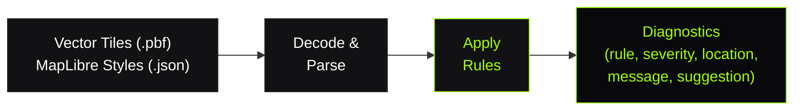

# What is TileGuard?

TileGuard is a **rule-based validation framework** for vector tiles and MapLibre style specifications. It applies the same engineering discipline that ESLint brings to JavaScript — to the geospatial stack.

## The Problem

Modern web maps render vector tiles client-side. The tile data is the truth — if a polygon has an unclosed ring, a self-intersection, or incorrect winding order, the rendering engine has to guess. Different renderers guess differently. The result: visual glitches, broken extrusions, missing features, and silent data corruption.

**Rendering tests** can tell you something *looks* wrong. But they can't tell you:

- Which geometry in which layer has the error?
- Is it a self-intersection or a winding order issue?
- Was this bug introduced in this tile generation run, or was it always there?
- Which features regressed between v1 and v2?

You're left manually inspecting tiles in QGIS, writing ad-hoc scripts, or hoping someone notices in production.

### Real-World Examples

These aren't hypothetical — they're the kinds of issues tile pipelines produce daily:

| Symptom in the map | Root cause in the tile |
|:-------------------|:-----------------------|
| Building footprint has a spike/artifact | `tile/self-intersection` — polygon edges cross |
| Filled polygon appears hollow | `tile/winding-order` — hole wound like an outer ring |
| Lake has a chunk missing | `tile/hole-containment` — hole vertices escaped the shell |
| Polygon outline renders but fill is empty | `tile/unclosed-ring` — ring not closed |
| Label layer breaks the entire map | `style/known-source` — typo in source reference |
| Tile loads slowly, map lags on zoom | `tile/feature-count` — 80k features in one tile |

None of these produce a runtime error. The map still loads. It just looks wrong — silently, in production, to your users.

## The Solution

TileGuard provides **deterministic, automated validation** with structured diagnostics:



Every finding is machine-readable. Every finding is actionable. Every finding tells you exactly where the problem is and how to fix it.

### Before TileGuard

```text
"The map looks weird on zoom 14 near downtown."
→ Open QGIS
→ Load the tile
→ Zoom around for 10 minutes
→ Maybe find the bad polygon
→ No structured record of what was wrong
→ No way to prevent it from happening again
```

### With TileGuard

```bash
$ tileguard check ./tiles/14/8741/5476.pbf

✗ tile/self-intersection
  Geometry in layer "buildings", feature 42 has intersecting
  segments 1 and 4.
  → layer: buildings · feature: 42 · part: 0
  ℹ Simplify or repair this geometry.

──────────────────────────────────
  1 error in 1 file (34ms)
```

Found in 34 milliseconds. Exact layer, exact feature, exact segments. Actionable suggestion. Machine-readable. CI-ready.

## Core Principles

### Rules, Not Monolithic Validators

TileGuard doesn't have a single `validate()` function that checks everything. Each concern is a separate **rule** — a plain TypeScript object under 25 lines:

| Rule | What it catches |
|:-----|:----------------|
| `tile/self-intersection` | Polygon edges that cross themselves |
| `tile/winding-order` | Rings wound in the wrong direction |
| `tile/hole-containment` | Holes outside their parent polygon |
| `tile/coordinate-range` | Vertices outside the tile extent |
| `style/known-source` | Layers referencing undeclared sources |
| `style/zoom-range` | Invisible layers (minzoom > maxzoom) |

Rules run independently. You enable, disable, or configure each one. You can write new rules without touching existing ones.

### Structured Diagnostics

Every diagnostic is a data structure, not a string:

```typescript
{
  ruleId: 'tile/self-intersection',
  severity: 'error',
  message: 'Geometry has intersecting segments 1 and 4.',
  location: { layer: 'buildings', featureIndex: 42, partIndex: 0 },
  suggestion: 'Simplify or repair this geometry.',
  data: { segments: [1, 4] }
}
```

This means:
- **CI** can parse it as JSON and fail builds
- **The Inspector** can highlight the exact segment on canvas
- **Reports** can aggregate findings by severity and layer
- **Custom tooling** can consume it programmatically

The diagnostic is the product — not the CLI output, not the visual overlay. Those are just views of the same underlying data.

### Convention-Aware

TileGuard auto-detects whether tiles use the **MVT convention** (outer rings clockwise) or the **OGC/GeoJSON convention** (outer rings counter-clockwise). It won't give you false positives on Planetiler or OpenMapTiles output.

This matters because the two most popular tile encoders disagree on winding direction. A naïve validator would flag every single polygon from Planetiler as "wrong." TileGuard detects the convention first, then validates consistency within it.

### Separation of Concerns

```text
Rules never print.
Reporters never validate.
The Inspector never runs rules.
```

Adding a rule never touches formatting. Adding a reporter never touches validation. Adding a visualization never touches diagnostics. Each layer has one job.

This is what makes TileGuard reliable — a bug in one component cannot corrupt another. A rule can't accidentally break the CLI. A new reporter can't introduce false positives.

## What TileGuard Is Not

- **Not a renderer** — it doesn't draw maps, it validates the data maps consume
- **Not a tile server** — it doesn't serve tiles, it checks them before they're served
- **Not a geometry library** — it doesn't create or transform geometry, it validates existing geometry
- **Not a MapLibre plugin** — it runs before MapLibre ever sees the data

TileGuard sits between your tile generation pipeline and your deployment — the quality gate.

## Who Is It For?

- **Tile pipeline engineers** — Catch geometry errors before production
- **Style authors** — Validate styles match your source definitions
- **CI/CD systems** — Automated quality gates on pull requests
- **Data teams** — Compare tile versions, detect regressions, generate evidence
- **Open-source contributors** — Extend with custom rules in ~25 lines

## What Next?

- [**Quick Start ›**](/getting-started/quick-start) — Run TileGuard in 5 minutes
- [**How It Works ›**](/learn/how-it-works) — Architecture and pipeline
- [**View All Rules ›**](/rules/) — See what TileGuard catches
