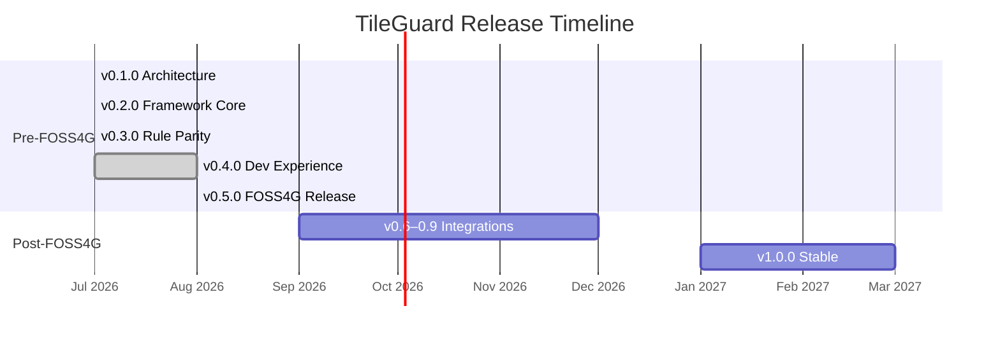

# Roadmap

TileGuard follows a dual-track strategy: internal **Phases** (engineering milestones) and public **Versions** (releases). The project is calibrated around the **FOSS4G 2026** presentation (Hiroshima, August 30, 2026).

## Current Status

**v0.5.0-rc.1** — All core functionality complete and tested. ~1,838 tests passing across 9 packages.

## Release Timeline

## Phase Map

| Phase | Focus | Status |
|:------|:------|:-------|
| Phase 1 | Architecture & Contracts | ✅ Complete |
| Phase 2 | Framework Core (`@tileguard/core`) | ✅ Complete |
| Phase 3 | Domain Rules Migration (12 tile + 9 style) | ✅ Complete |
| Phase 4 | Developer Experience (Inspector, CLI) | ✅ Complete |
| Phase 5 | FOSS4G Quality Gate (stabilization) | 🔄 In Progress |
| Phase 6 | Post-Conference (formats, integrations) | 📋 Planned |
| Phase 7 | Production Stability | 📋 Planned |

## v0.5.0 — FOSS4G Release (Current)

The release presented at FOSS4G 2026. Everything needed to demo and adopt:

- ✅ 25 built-in rules (12 tile + 4 perf + 9 style)
- ✅ Visual Inspector with diagnostic overlays
- ✅ CLI with 12 commands (inc. profile, hook)
- ✅ Comparison and regression detection
- ✅ Engineering report generation (Markdown, HTML, JSON)
- ✅ Convention-aware validation (MVT + OGC)
- ✅ CI/GitHub Actions integration
- ✅ Documentation site
- 🔄 Final stabilization and false-positive elimination

## v0.6.0–v0.9.0 — Post-Conference

Expand the framework based on community feedback:

- ✅ **SARIF reporter** — GitHub Code Scanning integration
- **PMTiles support** — validate tiles directly from PMTiles archives
- **Render regression testing** — perceptual pixel comparison (Playwright-based)
- **IDE integration** — VS Code extension showing inline diagnostics
- **PDF reports** — formatted engineering reports for stakeholders
- **Performance** — 10,000 tiles in under 60 seconds

## v1.0.0 — Production Stable

The first stable release with backward-compatibility guarantees:

- **Stable API** — no breaking changes to Diagnostic, Rule, Plugin interfaces
- **Python SDK** — consume TileGuard from Python pipelines
- **Plugin marketplace** — community-contributed rule packages
- **Enterprise features** — custom reporters, shared configurations
- **Performance benchmarks** — published and tracked in CI

## Success Criteria

| Metric | Target |
|:-------|:-------|
| Adoption | CI quality gate in ≥ 3 major OSS geospatial projects within 12 months of v1.0 |
| Extensibility | ≥ 30% of rules contributed by community |
| Performance | 10,000 tiles validated in < 60s (CI environment) |
| Reliability | Zero false positives in structural validation |

## How to Influence the Roadmap

- **File issues** for features you need
- **Contribute rules** for validation gaps you encounter
- **Provide feedback** on the discussion board
- **Present TileGuard** at your local geo meetup

The roadmap prioritizes real user needs over speculative features. If you're using TileGuard in production, your feedback directly shapes what gets built next.
