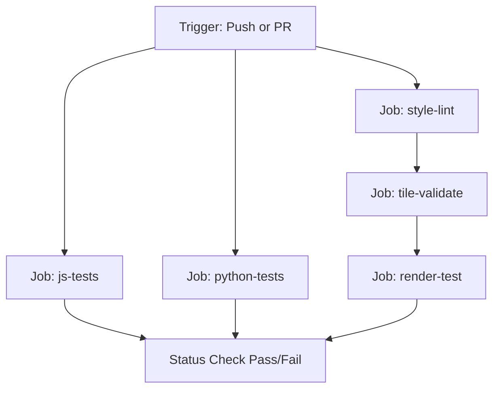

# TileGuard Architecture & Detailed Codebase Documentation 🛡️

TileGuard is a tile quality testing toolkit designed for open-source geospatial projects. It acts as a drop-in CI/CD quality gate for MapLibre, QGIS, GeoServer, and vector tile pipelines. This document provides a detailed architectural reference, low-level implementation details, algorithm explanations, configurations, and current integration statuses.

---

## 1. Directory Structure & Workspace Layout

The project is structured as a monorepo containing JavaScript and Python implementations, shared fixtures, and documentation:

```
tileguard/
├── packages/
│   ├── js/                          ← npm package (tileguard)
│   │   ├── bin/
│   │   │   └── tileguard.js         ← CLI Entry point (npx tileguard)
│   │   ├── src/
│   │   │   ├── validate.js          ← Core JS tile validator
│   │   │   ├── style-lint.js        ← MapLibre style JSON validator
│   │   │   ├── render-compare.js    ← Render compare stub
│   │   │   ├── reporter.js          ← Output formatter (text/JSON)
│   │   │   └── utils/
│   │   │       ├── pbf-decoder.js   ← Protobuf parser & MVT decoder
│   │   │       ├── pixel-diff.js    ← Perceptual pixel difference engine
│   │   │       └── geometry.js      ← Low-level geometry validation checks
│   │   ├── test/
│   │   │   ├── validate.test.js     ← JS validation unit tests
│   │   │   ├── style-lint.test.js   ← JS style lint tests (empty)
│   │   │   └── render.test.js       ← JS render tests (empty)
│   │   ├── package.json
│   │   └── package-lock.json
│   │
│   └── python/                      ← pip package (tileguard)
│       ├── tileguard/
│       │   ├── __init__.py
│       │   ├── __main__.py          ← CLI Entry point (python -m tileguard)
│       │   ├── validate.py          ← Core Python tile validator
│       │   ├── style_lint.py        ← Style lint stub (empty)
│       │   ├── reporter.py          ← Output formatter (text/JSON)
│       │   └── utils/
│       │       ├── pbf_decoder.py   ← Protobuf parser & MVT decoder
│       │       └── geometry.py      ← Low-level geometry validation checks
│       ├── tests/
│       │   ├── test_validate.py     ← Python validation unit tests
│       │   └── test_style_lint.py   ← Python style lint tests (empty)
│       ├── pyproject.toml
│       └── requirements.txt
│
├── fixtures/                        ← Shared test tile fixtures
│   ├── fill-color/                  ← Placeholder style.json, info.json, expected.png
│   ├── fill-extrusion/
│   ├── line-dasharray/
│   ├── line-width/
│   ├── raster-opacity/
│   └── symbol-placement/
│
├── .github/
│   └── workflows/
│       └── tile-quality.yml         ← CI/CD pipeline definition
│
├── docs/
│   ├── ARCHITECTURE.md              ← You are here
│   ├── FIXTURES.md                  ← Shared fixtures documentation (empty)
│   └── CI_INTEGRATION.md            ← CI integration details (empty)
│
├── README.md                        ← Main readme
├── CONTRIBUTING.md                  ← Contributing guidelines (empty)
└── LICENSE                          ← MIT License
```

---

## 2. Low-Level Component Architecture

### A. PBF / MVT Protobuf Decoders
<!-- TODO: INSERT DIAGRAM 6: Vector Tile Decoder (Data Layout Diagram) -->

**Image Description / Generation Prompt:** A block diagram representing the hierarchical structure of a decoded Mapbox Vector Tile (MVT) binary payload.
1. The top-level block is the raw `VectorTile` binary buffer (protobuf format).
2. Underneath, show that the buffer contains one or more `Layers`.
3. Each `Layer` contains:
   - `Name` (string identifier)
   - `Extent` (typically 4096 coordinate grid dimensions)
   - `Feature Pool` (an array of individual feature objects)
   - `Key Pool` (a list of unique property keys)
   - `Value Pool` (a list of unique property values across different types: string, float, integer, boolean)
4. Each `Feature` within the pool contains:
   - `ID` (unique identifier)
   - `Type` (Geometry Type: Point, LineString, or Polygon)
   - `Packed Tags` (an array of alternating integers mapping key indices to value indices in the layer pools)
   - `Geometry Commands` (packed draw commands containing command IDs and coordinate parameters: MoveTo, LineTo, ClosePath)

Vector tiles contain binary-encoded layers according to the Mapbox Vector Tile (MVT) specification. TileGuard includes custom protocol buffer decoders to avoid external dependencies where possible and maintain consistency between Javascript and Python engines.

- **Location**: `packages/js/src/utils/pbf-decoder.js` and `packages/python/tileguard/utils/pbf_decoder.py`
- **MVT Key Specification Mappings**:
  - **Layers (Field `3`, Wire Type `2`)**: Contains MVT layer messages.
    - Name (Field `1`, Wire Type `2`): String representing the layer name.
    - Features (Field `2`, Wire Type `2`): Repeated feature messages.
    - Keys (Field `3`, Wire Type `2`): Repeated string keys for feature properties.
    - Values (Field `4`, Wire Type `2`): Repeated value messages representing property values of type string (1), float (2), double (3), int (4), uint (5), svarint (6), or bool (7).
    - Extent (Field `5`, Wire Type `0`): Integer tile coordinate grid range (usually `4096`).
    - Version (Field `15`, Wire Type `0`): Integer version number.
  - **Features**:
    - ID (Field `1`, Wire Type `0`): Varint feature ID.
    - Tags (Field `2`, Wire Type `2`): Packed varint key-value indices mapped to the layer's `keys` and `values` pools.
    - Type (Field `3`, Wire Type `0`): Varint geometry type: `0` (Unknown), `1` (Point), `2` (LineString), `3` (Polygon).
    - Geometry Commands (Field `4`, Wire Type `2`): Packed varint draw commands defining drawing paths.

- **Geometry Decimation & Parsing**:
  <!-- TODO: INSERT DIAGRAM 7: ZigZag Coordinate Decoding (Bitwise Workflow) -->

**Image Description / Generation Prompt:** A flowchart illustrating the mathematical and bitwise operations used to decode relative coordinate offsets from MVT draw commands in `pbf-decoder.ts`.
1. Input: An unsigned integer `N` decoded from a raw protobuf varint.
2. Step 1: Perform the ZigZag decode bitwise shift: `(N >>> 1) ^ -(N & 1)` to obtain the signed coordinate delta offset `dValue` (which can be `dx` or `dy`).
3. Step 2: Feed `dValue` into the coordinate accumulator.
4. Step 3: Compute the absolute position relative to the previous point: `x_new = x_prev + dx` and `y_new = y_prev + dy`.
5. Output: Absolute 2D coordinates `(x_new, y_new)` plotted on the vector grid extent.

  - Drawings are defined by command integers. Command types are:
    - `MoveTo` (`1`): Move to a starting coordinate.
    - `LineTo` (`2`): Draw lines to coordinates.
    - `ClosePath` (`7`): Close the path back to the starting point.
  - Coordinates are stored as relative delta offsets from the previous point using **ZigZag encoding** to store negative numbers efficiently. The decoders translate them back to absolute grid values using:
    ```javascript
    function zigZagDecode(n) {
      return (n >>> 1) ^ -(n & 1);
    }
    ```

---

### B. Core Tile Validator
This component handles decompression, decodes protobuf structures into runtime memory structures, and executes content sanity tests.

- **Location**: `packages/js/src/validate.js` and `packages/python/tileguard/validate.py`
- **Input Options**:
  - `requiredLayers` (`string[]`): Lists which layers *must* exist. Fails with `MISSING_LAYER` if any are missing.
  - `minFeatures` / `maxFeatures` (`number`): Fails if the total sum of features across all layers falls outside these values.
  - `requiredProperties` (`Record<string, string[]>`): Validates property key presence on every feature of specific layers. Fails with `MISSING_PROPERTY` on any feature violating this rule.
  - `checkGeometry` (`boolean`): If true, delegates checking to the low-level geometry validation module.
  - `layerConfig` (`Record<string, { minFeatures?: number, maxFeatures?: number }>`): Enforces feature thresholds on a per-layer basis (fails with `LOW_LAYER_FEATURES` or `HIGH_LAYER_FEATURES`).

- **Decompression**: Detects Gzip headers via the magic bytes `0x1f 0x8b` at index `0` and `1` and automatically decompresses using Node's `zlib.gunzipSync` or Python's `gzip.decompress`.

---

### C. Geometry Validation Subsystem
The Geometry Validation Subsystem is responsible for ensuring that every geometry contained within a vector tile is mathematically valid, structurally consistent, and safe to render. Before higher-level semantic rules execute, TileGuard validates the underlying coordinate data to detect malformed geometries that could lead to rendering artifacts, incorrect analysis, or invalid map data.

The subsystem performs a deterministic sequence of topology checks including coordinate bounds validation, degeneracy detection, polygon closure verification, signed area computation, and self-intersection detection. These checks form the mathematical foundation of TileGuard's geometry engine and are implemented consistently across both JavaScript and Python runtimes.

---

## Geometry Validation Pipeline

Every polygon ring follows the same validation pipeline. The engine evaluates each topology constraint sequentially and immediately emits a diagnostic whenever a check fails. Only geometries that successfully pass every stage continue through the remainder of the validation engine.

<p align="center">
  
</p>

<p align="center">
<i>Figure C-1. Geometry validation pipeline executed for every polygon ring before rule evaluation.</i>
</p>

---

## Mathematical Foundations

The previous diagram illustrates **what** the validation engine checks. The following mathematical algorithms explain **how** those validation decisions are computed internally.

### Coordinate Bounds Validation

Every coordinate is verified to lie within the valid vector tile extent (with a small configurable tolerance for boundary geometries). Coordinates outside the permitted range indicate corrupted tile data or invalid encoding and immediately produce an out-of-range diagnostic.

### Signed Area (Shoelace Formula)

Polygon validity requires a non-zero enclosed area. TileGuard computes the signed area of each polygon ring using the Shoelace formula:

\[
Area=\frac12\sum_{i=0}^{n-1}(x_i y_{i+1}-x_{i+1}y_i)
\]

The sign of the computed area also determines polygon winding direction:

- **Area > 0** → Clockwise winding (outer ring)
- **Area < 0** → Counter-clockwise winding (inner hole)
- **|Area| = 0** → `ZERO_AREA_RING`

### Orientation Test

To detect edge crossings, TileGuard evaluates the orientation of three points using the integer-only cross product:

\[
val=(B_y-A_y)(C_x-B_x)-(B_x-A_x)(C_y-B_y)
\]

The orientation result is interpreted as:

- **val > 0** → Clockwise
- **val < 0** → Counter-clockwise
- **val = 0** → Collinear

Because this algorithm relies exclusively on integer arithmetic, it remains deterministic and avoids floating-point precision issues.

### Segment Intersection

Self-intersections are detected by comparing non-adjacent polygon edges. Two segments intersect when the orientations of both endpoint pairs differ:

- `orient(A, B, C)` and `orient(A, B, D)` have opposite signs.
- `orient(C, D, A)` and `orient(C, D, B)` have opposite signs.

Any detected intersection produces a `SELF_INTERSECTION` diagnostic.

---

## Geometry Algorithms Under the Hood

The following figure summarizes the computational geometry algorithms that power TileGuard's validation engine, including the Shoelace area calculation, orientation testing, and segment intersection detection.

<p align="center">
  
</p>

<p align="center">
<i>Figure C-2. Mathematical algorithms used internally by the geometry validation engine.</i>
</p>

---

## Implementation

**JavaScript**

```text
packages/js/src/utils/geometry.js
```

**Python**

```text
packages/python/tileguard/utils/geometry.py
```


A robust custom geometry check engine ensuring coordinate bounds, topology soundness, and structural integrity.

- **Location**: `packages/js/src/utils/geometry.js` and `packages/python/tileguard/utils/geometry.py`
- **Mathematical Formulations & Algorithms**:
  1. **Coordinate Out-of-Range**: Confirms coordinates are within `[0, extent]` (with a small buffer for outer-boundary lines).
  2. **Degeneracy Checks**:
     - LineStrings must contain at least `2` unique vertices.
     - Polygons must contain at least `3` unique vertices and at least `4` total points (including the closed coordinate).
  3. **Unclosed Ring**: Confirms that the first point coordinate `(x_0, y_0)` matches the final point coordinate `(x_n, y_n)` of polygon loops.
  4. **Zero-Area Ring**: Checks polygon loop areas using the **Shoelace formula (signed area)**:
     $$\text{Area} = \frac{1}{2} \sum_{i=0}^{n-1} (x_i y_{i+1} - x_{i+1} y_i)$$
     If $|\text{Area}| = 0$, the polygon has no surface area, causing a `ZERO_AREA_RING` failure.
  5. **Self-Intersection detection**:
     Iterates through segment pairs $(A, B)$ and $(C, D)$ to identify intersections. A segment pair intersects if the orientation of points $(A, B, C)$ and $(A, B, D)$ differ, and the orientation of points $(C, D, A)$ and $(C, D, B)$ also differ.
     - **Orientation Test**:
       $$\text{Val} = (B_y - A_y)(C_x - B_x) - (B_x - A_x)(C_y - B_y)$$
       - `Val == 0`: Colinear
       - `Val > 0`: Clockwise
       - `Val < 0`: Counter-Clockwise

---

### D. Style Linter
Enforces strict spec compliance and best practices on MapLibre style JSON definitions.

- **Location**: `packages/js/src/style-lint.js` (Note: Python implementation `style_lint.py` is currently an empty stub).
- **Core Checks**:
  - Validates overall JSON structure and parses layout attributes.
  - Requires version property version to be exactly `8`.
  - Asserts that a top-level `sources` object and `layers` array are present.
  - Matches source references in layers against declared IDs in the `sources` block, failing with `UNKNOWN_SOURCE` if a layer points to a non-existent source.
  - Warns on deprecated layouts (e.g. usage of the obsolete `ref` property which is unsupported in MapLibre GL JS v2+).
  - Asserts correct zoom hierarchies (fails with `INVALID_ZOOM_RANGE` if `minzoom > maxzoom`).

---

### E. Render Compare (Visual Regression Engine)
<!-- TODO: INSERT DIAGRAM 11: Perceptual Visual Regression Stub (Pipeline Diagram) -->

**Image Description / Generation Prompt:** A workflow pipeline diagram visualizing the Playwright-based canvas rendering regression comparison flow.
1. Input: A MapLibre Style JSON configuration sheet.
2. Step 1: Launch a headless Chromium browser instance using Playwright.
3. Step 2: Load the style sheet into a mock canvas page. Disable GL transition animations to prevent frame mismatching.
4. Step 3: Take a high-resolution canvas snapshot of the map rendering output (actual.png).
5. Step 4: Pass actual.png and expected.png (reference baseline) into the pixelmatch comparison utility.
6. Output: A highlighted difference image (diff.png) indicating mismatching pixel regions, generating a regression error diagnostic if the pixel diff count exceeds the threshold.

Designed to run headless integration visual regression tests.

- **Location**: `packages/js/src/render-compare.js`
- **Implementation Status**: Currently exists as a **functional stub**. It identifies the presence of `style.json` and `expected.png` inside test directories and skips execution returning a successful indicator (`pass: true`, `skipped: true`) with a message `'Render comparison engine is not implemented yet'`.
- **Target Specification**:
  - Instantiates Playwright headless chromium container.
  - Boots up a blank web viewport running MapLibre GL JS, disables fade-in transitions for absolute determinism, injects the style under validation, and takes a canvas screenshot.
  - Utilizes perceptual comparison via `pixelmatch` to check whether pixel differences cross thresholds:
    ```javascript
    const diffPixels = pixelmatch(actual, expected, diffPng, width, height, {
      threshold: 0.0625, // 16/255 perceptual threshold
      includeAA: false,  // Ignore anti-aliasing variations
    });
    ```

---

### F. CLI Entrypoints & Reporters
Provides CLI command parsing and structures output in either human-readable stdout or computer-parseable JSON formats.

- **Locations**:
  - JS: `packages/js/bin/tileguard.js` and `packages/js/src/reporter.js`
  - Python: `packages/python/tileguard/__main__.py` and `packages/python/tileguard/reporter.py`
- **CLI Commands**:
  - `tileguard validate <source>`: Validates a single `.pbf` file or remote URL.
  - `tileguard validate --batch <file>`: Validates a text file containing line-separated tile paths/URLs.
  - `tileguard style-lint <style.json>`: Runs Style Linter.
  - `tileguard render --fixture <path>`: Visual regression testing on a specific fixture directory.
  - `tileguard render --fixtures <path>`: Mass visual regression runs on all subfolders in the fixtures path.

---

## 3. Implementation Matrix

The following table summarizes the implementation completeness of each subsystem across both languages:

| Feature / Module | JavaScript (`packages/js`) | Python (`packages/python`) | Implementation Status |
| :--- | :--- | :--- | :--- |
| **MVT Decoder** | `src/utils/pbf-decoder.js` | `tileguard/utils/pbf_decoder.py` | **Complete** (Custom low-level reader) |
| **Tile Validator** | `src/validate.js` | `tileguard/validate.py` | **Complete** (Auto-decompression, structural checks) |
| **Geometry Checks**| `src/utils/geometry.js` | `tileguard/utils/geometry.py` | **Complete** (Shoelace, segment intersection algos) |
| **Style Linter** | `src/style-lint.js` | `tileguard/style_lint.py` | **JS Only** (Python module is empty) |
| **Render Compare** | `src/render-compare.js` | *N/A* | **Stub/Placeholder** (Returns skipped state) |
| **CLI Wrapper** | `bin/tileguard.js` | `tileguard/__main__.py` | **Complete** (Command parsing & text/JSON outputs) |
| **Unit Tests** | `test/validate.test.js` | `tests/test_validate.py` | **Complete** (Fully passing test suites) |

---

## 4. CI/CD Workflow Pipeline

The workspace contains `.github/workflows/tile-quality.yml` which defines the testing workflow:



### Steps in the Workflow:
1. **Style Lint (`style-lint`)**: Walks the `fixtures` directory, finding `style.json` configs, and executing `style-lint` inside node.
2. **Tile Validation (`tile-validate`)**: Finds test tiles (`.pbf` files) and executes verification command validation.
3. **JS Tests (`js-tests`)**: Runs the Node.js test suite via `npm test` inside `packages/js`.
4. **Python Tests (`python-tests`)**: Sets up Python, installs runtime library dependencies (including `shapely`, `mapbox-vector-tile`, `Pillow`, `pytest`), and runs test suites using `pytest`.
5. **Render Tests (`render-test`)**:
   - Spins up virtual display buffer server (`xvfb-run`).
   - Downloads/installs Playwright dependencies and browsers.
   - Runs `tileguard.js render --fixtures ./fixtures/`.
   - On regression failures: archives actual/diff images and automatically comments on the pull request summarizing the diff metrics.
