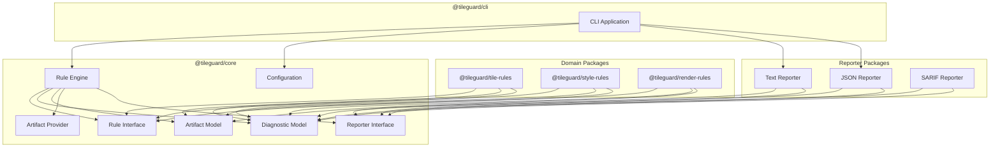
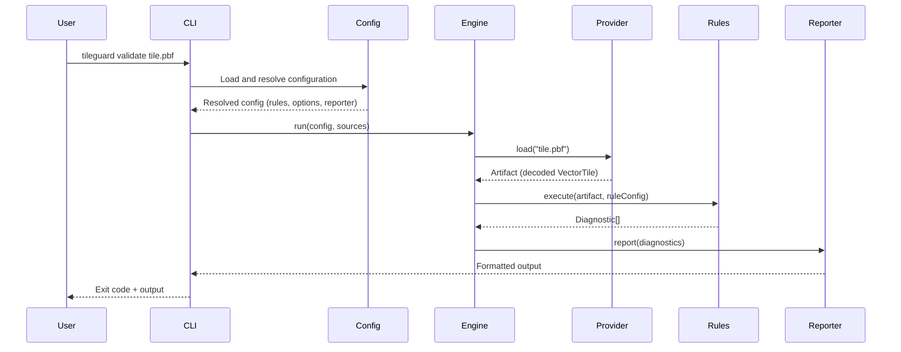

# 01 — Architecture Overview

## What TileGuard Is

TileGuard is a **geospatial quality analysis framework**. Its primary interface is a
command-line application, but the framework itself is the product. The CLI is one
consumer of the framework; CI integrations, IDE plugins, and programmatic APIs are
equally valid consumers.

The framework's responsibility is to orchestrate validation. It loads geospatial
artifacts (vector tiles, style specifications, render snapshots), routes them to
rules that understand those artifact types, collects structured diagnostics, and
hands diagnostics to reporters for presentation. The framework itself validates
nothing — rules validate everything.

This is the same separation of concerns that makes ESLint, Ruff, and Clang-Tidy
successful: the engine is stable and domain-agnostic; the validation logic is
modular, reusable, and community-extensible.

---

## Architectural Principles

These principles are ordered by priority. When two principles conflict, the
higher-numbered principle yields to the lower-numbered one.

### 1. Contracts Before Implementation

Every component interacts through explicitly defined interfaces. Implementation
details are private. Components can be replaced or rewritten without affecting
other parts of the system as long as they satisfy their interface contract.

### 2. Dependencies Point Inward
<!-- TODO: INSERT DIAGRAM 1: Monorepo Package Dependencies -->

**Image Description / Generation Prompt:** A UML Component Diagram representing the monorepo package dependency structure of TileGuard. Draw the following components as boxes: `tileguard (cli)` (at the top), `@tileguard/config` (middle-left), `@tileguard/core` (middle-right), `@tileguard/reporters` (middle-bottom), `@tileguard/tile-rules` (bottom-left), `@tileguard/style-rules` (bottom-right), and `@tileguard/shared` (bottom-middle). Draw solid arrows pointing from `tileguard (cli)` to `@tileguard/config`, `@tileguard/core`, `@tileguard/reporters`, `@tileguard/tile-rules`, and `@tileguard/style-rules`. Draw solid arrows pointing from `@tileguard/tile-rules` and `@tileguard/style-rules` to `@tileguard/core` and `@tileguard/shared`. Draw arrows pointing from `@tileguard/config` and `@tileguard/reporters` to `@tileguard/core`. Draw an arrow pointing from `@tileguard/shared` to `@tileguard/core`. Mark the arrows indicating that imports flow strictly inward, showing `@tileguard/core` as the independent kernel at the core of the dependency graph.


The dependency graph forms concentric rings. The Core package is at the center and
has zero dependencies on outer packages. Domain packages (tile-rules, style-rules)
depend on Core. The CLI depends on domain packages and Core. No package in an inner
ring may import from an outer ring.

```
┌─────────────────────────────────────────────────┐
│                     CLI                         │
│  ┌───────────────────────────────────────────┐  │
│  │            Domain Packages                │  │
│  │  (tile-rules, style-rules, render-rules)  │  │
│  │  ┌─────────────────────────────────────┐  │  │
│  │  │              Core                   │  │  │
│  │  │  Diagnostic · Artifact · Rule       │  │  │
│  │  │  Reporter · Config · Engine         │  │  │
│  │  └─────────────────────────────────────┘  │  │
│  └───────────────────────────────────────────┘  │
└─────────────────────────────────────────────────┘
```

### 3. Rules Are Pure Functions of (Artifact, Config) → Diagnostic[]

A rule receives a decoded artifact and its own configuration. It returns zero or
more diagnostics. It must not produce side effects: no console output, no file
writes, no network requests, no mutation of shared state. This makes every rule
independently testable, deterministic, and safe to run in any order or in parallel.

### 4. Diagnostics Are the Universal Language

No component produces formatted output directly. Every validation result is a
structured `Diagnostic` value. Reporters consume diagnostics and decide how to
present them. This means adding SARIF output, GitHub annotations, or IDE
integration never requires changing validation logic.

### 5. Composition Over Inheritance

Components are plain objects conforming to TypeScript interfaces. There are no
abstract base classes, no class hierarchies, no constructor injection chains. A
rule is an object with specific properties. A reporter is an object with a
`report` method. This keeps the framework approachable for contributors and
avoids the fragile base class problem.

### 6. Explicit Over Clever

Configuration is flat and declarative. Error messages explain what failed, why,
and how to fix it. APIs accept plain objects rather than builder patterns. The
framework should be understandable by reading source code, not by studying a
framework guide.

---

## Component Map



---

## The Run Pipeline
<!-- TODO: INSERT DIAGRAM 2: CLI-to-Output Flow -->

**Image Description / Generation Prompt:** A UML Sequence Diagram visualizing the end-to-end execution pipeline of TileGuard. The actors/objects from left to right are: `User/Shell`, `cli.ts (CLI Entrypoint)`, `loadConfig() (@tileguard/config)`, `Engine (@tileguard/core)`, `RulesRunner (Execution Loop)`, and `Reporters (@tileguard/reporters)`. The execution steps flow sequentially:
1. `User/Shell` runs the CLI check command.
2. `cli.ts` invokes `loadConfig()` to find and parse configuration files.
3. `loadConfig()` returns the validated `TileGuardConfig` object to `cli.ts`.
4. `cli.ts` instantiates the `Engine` with the resolved configuration.
5. `cli.ts` calls `engine.run(sources)`.
6. The `Engine` initializes the `RulesRunner` check loop.
7. The `RulesRunner` fetches and decodes tile/style artifacts, executing matching active rules for each.
8. Rules call `context.report()` to append diagnostics back to the engine.
9. The `Engine` collects all diagnostics and invokes `reporters.report(diagnostics)`.
10. `Reporters` format the diagnostic outputs and write them to the terminal or JSON file.
11. `cli.ts` exits with code 1 if errors were found, or code 0 if none.


When TileGuard executes, the following stages occur in order:



**Stage 1 — Configuration Resolution.** The CLI parses command-line arguments,
loads any configuration file, merges them, and produces a resolved configuration
object that fully describes the run: which rules are enabled, what their settings
are, which reporter to use, and which artifact sources to process.

**Stage 2 — Artifact Loading.** For each source (file path, URL, etc.), the engine
selects an appropriate Artifact Provider based on the source type. The provider
loads the raw bytes, detects the format, decodes the content, and returns a typed
Artifact value.

**Stage 3 — Rule Execution.** The engine selects all rules whose declared artifact
types match the loaded artifact. For each matching rule, it constructs a rule
context containing the artifact and the rule's configuration, then invokes the
rule. The rule returns zero or more diagnostics.

**Stage 4 — Diagnostic Collection.** The engine collects all diagnostics from all
rules across all artifacts into a single ordered list.

**Stage 5 — Reporting.** The engine passes the collected diagnostics to the
configured reporter. The reporter formats the output according to its
implementation (terminal text, JSON, SARIF, etc.).

**Stage 6 — Exit.** The CLI determines the process exit code based on diagnostic
severities (any `error` → exit 1, warnings-only → exit 0).

---

## What the Core Owns

The Core package (`@tileguard/core`) owns the following, and nothing else:

| Concept | Responsibility |
|:--------|:---------------|
| `Diagnostic` | The structured validation result type |
| `Severity` | The severity enum: `error`, `warning`, `info` |
| `Location` | An optional pointer into an artifact (layer, feature, property path) |
| `Artifact` | The base artifact type with type discriminant and metadata |
| `ArtifactProvider` | The interface for loading and decoding artifacts |
| `Rule` | The interface that all rules implement |
| `RuleMeta` | Metadata about a rule (id, description, docs URL, default severity) |
| `RuleContext` | The context object passed to a rule during execution |
| `Reporter` | The interface for diagnostic output formatters |
| `ReporterContext` | Metadata about the run available to reporters |
| `Config` | The resolved configuration type |
| `Engine` | The orchestrator that connects all components |

The Core does **not** own:
- Any specific rules (those live in domain packages)
- Any specific reporters (those live in reporter packages or the CLI)
- Any specific artifact providers (those live in domain packages)
- CLI argument parsing (that lives in the CLI package)
- Any geospatial domain knowledge

---

## What Domain Packages Own

Each domain package (e.g., `@tileguard/tile-rules`) owns:

1. **Artifact type definitions** — e.g., `VectorTileArtifact` extending the base `Artifact`
2. **Artifact providers** — e.g., a provider that reads `.pbf` files, detects gzip, decodes MVT
3. **Rules** — e.g., `tile/required-layers`, `tile/coordinate-range`, `tile/unclosed-ring`
4. **Rule pack exports** — a default export that bundles all rules from the package

Domain packages depend on `@tileguard/core` and nothing else. They must not depend
on other domain packages. A project that only uses tile validation should not need
to install the style linter.

---

## Cross-Cutting Concerns

### Error Handling

Errors fall into two categories:

1. **Infrastructure errors** — file not found, network timeout, invalid protobuf
   bytes. These are reported as diagnostics with specific error codes
   (`artifact/load-failed`, `artifact/decode-failed`). They are not thrown as
   exceptions to the caller.

2. **Framework bugs** — null reference in the engine, type mismatch in a rule.
   These are thrown as exceptions and should crash loudly. They indicate a bug in
   TileGuard itself, not a problem with the user's artifacts.

Rules must never throw exceptions during normal operation. If a rule encounters
data it cannot process, it should return a diagnostic explaining the situation
rather than crashing the run.

### Performance

The framework should support thousands of rules executing against hundreds of
artifacts without becoming a bottleneck. Key performance properties:

- Rules are stateless and can execute in parallel (future optimization)
- Artifact providers can cache decoded artifacts for re-use across rules
- The engine avoids loading artifacts that no enabled rule handles
- Diagnostic collection uses simple array accumulation, not event emitters

### Extensibility

The primary extension point is writing new rules. A rule is a plain object with
fewer than 10 required properties. Adding a new rule to an existing domain
package requires no changes to Core, the engine, the CLI, or any reporter.

Secondary extension points include custom artifact providers (for new source
types) and custom reporters (for new output formats).

---

## Relationship to Existing Code
<!-- TODO: INSERT DIAGRAM 2: CLI-to-Output Flow -->

**Image Description / Generation Prompt:** A UML Sequence Diagram visualizing the end-to-end execution pipeline of TileGuard. The actors/objects from left to right are: `User/Shell`, `cli.ts (CLI Entrypoint)`, `loadConfig() (@tileguard/config)`, `Engine (@tileguard/core)`, `RulesRunner (Execution Loop)`, and `Reporters (@tileguard/reporters)`. The execution steps flow sequentially:
1. `User/Shell` runs the CLI check command.
2. `cli.ts` invokes `loadConfig()` to find and parse configuration files.
3. `loadConfig()` returns the validated `TileGuardConfig` object to `cli.ts`.
4. `cli.ts` instantiates the `Engine` with the resolved configuration.
5. `cli.ts` calls `engine.run(sources)`.
6. The `Engine` initializes the `RulesRunner` check loop.
7. The `RulesRunner` fetches and decodes tile/style artifacts, executing matching active rules for each.
8. Rules call `context.report()` to append diagnostics back to the engine.
9. The `Engine` collects all diagnostics and invokes `reporters.report(diagnostics)`.
10. `Reporters` format the diagnostic outputs and write them to the terminal or JSON file.
11. `cli.ts` exits with code 1 if errors were found, or code 0 if none.


The current codebase (`packages/js/`, `packages/python/`) is a working procedural
prototype. It will be superseded by the framework implementation but its logic
will be preserved:

- `validate.js` → decomposed into individual rules in `@tileguard/tile-rules`
- `style-lint.js` → decomposed into individual rules in `@tileguard/style-rules`
- `pbf-decoder.js` → becomes the VectorTile artifact provider
- `geometry.js` → becomes a utility imported by geometry-related tile rules
- `reporter.js` → replaced by the `TextReporter` and `JsonReporter` implementations
- `tileguard.js` (CLI) → replaced by the `@tileguard/cli` package

The existing Python implementation will not be maintained as a parallel framework.
Python support will be provided through language bindings or an SDK that calls the
TypeScript engine. See [ADR-001](./adr/001-typescript-reference-implementation.md).

---

*Next: [02 — Diagnostic Model](./02-diagnostic-model.md)*
