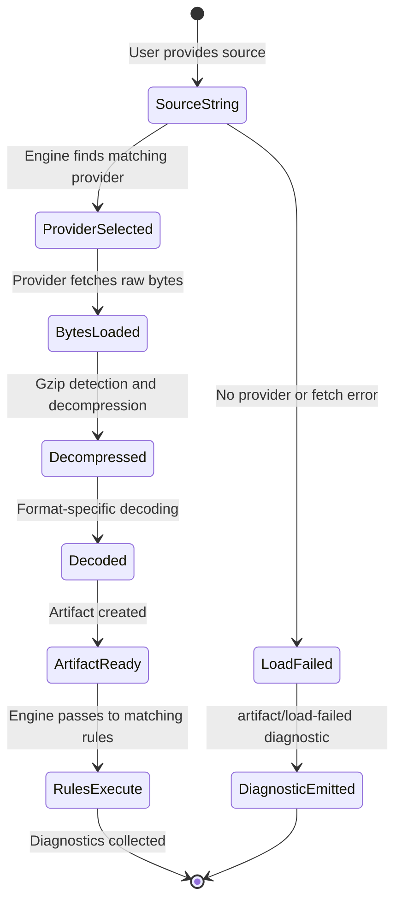

# 03 — Artifact Model

## Purpose

Artifacts are the things TileGuard validates. A vector tile is an artifact. A
MapLibre style specification is an artifact. A render snapshot is an artifact.
Future artifact types — GeoParquet schemas, PMTiles archives, Cloud-Optimized
GeoTIFFs — are equally valid.

The artifact model defines what an artifact is, how artifacts are loaded and
decoded, and how the framework stays independent of specific artifact formats.

---

## The Artifact Type

```typescript
/**
 * An Artifact is a decoded, in-memory representation of a geospatial object
 * that rules can validate. Each artifact has a type discriminant and a
 * typed content payload.
 *
 * Artifacts are the input to rules. They are created by Artifact Providers
 * and consumed by the Rule Engine.
 */
interface Artifact<T extends string = string, C = unknown> {
  /** Type discriminant. Used by the engine to match artifacts to rules.
   *  Examples: "VectorTile", "StyleSpecification", "RenderSnapshot". */
  type: T;

  /** The source this artifact was loaded from. Preserved for diagnostic
   *  reporting and caching. */
  ref: ArtifactRef;

  /** The decoded content of the artifact. The shape depends on the type.
   *  For VectorTile: decoded tile with layers, features, geometry.
   *  For StyleSpecification: parsed JSON style object.
   *  For RenderSnapshot: pixel buffer with dimensions. */
  content: C;

  /** Optional metadata about the artifact. Providers may attach
   *  information discovered during loading (file size, compression
   *  type, HTTP headers, etc.). */
  metadata?: Record<string, unknown>;
}
```

### Concrete Artifact Types

Domain packages define concrete artifact types by narrowing the generic:

```typescript
// In @tileguard/tile-rules
interface VectorTileContent {
  layers: Record<string, VectorTileLayer>;
}

interface VectorTileLayer {
  name: string;
  version: number | null;
  extent: number;
  features: VectorTileFeature[];
  keys: string[];
  values: unknown[];
}

interface VectorTileFeature {
  id?: number;
  type: number;               // 0=Unknown, 1=Point, 2=LineString, 3=Polygon
  geometryType: string;
  properties: Record<string, unknown>;
  geometry: VectorTileGeometry;
}

type VectorTileGeometry = Point[] | Point[][];
type Point = { x: number; y: number };

type VectorTileArtifact = Artifact<'VectorTile', VectorTileContent>;
```

```typescript
// In @tileguard/style-rules
interface StyleSpecificationContent {
  version: number;
  sources: Record<string, StyleSource>;
  layers: StyleLayer[];
  // ... additional style properties
}

type StyleArtifact = Artifact<'StyleSpecification', StyleSpecificationContent>;
```

```typescript
// In @tileguard/render-rules (future)
interface RenderSnapshotContent {
  width: number;
  height: number;
  pixels: Uint8Array;         // RGBA pixel data
  format: 'png';
}

type RenderSnapshotArtifact = Artifact<'RenderSnapshot', RenderSnapshotContent>;
```

These types live in their respective domain packages, not in Core. Core only
knows about `Artifact<string, unknown>`. This keeps Core free of domain knowledge.

---

## Artifact Providers
<!-- TODO: INSERT DIAGRAM 4: Dynamic Config Loader Evaluation -->

```typescript
/**
 * An ArtifactProvider loads artifacts from sources. It handles the full
 * pipeline: source detection → byte loading → format detection → decoding.
 *
 * Each provider declares which artifact types it produces and which source
 * patterns it can handle.
 */
interface ArtifactProvider {
  /** A unique identifier for this provider. Used in configuration and
   *  error messages. */
  id: string;

  /** The artifact types this provider can produce. */
  artifactTypes: string[];

  /** Returns true if this provider can handle the given source string.
   *  The engine calls this to select the appropriate provider. */
  canHandle(source: string): boolean;

  /** Loads and decodes the artifact from the given source.
   *  Returns a fully decoded Artifact ready for rule execution. */
  load(source: string, options?: ProviderOptions): Promise<Artifact>;
}

interface ProviderOptions {
  /** HTTP request timeout in milliseconds. */
  timeout?: number;

  /** Additional headers for HTTP requests. */
  headers?: Record<string, string>;
}
```

### Provider Examples

```typescript
// VectorTile provider: handles .pbf files and tile URLs
const vectorTileProvider: ArtifactProvider = {
  id: 'vector-tile',
  artifactTypes: ['VectorTile'],

  canHandle(source: string): boolean {
    return source.endsWith('.pbf')
      || source.endsWith('.mvt')
      || source.match(/\/\d+\/\d+\/\d+\.pbf$/) !== null;
  },

  async load(source: string, options?: ProviderOptions): Promise<VectorTileArtifact> {
    const bytes = await fetchBytes(source, options);
    const buffer = isGzipped(bytes) ? gunzipSync(bytes) : bytes;
    const content = decodeMvt(buffer);
    return {
      type: 'VectorTile',
      ref: { type: 'VectorTile', source },
      content,
      metadata: {
        compressed: isGzipped(bytes),
        rawSize: bytes.length,
        decodedSize: buffer.length,
      }
    };
  }
};

// Style provider: handles .json files and URLs ending in style.json
const styleProvider: ArtifactProvider = {
  id: 'style-specification',
  artifactTypes: ['StyleSpecification'],

  canHandle(source: string): boolean {
    return source.endsWith('.json') || source.endsWith('style.json');
  },

  async load(source: string): Promise<StyleArtifact> {
    const text = await readFileOrFetch(source);
    const content = JSON.parse(text);
    return {
      type: 'StyleSpecification',
      ref: { type: 'StyleSpecification', source },
      content,
    };
  }
};
```

### Provider Selection

When the engine needs to load a source, it iterates through registered providers
and calls `canHandle(source)`. The first provider that returns `true` is used.

If no provider can handle a source, the engine produces an `artifact/no-provider`
diagnostic rather than throwing an exception.

If multiple providers can handle a source, the first registered one wins. Users
can control provider priority through configuration if needed. In practice, this
is rarely ambiguous because source patterns are distinct (`.pbf` vs `.json`).

### Why Not Separate Source and Decoder?

We considered a two-stage pipeline:

```
Source (file, URL, MBTiles) → raw bytes → Decoder (MVT, JSON, PNG) → Artifact
```

This is more composable — an MBTiles source could yield bytes that the MVT decoder
handles, and a file source could yield bytes that either the MVT or JSON decoder
handles.

However, the two-stage approach creates a coordination problem: who decides which
decoder to use for which bytes? The source knows the content type (it read the
file extension or HTTP headers), but the decoder interface doesn't have access to
that information. We'd need a format detection layer between source and decoder.

The single-provider approach is simpler: each provider knows both how to fetch
and how to decode its format. If a new source type emerges (e.g., PMTiles), a
new provider handles the full pipeline for that source type.

If this decision proves limiting in the future (e.g., we need the same MVT
decoder for both .pbf files and MBTiles entries), providers can internally share
decoder utilities without exposing a two-stage pipeline to the framework.

---

## Artifact Type Registration

Domain packages export their artifact types and providers as part of their
public API:

```typescript
// @tileguard/tile-rules/index.ts
export const tilePlugin = {
  providers: [vectorTileProvider],
  rules: [requiredLayersRule, coordinateRangeRule, ...],
};
```

The CLI or programmatic API registers plugins with the engine:

```typescript
import { createEngine } from '@tileguard/core';
import { tilePlugin } from '@tileguard/tile-rules';
import { stylePlugin } from '@tileguard/style-rules';

const engine = createEngine({
  plugins: [tilePlugin, stylePlugin],
  // ...
});
```

This keeps the engine unaware of specific artifact types while allowing
domain packages to extend it with both providers and rules.

---

## Artifact Lifecycle
<!-- TODO: INSERT DIAGRAM 4: Dynamic Config Loader Evaluation -->



Key points:
- If loading fails, a diagnostic is emitted — the engine does not crash.
- If a source matches no provider, a diagnostic is emitted.
- Artifacts are created once and can be shared across multiple rules.
- Artifacts are not mutated after creation.

---

## Design Constraints

1. **Core must not import domain types.** The `Artifact` interface uses generics
   so Core can handle artifacts without knowing their concrete types.

2. **Artifacts must be synchronously accessible.** Once loaded, the artifact's
   `content` is fully decoded and in memory. Rules must not need to do additional
   I/O to access artifact data.

3. **Artifacts are read-only.** Rules receive artifacts but must not modify them.
   TypeScript's `Readonly<>` is used to signal this intent, but deep immutability
   is not enforced at runtime.

4. **Provider errors produce diagnostics, not exceptions.** A missing file or
   network error is a validation finding, not a framework crash.

---

*Previous: [02 — Diagnostic Model](./02-diagnostic-model.md) · Next: [04 — Rule System](./04-rule-system.md)*
