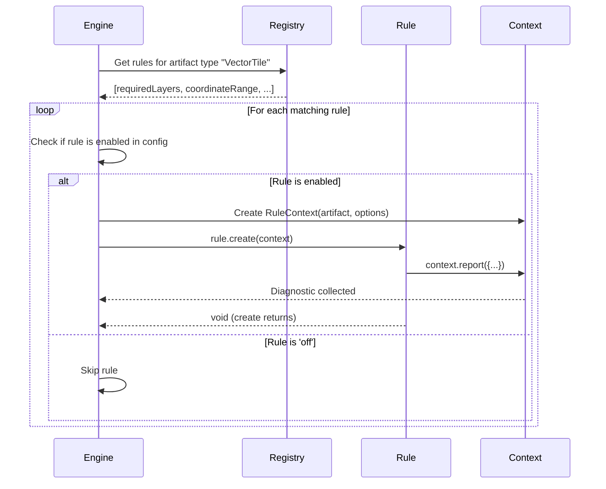

# 04 — Rule System

## Purpose

Rules are the fundamental extension mechanism of TileGuard. Every validation
concern — from "required layers must exist" to "polygon rings must be closed" —
is encapsulated in an independent rule. This document defines the rule interface,
lifecycle, context, registration, and configuration.

---

## The Rule Interface

```typescript
/**
 * A Rule is a plain object that declares its identity, metadata, and
 * validation logic. Rules are not classes — they are values conforming
 * to this interface.
 *
 * Rules are the primary extension point of TileGuard. Adding a new
 * validation check to the framework means creating a new Rule object.
 */
interface Rule<C = unknown> {
  /** Unique identifier using namespaced format: "category/rule-name".
   *  The category groups related rules (tile, style, render, project).
   *  The name describes the specific concern.
   *
   *  Examples: "tile/required-layers", "style/known-source",
   *  "render/pixel-match", "tile/coordinate-range". */
  id: string;

  /** Metadata about the rule. Displayed in help output, documentation
   *  generation, and diagnostic reports. */
  meta: RuleMeta;

  /** The artifact types this rule can validate.
   *  The engine uses this to skip rules that don't apply to the
   *  current artifact.
   *
   *  A rule that validates VectorTile artifacts declares:
   *    artifactTypes: ['VectorTile']
   *
   *  A rule that validates multiple artifact types (rare) declares:
   *    artifactTypes: ['VectorTile', 'StyleSpecification'] */
  artifactTypes: string[];

  /** Optional. A JSON Schema or validation function for this rule's
   *  configuration options. If provided, the engine validates the
   *  user's config against this schema before invoking the rule. */
  schema?: object;

  /** The validation function. Receives a context object and produces
   *  diagnostics by calling context.report().
   *
   *  This function must be pure: no side effects, no console output,
   *  no file writes, no network requests, no shared mutable state. */
  create(context: RuleContext<C>): void | Promise<void>;
}
```

---

## Rule Metadata

```typescript
/**
 * Metadata about a rule. Used for documentation, help output, and
 * reporter enrichment.
 */
interface RuleMeta {
  /** Human-readable description of what this rule checks.
   *  Example: "Ensures that all required layers are present in the tile." */
  description: string;

  /** Default severity when the user does not configure an override. */
  defaultSeverity: Severity;

  /** URL to the rule's documentation page. Automatically included
   *  in diagnostics as docsUrl. */
  docsUrl?: string;

  /** Whether this rule is recommended for inclusion in default configs.
   *  Used to build the "recommended" preset. */
  recommended?: boolean;

  /** Whether this rule supports auto-fix suggestions. */
  hasSuggestions?: boolean;

  /** Semantic version when this rule was introduced. */
  since?: string;
}
```

---

## Rule Context

```typescript
/**
 * The context object passed to a rule's create() function. Provides
 * access to the artifact being validated, the rule's configuration,
 * and a method to emit diagnostics.
 *
 * The context is the rule's entire world. Rules should not access
 * anything outside this context.
 */
interface RuleContext<C = unknown> {
  /** The artifact being validated. Typed as the base Artifact to
   *  allow Core to remain domain-agnostic. Rules should narrow
   *  the type based on their declared artifactTypes. */
  artifact: Readonly<Artifact>;

  /** The rule's configuration, as specified by the user's config
   *  file and validated against the rule's schema. If the rule
   *  has no configurable options, this is undefined. */
  options: Readonly<C> | undefined;

  /** Emits a diagnostic. The engine automatically fills in the
   *  ruleId, severity (from config or rule default), artifact ref,
   *  and docsUrl. The rule provides the message, location,
   *  suggestion, and data.
   *
   *  This is the ONLY way a rule should produce output. */
  report(descriptor: DiagnosticDescriptor): void;
}

/**
 * The subset of Diagnostic fields that a rule provides when reporting.
 * The engine fills in the remaining fields (ruleId, severity, artifact, docsUrl).
 */
interface DiagnosticDescriptor {
  message: string;
  location?: Location;
  suggestion?: string;
  data?: Record<string, unknown>;
}
```

### Why `context.report()` Instead of Return Values?

We considered having rules return `Diagnostic[]`:

```typescript
// Alternative: return-based
create(context): Diagnostic[] {
  const diagnostics: Diagnostic[] = [];
  // ... push diagnostics
  return diagnostics;
}
```

The callback pattern (`context.report()`) is preferred for several reasons:

1. **Streaming.** Rules can emit diagnostics as they find them rather than
   accumulating an array. This enables future streaming reporters that
   display results as they arrive.

2. **Automatic enrichment.** The context fills in `ruleId`, `severity`,
   `artifact`, and `docsUrl` automatically. With return values, every rule
   would need to include these fields manually — boilerplate that leads to
   errors.

3. **Consistency with ESLint.** This pattern is familiar to the millions of
   developers who have written ESLint rules. Familiarity reduces the learning
   curve for new contributors.

4. **Void return.** Rules that find no problems simply don't call
   `context.report()`. There's no need to return an empty array. The happy
   path is the simplest path.

---

## Example Rules

### tile/required-layers
<!-- TODO: INSERT DIAGRAM 1: Monorepo Package Dependencies -->

**Image Description / Generation Prompt:** A UML Component Diagram representing the monorepo package dependency structure of TileGuard. Draw the following components as boxes: `tileguard (cli)` (at the top), `@tileguard/config` (middle-left), `@tileguard/core` (middle-right), `@tileguard/reporters` (middle-bottom), `@tileguard/tile-rules` (bottom-left), `@tileguard/style-rules` (bottom-right), and `@tileguard/shared` (bottom-middle). Draw solid arrows pointing from `tileguard (cli)` to `@tileguard/config`, `@tileguard/core`, `@tileguard/reporters`, `@tileguard/tile-rules`, and `@tileguard/style-rules`. Draw solid arrows pointing from `@tileguard/tile-rules` and `@tileguard/style-rules` to `@tileguard/core` and `@tileguard/shared`. Draw arrows pointing from `@tileguard/config` and `@tileguard/reporters` to `@tileguard/core`. Draw an arrow pointing from `@tileguard/shared` to `@tileguard/core`. Mark the arrows indicating that imports flow strictly inward, showing `@tileguard/core` as the independent kernel at the core of the dependency graph.


```typescript
import type { Rule, VectorTileArtifact } from '@tileguard/core';

interface RequiredLayersOptions {
  layers: string[];
}

export const requiredLayersRule: Rule<RequiredLayersOptions> = {
  id: 'tile/required-layers',
  meta: {
    description: 'Ensures that all required layers are present in the tile.',
    defaultSeverity: 'error',
    recommended: true,
    since: '1.0.0',
  },
  artifactTypes: ['VectorTile'],
  schema: {
    type: 'object',
    properties: {
      layers: { type: 'array', items: { type: 'string' }, minItems: 1 }
    },
    required: ['layers'],
  },

  create(context) {
    const artifact = context.artifact as VectorTileArtifact;
    const requiredLayers = context.options?.layers ?? [];
    const availableLayers = Object.keys(artifact.content.layers);

    for (const layer of requiredLayers) {
      if (!artifact.content.layers[layer]) {
        context.report({
          message: `Required layer "${layer}" is not present in the tile.`,
          location: { layer },
          suggestion: `Add a "${layer}" layer to your tile generation pipeline.`,
          data: { requiredLayer: layer, availableLayers },
        });
      }
    }
  },
};
```

### tile/unclosed-ring

```typescript
export const unclosedRingRule: Rule = {
  id: 'tile/unclosed-ring',
  meta: {
    description: 'Polygon rings must be closed (first point equals last point).',
    defaultSeverity: 'error',
    recommended: true,
    since: '1.0.0',
  },
  artifactTypes: ['VectorTile'],

  create(context) {
    const artifact = context.artifact as VectorTileArtifact;

    for (const [layerName, layer] of Object.entries(artifact.content.layers)) {
      for (let fi = 0; fi < layer.features.length; fi++) {
        const feature = layer.features[fi];
        if (feature.type !== 3) continue; // Only polygons

        const parts = feature.geometry as Point[][];
        for (let pi = 0; pi < parts.length; pi++) {
          const ring = parts[pi];
          if (ring.length < 2) continue;
          const first = ring[0];
          const last = ring[ring.length - 1];
          if (first.x !== last.x || first.y !== last.y) {
            context.report({
              message: `Polygon ring is not closed in layer "${layerName}", feature ${fi}.`,
              location: { layer: layerName, featureIndex: fi, partIndex: pi },
              suggestion: 'Ensure the last coordinate of each polygon ring matches the first.',
            });
          }
        }
      }
    }
  },
};
```

### style/known-source

```typescript
export const knownSourceRule: Rule = {
  id: 'style/known-source',
  meta: {
    description: 'Layer source references must point to declared sources.',
    defaultSeverity: 'error',
    recommended: true,
    since: '1.0.0',
  },
  artifactTypes: ['StyleSpecification'],

  create(context) {
    const style = (context.artifact as StyleArtifact).content;
    const sourceIds = new Set(Object.keys(style.sources ?? {}));

    for (let i = 0; i < (style.layers ?? []).length; i++) {
      const layer = style.layers[i];
      if (layer.source && !sourceIds.has(layer.source)) {
        context.report({
          message: `Layer "${layer.id}" references unknown source "${layer.source}".`,
          location: { jsonPath: `layers[${i}].source` },
          suggestion: `Add "${layer.source}" to the top-level sources object, or fix the source reference.`,
          data: { layerId: layer.id, source: layer.source, availableSources: [...sourceIds] },
        });
      }
    }
  },
};
```

---

## Rule Granularity
<!-- TODO: INSERT DIAGRAM 8: Polygon Topology Sanity Checks -->

**Image Description / Generation Prompt:** A decision tree diagram mapping out the polygon topology sanity validation checks executed in `geometry.ts`.
1. Input: A sequence of coordinate vertices representing a polygon ring.
2. Condition 1: "Does the ring contain at least 3 unique vertices and 4 total points?"
   - No: Emit `DEGENERATE_POLYGON` diagnostic.
   - Yes: Proceed to next check.
3. Condition 2: "Is the first vertex identical to the last vertex (closure check)?"
   - No: Emit `UNCLOSED_RING` diagnostic.
   - Yes: Proceed to next check.
4. Condition 3: "Is the absolute signed area of the ring greater than zero (using Shoelace formula)?"
   - No: Emit `ZERO_AREA_RING` diagnostic.
   - Yes: The polygon ring is considered topologically sound (Pass).

<!-- TODO: INSERT DIAGRAM 10: Segment Orientation Self-Intersection Check -->

**Image Description / Generation Prompt:** A vector geometry diagram explaining the segment orientation tests used to determine if two line segments AB and CD intersect without using float division.
1. Show two intersecting line segments AB and CD on a 2D plane.
2. Write the 2D cross-product orientation formula: val = (B_y - A_y)(C_x - B_x) - (B_x - A_x)(C_y - B_y).
3. Render three diagrams representing the three possible orientation outputs:
   - val > 0: Clockwise curvature.
   - val < 0: Counter-clockwise curvature.
   - val = 0: Collinear segments.
4. Intersection Condition: Show that segments AB and CD intersect if and only if the orientation of (A, B, C) and (A, B, D) have different signs, AND the orientation of (C, D, A) and (C, D, B) have different signs.


Each rule validates **exactly one concern**. This is a deliberate design decision
with significant trade-offs.

### Why Fine-Grained Rules

The existing codebase has a single `GEOMETRY_INVALID` error code that wraps
coordinate range errors, degenerate geometries, unclosed rings, zero-area rings,
and self-intersections. In the framework, each of these becomes a separate rule:

| Rule ID | Concern |
|:--------|:--------|
| `tile/coordinate-range` | Coordinates within tile extent |
| `tile/degenerate-geometry` | Minimum vertex count for geometry types |
| `tile/unclosed-ring` | Polygon ring closure |
| `tile/zero-area-ring` | Non-zero polygon area |
| `tile/self-intersection` | No segment self-intersections |

**Benefits of fine granularity:**

1. **Per-rule configuration.** A project can disable `tile/self-intersection`
   (expensive, sometimes false-positive) while keeping `tile/unclosed-ring`.
2. **Per-rule severity.** Self-intersections might be warnings in one project
   and errors in another.
3. **Clear diagnostics.** Each diagnostic has a specific rule ID that maps to
   specific documentation.
4. **Independent testing.** Each rule can be tested in isolation with minimal
   fixtures.

**Cost of fine granularity:**

1. **Performance.** Five rules iterating over all features in all layers instead
   of one rule doing all geometry checks in a single pass. This is mitigated by
   the fact that decoded geometry is shared across rules (the artifact is loaded
   once).
2. **Boilerplate.** Each rule has its own `id`, `meta`, `artifactTypes`, and
   `create` function. This is minimal — roughly 15-25 lines per rule.

We accept this cost. Configurability and clarity are more valuable than saving
a few microseconds of iteration time. If performance becomes a measured problem,
the engine can batch geometry rules into a single traversal pass as an
optimization — but this should be an engine optimization, not a rule design
constraint.

---

## Rule Registration and Discovery

Rules are registered with the engine through plugins:

```typescript
// Plugin: a bundle of providers and rules
interface Plugin {
  /** Plugin identifier. */
  id: string;

  /** Artifact providers contributed by this plugin. */
  providers?: ArtifactProvider[];

  /** Rules contributed by this plugin. */
  rules?: Rule[];
}

// Registration
const engine = createEngine({
  plugins: [tilePlugin, stylePlugin],
});
```

The engine extracts all rules from all plugins and indexes them by artifact type
for efficient lookup during execution.

### Why Not File-System Discovery?

ESLint discovers rules by scanning file system paths and requiring modules. This
is flexible but creates several problems:

1. **Implicit dependencies.** A missing rule file causes a runtime error rather
   than a compile-time error.
2. **Dynamic imports.** ESLint's flat config moved away from file-system
   discovery precisely because it was fragile and hard to reason about.
3. **Performance.** Scanning directories and requiring modules at startup is
   slow.

TileGuard uses explicit registration. If you want tile rules, you import
`@tileguard/tile-rules` and pass it to the engine. This is type-safe,
tree-shakeable, and has zero ambiguity.

---

## Rule Configuration

Users configure rules in their configuration file:

```typescript
// tileguard.config.ts
export default {
  rules: {
    'tile/required-layers': ['error', { layers: ['water', 'roads', 'buildings'] }],
    'tile/self-intersection': 'warning',
    'tile/coordinate-range': 'error',
    'tile/no-empty': 'off',
  }
};
```

Each rule entry is either:
- A `Severity` string (`'error'`, `'warning'`, `'info'`, `'off'`)
- A tuple of `[Severity, Options]` where Options is the rule-specific config

The engine resolves the final severity:
1. If the user specified a severity → use it
2. If `'off'` → skip this rule entirely
3. If unspecified → use `meta.defaultSeverity`

Rule options are validated against the rule's `schema` (if provided) before
execution. Invalid options produce a configuration error, not a runtime crash.

---

## Rule Lifecycle
<!-- TODO: INSERT DIAGRAM 2: CLI-to-Output Flow -->

**Image Description / Generation Prompt:** A UML Sequence Diagram visualizing the end-to-end execution pipeline of TileGuard. The actors/objects from left to right are: `User/Shell`, `cli.ts (CLI Entrypoint)`, `loadConfig() (@tileguard/config)`, `Engine (@tileguard/core)`, `RulesRunner (Execution Loop)`, and `Reporters (@tileguard/reporters)`. The execution steps flow sequentially:
1. `User/Shell` runs the CLI check command.
2. `cli.ts` invokes `loadConfig()` to find and parse configuration files.
3. `loadConfig()` returns the validated `TileGuardConfig` object to `cli.ts`.
4. `cli.ts` instantiates the `Engine` with the resolved configuration.
5. `cli.ts` calls `engine.run(sources)`.
6. The `Engine` initializes the `RulesRunner` check loop.
7. The `RulesRunner` fetches and decodes tile/style artifacts, executing matching active rules for each.
8. Rules call `context.report()` to append diagnostics back to the engine.
9. The `Engine` collects all diagnostics and invokes `reporters.report(diagnostics)`.
10. `Reporters` format the diagnostic outputs and write them to the terminal or JSON file.
11. `cli.ts` exits with code 1 if errors were found, or code 0 if none.




1. **Selection.** The engine queries the registry for all rules matching the
   current artifact type.
2. **Filtering.** Rules configured as `'off'` are skipped.
3. **Context Creation.** For each active rule, the engine creates a fresh
   `RuleContext` with the artifact and the rule's resolved options.
4. **Execution.** The engine calls `rule.create(context)`. The rule calls
   `context.report()` zero or more times.
5. **Collection.** Each `context.report()` call creates a `Diagnostic` and
   adds it to the engine's accumulator.

Rules may be async (`create` returns a `Promise<void>`). The engine awaits each
rule's completion before moving to the next. Future optimization: rules that
declare no shared state could run in parallel.

---

## Rule ID Naming Convention

Rule IDs follow the pattern `category/rule-name`:

| Category | Scope |
|:---------|:------|
| `tile/` | Vector tile structure and content |
| `style/` | MapLibre style specification |
| `render/` | Visual regression and pixel comparison |
| `artifact/` | Artifact loading and decoding (framework-level) |
| `project/` | Project-specific custom rules |

Rule names use kebab-case: `required-layers`, `coordinate-range`, `known-source`.

This convention:
- Groups related rules visually in configuration files
- Prevents name collisions between domain packages
- Enables glob patterns in configuration: `{ 'tile/*': 'error' }`

---

## Comparison with ESLint

| Aspect | ESLint | TileGuard |
|:-------|:-------|:----------|
| Rule signature | `create(context) → listeners` | `create(context) → void` |
| Traversal | Visitor pattern over AST nodes | Direct artifact access |
| Diagnostic emission | `context.report()` | `context.report()` |
| Configuration | `[severity, options]` tuple | `[severity, options]` tuple |
| Registration | File-system discovery or flat config | Explicit plugin registration |
| Schema validation | JSON Schema for options | JSON Schema for options |
| Async rules | Not supported | Supported (Promise) |

The most significant difference is traversal. ESLint rules subscribe to AST node
types (`FunctionDeclaration`, `IfStatement`) and the engine calls the listener
when that node type is encountered during tree walking. TileGuard rules receive
the full artifact and traverse it themselves.

See [ADR-004](./adr/004-direct-artifact-access.md) for the detailed rationale
behind direct artifact access over the visitor pattern.

---

*Previous: [03 — Artifact Model](./03-artifact-model.md) · Next: [05 — Reporter System](./05-reporter-system.md)*
