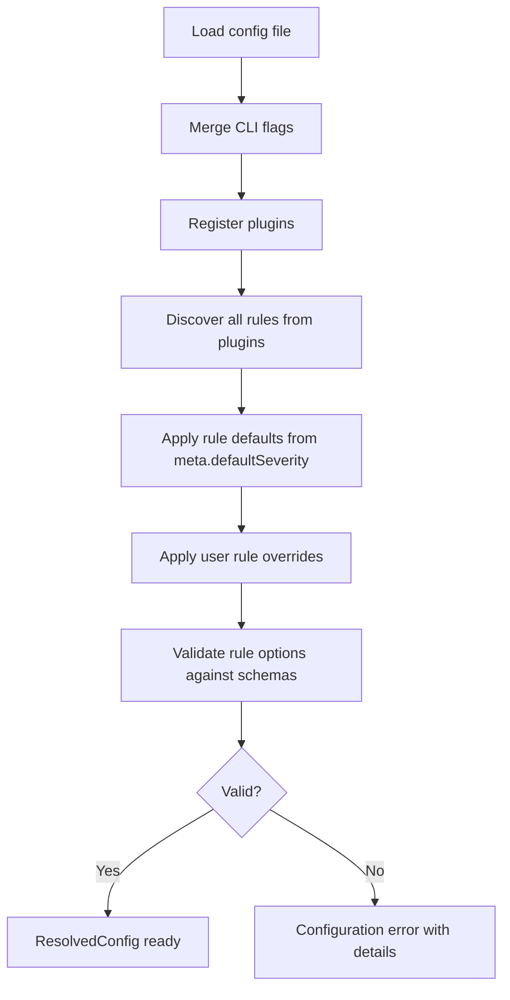

# 06 — Configuration

## Purpose

The configuration system allows users to customize TileGuard's behavior
per-project: which rules are enabled, at what severity, with what options,
and which reporter to use. Configuration should be simple, flat, and
predictable.

---

## Configuration File
<!-- TODO: INSERT DIAGRAM 1: Monorepo Package Dependencies -->

TileGuard supports a single configuration file at the project root:

```
tileguard.config.ts    ← TypeScript (preferred, type-safe)
tileguard.config.js    ← JavaScript (ESM)
tileguard.config.json  ← JSON (no comments, no logic)
```

The engine looks for these files in order and uses the first one found.
If no config file exists, the engine runs with default settings (all
recommended rules at their default severity).

### Why a Single File

ESLint's legacy configuration system (`.eslintrc`, `.eslintrc.js`,
`.eslintrc.json`, `.eslintrc.yml`, plus `package.json` `eslintConfig`
field, plus directory-level cascading) was a persistent source of
confusion. Users encountered unexpected behavior because of config
files in parent directories, surprising merge semantics, and ambiguous
resolution order.

ESLint's flat config migration (2023-2024) was one of the largest
breaking changes in the project's history, undertaken specifically to
eliminate this complexity.

TileGuard learns from this. One file, one location, no cascading. If a
monorepo needs different configurations for different directories, it
uses the `overrides` mechanism within that single file (see below).

---

## Configuration Shape

```typescript
/**
 * The user-facing configuration type. This is what tileguard.config.ts
 * exports.
 */
interface TileGuardConfig {
  /** Plugins to load. Each plugin contributes providers and rules. */
  plugins?: Plugin[];

  /** Rule configuration. Keys are rule IDs, values are severity or
   *  [severity, options] tuples. */
  rules?: Record<string, RuleConfig>;

  /** Reporter to use. Default: "text". */
  reporter?: string | [string, Record<string, unknown>];

  /** Path-specific overrides. Allows different rule configs for
   *  different file patterns. */
  overrides?: Override[];

  /** Global options that apply to all rules and providers. */
  options?: GlobalOptions;
}

/** A rule's configuration: severity alone, or severity + options. */
type RuleConfig =
  | Severity
  | 'off'
  | [Severity, unknown];

/** Path-specific configuration override. */
interface Override {
  /** Glob patterns to match against artifact source paths. */
  files: string[];

  /** Rule overrides for matching files. */
  rules?: Record<string, RuleConfig>;
}

/** Global options available to providers and the engine. */
interface GlobalOptions {
  /** HTTP timeout for remote artifact loading, in milliseconds. */
  timeout?: number;

  /** Maximum number of diagnostic details to include per rule. */
  maxDetails?: number;

  /** Hard cap for all diagnostics, including the truncation notice. */
  maxDiagnostics?: number;
}
```

---

## Example Configurations

### Minimal

```typescript
// tileguard.config.ts
import { tilePlugin } from '@tileguard/tile-rules';

export default {
  plugins: [tilePlugin],
};
// Uses all recommended rules at default severities.
```

### Typical Project

```typescript
// tileguard.config.ts
import { tilePlugin } from '@tileguard/tile-rules';
import { stylePlugin } from '@tileguard/style-rules';

export default {
  plugins: [tilePlugin, stylePlugin],
  rules: {
    'tile/required-layers': ['error', { layers: ['water', 'roads', 'buildings'] }],
    'tile/feature-count': ['warning', { min: 1, max: 50000 }],
    'tile/self-intersection': 'warning',      // downgrade from error
    'tile/no-empty': 'off',                    // disable
    'style/known-source': 'error',
    'style/no-deprecated-ref': 'error',        // upgrade from warning
  },
  reporter: 'text',
};
```

### Monorepo with Overrides

```typescript
// tileguard.config.ts
import { tilePlugin } from '@tileguard/tile-rules';
import { stylePlugin } from '@tileguard/style-rules';

export default {
  plugins: [tilePlugin, stylePlugin],
  rules: {
    'tile/required-layers': ['error', { layers: ['water', 'roads'] }],
  },
  overrides: [
    {
      files: ['fixtures/experimental/**'],
      rules: {
        'tile/self-intersection': 'off',
        'tile/required-layers': ['warning', { layers: ['water'] }],
      },
    },
  ],
};
```

### JSON Configuration

```json
{
  "rules": {
    "tile/required-layers": ["error", { "layers": ["water", "roads"] }],
    "tile/self-intersection": "warning"
  },
  "reporter": "json"
}
```

JSON configs cannot import plugins — they use string-based plugin references
that the engine resolves. This is less type-safe but acceptable for simple
projects.

---

## Configuration Resolution
<!-- TODO: INSERT DIAGRAM 3: Upward Configuration Discovery Walk -->
<!-- TODO: INSERT DIAGRAM 5: Non-Short-Circuiting Schema Validation -->

When the engine starts, it resolves configuration through these steps:



**Step 1: Load config file.** Find and parse `tileguard.config.ts/js/json`.

**Step 2: Merge CLI flags.** CLI arguments (e.g., `--reporter json`) override
config file values. CLI is always highest priority.

**Step 3: Register plugins.** Iterate `config.plugins`, extract providers and
rules, register with engine.

**Step 4: Discover rules.** Build a map of all available rules from all plugins.

**Step 5: Apply defaults.** For each discovered rule, set severity to
`meta.defaultSeverity` unless it is not `recommended` (non-recommended rules
default to `'off'`).

**Step 6: Apply user overrides.** Merge user-specified `rules` entries on top
of defaults.

**Step 7: Compile path overrides.** Compile each override's file globs and
resolve its rule deltas. Matching and merging still happen per source.

**Step 8: Validate.** For each rule with user-provided options, validate
against the rule's JSON schema. Report all validation errors at once rather
than failing on the first one.

### Resolved Configuration

```typescript
/**
 * The fully resolved configuration after merging defaults, user config,
 * and CLI flags. This is what the engine uses internally.
 */
interface ResolvedConfig {
  /** All registered rules with their resolved severities and options. */
  rules: Map<string, ResolvedRuleConfig>;

  /** All registered artifact providers. */
  providers: ArtifactProvider[];

  /** The resolved reporter. */
  reporter: Reporter;

  /** Resolved global options. */
  options: Required<GlobalOptions>;

  /** Compiled path overrides, evaluated per source in declaration order. */
  overrides: ResolvedOverride[];
}

interface ResolvedRuleConfig {
  rule: Rule;
  severity: Severity;
  options: unknown;
  enabled: boolean;
}

interface ResolvedOverride {
  matches(source: string): boolean;
  rules: ReadonlyMap<string, ResolvedRuleOverride>;
}
```

---

## Presets

Presets are named collections of rule configurations. They are syntactic
sugar for common patterns:

```typescript
// @tileguard/tile-rules exports a recommended preset
export const recommended = {
  'tile/required-layers': 'error',
  'tile/coordinate-range': 'error',
  'tile/degenerate-geometry': 'error',
  'tile/unclosed-ring': 'error',
  'tile/zero-area-ring': 'error',
  'tile/self-intersection': 'error',
  'tile/feature-count': 'warning',
  'tile/no-empty': 'warning',
};

// User applies preset and overrides specific rules
export default {
  plugins: [tilePlugin],
  rules: {
    ...recommended,
    'tile/self-intersection': 'off',
  },
};
```

Presets are plain objects. They are not a special framework concept — they
are just `Record<string, RuleConfig>` values that happen to be exported
by domain packages. This keeps the configuration system simple and avoids
the abstraction weight of ESLint's "extends" mechanism.

---

## What Configuration Does Not Do
<!-- TODO: INSERT DIAGRAM 4: Dynamic Config Loader Evaluation -->

1. **No directory cascading.** There is exactly one config file per project.
   Use `overrides` with glob patterns for path-specific configuration.

2. **No implicit plugin loading.** Plugins must be explicitly listed. The
   engine does not scan `node_modules` for packages matching a naming
   convention.

3. **No runtime rule creation.** Rules are defined in code, not in config
   files. The config file enables, disables, and configures rules — it does
   not define new validation logic.

4. **No environment-based config.** There is no `env` or `globals` concept.
   If future needs arise, `overrides` with file patterns are sufficient.

---

*Previous: [05 — Reporter System](./05-reporter-system.md) · Next: [07 — Engine](./07-engine.md)*
