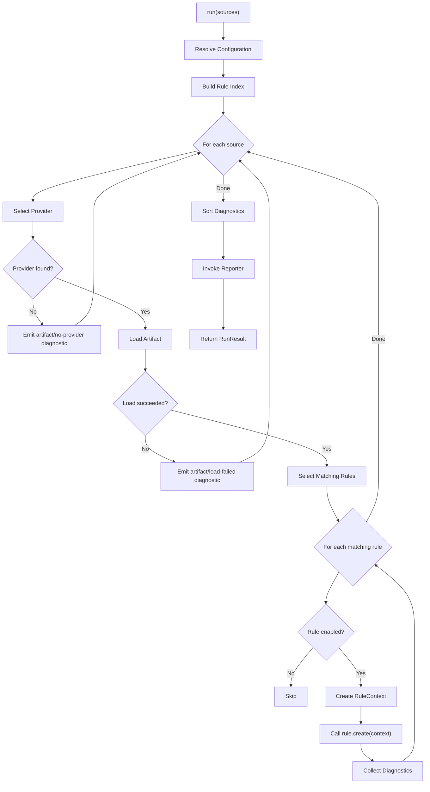

# 07 — Engine

## Purpose

The Engine is the core orchestrator of TileGuard. It connects configuration,
artifact providers, rules, and reporters into a coherent execution pipeline.
The engine itself has no knowledge of geospatial formats, specific rules, or
output formats. It is a generic quality analysis runner.

---

## The Engine Interface
<!-- TODO: INSERT DIAGRAM 1: Monorepo Package Dependencies -->

**Image Description / Generation Prompt:** A UML Component Diagram representing the monorepo package dependency structure of TileGuard. Draw the following components as boxes: `tileguard (cli)` (at the top), `@tileguard/config` (middle-left), `@tileguard/core` (middle-right), `@tileguard/reporters` (middle-bottom), `@tileguard/tile-rules` (bottom-left), `@tileguard/style-rules` (bottom-right), and `@tileguard/shared` (bottom-middle). Draw solid arrows pointing from `tileguard (cli)` to `@tileguard/config`, `@tileguard/core`, `@tileguard/reporters`, `@tileguard/tile-rules`, and `@tileguard/style-rules`. Draw solid arrows pointing from `@tileguard/tile-rules` and `@tileguard/style-rules` to `@tileguard/core` and `@tileguard/shared`. Draw arrows pointing from `@tileguard/config` and `@tileguard/reporters` to `@tileguard/core`. Draw an arrow pointing from `@tileguard/shared` to `@tileguard/core`. Mark the arrows indicating that imports flow strictly inward, showing `@tileguard/core` as the independent kernel at the core of the dependency graph.


```typescript
/**
 * Creates a configured engine instance ready for execution.
 */
function createEngine(config: TileGuardConfig): Engine;

/**
 * The Engine orchestrates a complete validation run.
 */
interface Engine {
  /** Executes validation on the given sources.
   *
   *  This is the primary entry point. It:
   *  1. Resolves configuration
   *  2. Loads artifacts from sources
   *  3. Executes matching rules against each artifact
   *  4. Collects diagnostics
   *  5. Invokes the reporter
   *  6. Returns a summary
   *
   *  @param sources - File paths, URLs, or other source identifiers.
   *  @returns Run result containing all diagnostics and summary statistics.
   */
  run(sources: string[]): Promise<RunResult>;
}

/**
 * The result of a complete engine run.
 */
interface RunResult {
  /** All diagnostics produced during the run, in order. */
  diagnostics: Diagnostic[];

  /** Summary statistics. */
  summary: RunSummary;
}

interface RunSummary {
  /** Total diagnostics by severity. */
  errors: number;
  warnings: number;
  infos: number;

  /** Number of sources processed. */
  sourceCount: number;

  /** Number of artifacts successfully loaded. */
  artifactCount: number;

  /** Number of rules executed (total across all artifacts). */
  ruleExecutions: number;

  /** Wall-clock duration of the entire run in milliseconds. */
  duration: number;

  /** Whether the run "passed" (no errors). */
  pass: boolean;
}
```

---

## Execution Pipeline
<!-- TODO: INSERT DIAGRAM 2: CLI-to-Output Flow -->

**Image Description / Generation Prompt:** A UML Sequence Diagram visualizing the end-to-end execution pipeline of TileGuard. The actors/objects from left to right are: `User/Shell`, `cli.ts (CLI Entrypoint)`, `loadConfig() (@tileguard/config)`, `Engine (@tileguard/core)`, `RulesRunner (Execution Loop)`, and `Reporters (@tileguard/reporters)`. The execution steps flow sequentially:
1. `User/Shell` runs the CLI check command.
2. `cli.ts` invokes `loadConfig()` to find and parse configuration files.
3. `loadConfig()` returns the validated `TileGuardConfig` object to `cli.ts`.
4. `cli.ts` instantiates the `Engine` with the resolved configuration.
5. `cli.ts` calls `engine.run(sources)`.
6. The `Engine` initializes the `RulesRunner` check loop.
7. The `RulesRunner` fetches and decodes tile/style artifacts, executing matching active rules for each.
8. Rules call `context.report()` to append diagnostics back to the engine.
9. The `Engine` collects all diagnostics and invokes `reporters.report(diagnostics)`.
10. `Reporters` format the diagnostic outputs and write them to the terminal or JSON file.
11. `cli.ts` exits with code 1 if errors were found, or code 0 if none.

<!-- TODO: INSERT DIAGRAM 3: Upward Configuration Discovery Walk -->

**Image Description / Generation Prompt:** A control flowchart explaining the directory-proximity-first configuration discovery walk performed by `finder.ts`. Start with a node "Start at current working directory (CWD)". For each directory level:
1. Loop through the ordered list of configuration file names: `tileguard.config.ts`, `tileguard.config.js`, `tileguard.config.mjs`, then `tileguard.config.json`.
2. Decision: "Does the current file candidate exist in this directory?"
   - Yes: Immediately return the absolute path of this file (Stop).
   - No: Move to the next candidate in the priority list.
3. Once all candidates at the current directory level are exhausted:
4. Decision: "Has the traversal hit the stopAt boundary or the file system root?"
   - Yes: Stop and return `undefined` (no configuration found).
   - No: Move up to the parent directory (`dir = parent`) and repeat the search for candidates.
This flowchart must emphasize that directory level proximity is checked completely before moving up a directory, meaning a `.json` file at a lower directory level will be found instead of a `.ts` file at a higher parent level.


The engine's `run()` method executes a deterministic pipeline:



### Stage 1: Configuration Resolution

See [06 — Configuration](./06-configuration.md). The engine resolves the
full configuration once at the start of the run. This produces a
`ResolvedConfig` containing all enabled rules with their severities and
options, all registered providers, and the selected reporter.

### Stage 2: Rule Index

The engine builds an index mapping artifact types to lists of enabled rules:

```typescript
// Internal structure
Map<string, ResolvedRuleConfig[]>
// Example:
// "VectorTile" → [requiredLayers, coordinateRange, unclosedRing, ...]
// "StyleSpecification" → [knownSource, zoomRange, uniqueLayerId, ...]
```

This avoids scanning all rules for every artifact.

### Stage 3: Artifact Loading

For each source string, the engine iterates registered providers and calls
`provider.canHandle(source)`. The first provider that returns `true` is used
to load the artifact.

If no provider matches, the engine emits an `artifact/no-provider` diagnostic
and continues to the next source. The run does not abort.

If loading fails (file not found, network error, decode error), the engine
emits an `artifact/load-failed` diagnostic and continues. This is important:
a single bad file should not prevent validation of all other files.

All infrastructure diagnostics use the same `maxDiagnostics` budget as rule
diagnostics. Once the hard cap is reached, the final slot contains
`engine/max-diagnostics` and the engine stops dispatching further work.

### Stage 4: Rule Execution
<!-- TODO: INSERT DIAGRAM 4: Dynamic Config Loader Evaluation -->

**Image Description / Generation Prompt:** A UML Activity Diagram illustrating the dynamic file format evaluation and loading execution paths in `loader.ts`. The process accepts an absolute file path.
1. Branch: Check the file extension.
2. If the extension is `.json`:
   - Read the file using `fs.readFileSync`.
   - Parse the contents using `JSON.parse`.
   - Validate that the parsed value is a plain object.
   - If any parsing/reading fails, catch the error, wrap it in a `ConfigLoadError` using ES2022 cause chaining, and throw.
3. If the extension is `.ts`, `.js`, or `.mjs`:
   - Load the file dynamically using `jiti`'s runtime compiler (`jiti.import`).
   - Verify that the module namespace has a `default` property (`'default' in module`).
   - Extract the default export value as the configuration object.
   - Validate that the value is a plain object.
   - If loading or validation fails, catch the error, wrap it in a `ConfigLoadError` with ES2022 cause chaining, and throw.
4. Output the loaded configuration object.

<!-- TODO: INSERT DIAGRAM 5: Non-Short-Circuiting Schema Validation -->

**Image Description / Generation Prompt:** An activity flowchart demonstrating the parallel non-short-circuiting configuration schema validation logic in `validator.ts`.
1. Start with the incoming configuration object.
2. Check: "Is the root configuration a plain object?"
   - No: Throw `ConfigValidationError` immediately (fast-fail root check).
   - Yes: Proceed to run validation sub-checkers.
3. Perform the following checks concurrently without stopping on failures:
   - `validatePlugins`: Check that plugins are not defined in JSON config files.
   - `validateRules`: Verify the syntax of rules, severities, and options shapes.
   - `validateReporters`: Verify reporter configurations (strings or tuples).
   - `validateOverrides`: Validate file globs and rule override maps.
   - `checkUnknownKeys`: Detect extraneous properties and collect warning diagnostics.
4. Aggregation Step: Accumulate all collected validation errors and warnings.
5. Decision: "Are there any errors in the accumulated list?"
   - Yes: Throw a single `ConfigValidationError` containing the complete list of errors and warnings.
   - No: Return the verified configuration object alongside any advisory warnings.


For each successfully loaded artifact, the engine looks up matching rules
in the rule index using `artifact.type`. Before that lookup, it applies every
path override matching the source, in declaration order. For each matching,
enabled rule:

1. Create a `RuleContext` with the artifact and the rule's resolved options.
2. Call `rule.create(context)`.
3. If `create` returns a Promise, await it.
4. Collect any diagnostics emitted via `context.report()`.

The engine wraps each rule invocation in error handling. If a rule throws an
unexpected exception:
- The engine catches the error.
- It emits an internal `engine/rule-error` diagnostic with the error details.
- It continues executing remaining rules.
- A rule bug must never crash the entire run.

### Stage 5: Diagnostic Ordering

After all rules have executed across all artifacts, the engine sorts
diagnostics in a deterministic order:

1. By artifact source (alphabetical)
2. By severity (error → warning → info)
3. By rule ID (alphabetical)
4. By location (layer → feature index → part index)

This ordering is deterministic regardless of rule execution order, which
is important for snapshot testing and reproducible CI output.

### Stage 6: Reporting

The engine constructs a `ReporterContext` with run metadata and invokes:

```typescript
await reporter.report(diagnostics, reporterContext);
```

### Stage 7: Result

The engine returns a `RunResult` containing all diagnostics and a summary.
The caller (CLI or programmatic API) uses `summary.pass` to determine the
exit code.

---

## Error Handling Philosophy

The engine distinguishes three categories of errors:

| Category | Example | Handling |
|:---------|:--------|:---------|
| **Validation finding** | Missing layer, unclosed ring | Normal diagnostic |
| **Infrastructure error** | File not found, network timeout | Diagnostic with `artifact/` rule ID |
| **Framework bug** | Null reference in engine, invalid rule interface | Error diagnostic + continue |

The engine never throws exceptions to its caller during normal operation.
Everything is reported through diagnostics. The only exceptions the caller
might see are truly catastrophic failures (out of memory, config file
syntax error that prevents the run from starting).

---

## Concurrency Model

The initial implementation is sequential: sources are processed one at a time,
rules execute one at a time within each source. This is the simplest correct
implementation.

The architecture supports future parallelism without interface changes:

- **Artifact loading** can be parallelized (I/O-bound).
- **Rule execution** can be parallelized for rules that handle the same artifact,
  because rules are stateless and share nothing.
- **Reporting** must remain sequential (reporters write to stdout/files).

Parallelism is an optimization that should be driven by measured performance
problems, not speculative design. The sequential model is correct, predictable,
and sufficient for typical project sizes.

---

## Engine Configuration

The engine itself has minimal configuration. Most configuration is delegated
to rules (via rule options) and reporters (via reporter options). The engine
only controls:

- **Source ordering** — whether to process sources in argument order or
  sorted alphabetically (default: argument order).
- **Fail fast** — whether to stop after the first error (default: false,
  validate all sources).
- **Max diagnostics** — upper limit on total diagnostics to prevent
  runaway output (default: 1000).

---

## Programmatic API

The engine is designed for programmatic use, not just CLI invocation:

```typescript
import { createEngine } from '@tileguard/core';
import { tilePlugin } from '@tileguard/tile-rules';

const engine = createEngine({
  plugins: [tilePlugin],
  rules: {
    'tile/required-layers': ['error', { layers: ['water', 'roads'] }],
  },
  reporter: 'json',
});

const result = await engine.run(['./tiles/14/8741/5321.pbf']);

console.log(result.summary.pass);      // true or false
console.log(result.diagnostics.length); // number of findings
```

This enables:
- Integration tests that validate tiles programmatically
- Custom scripts that process diagnostics
- IDE integrations that run TileGuard on file save
- Watch mode implementations

---

*Previous: [06 — Configuration](./06-configuration.md) · Next: [08 — Package Structure](./08-package-structure.md)*
