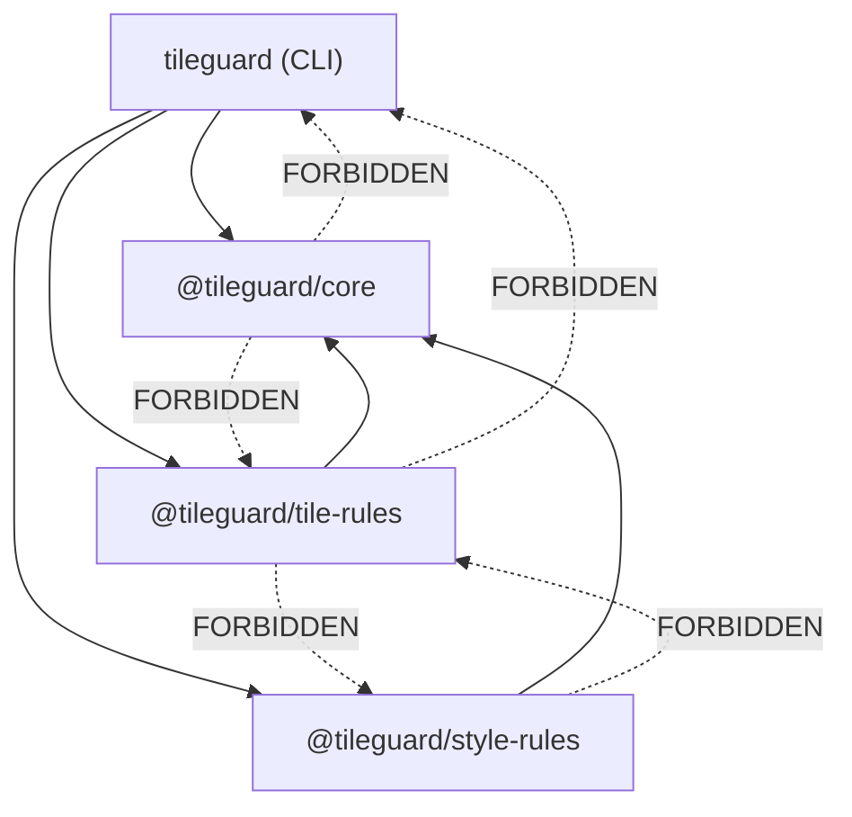

# 08 — Package Structure

## Purpose

This document defines the monorepo layout, package boundaries, dependency
rules, and build tooling for TileGuard. Package structure is an architectural
decision, not an implementation detail — it determines what can depend on
what, what ships independently, and what users need to install.

---

## Monorepo Layout

```
tileguard/
├── packages/
│   ├── core/                       ← @tileguard/core
│   │   ├── src/
│   │   │   ├── index.ts            ← Public API exports
│   │   │   ├── diagnostic.ts       ← Diagnostic, Severity, Location, ArtifactRef
│   │   │   ├── artifact.ts         ← Artifact, ArtifactProvider
│   │   │   ├── rule.ts             ← Rule, RuleMeta, RuleContext
│   │   │   ├── reporter.ts         ← Reporter, ReporterContext
│   │   │   ├── config.ts           ← TileGuardConfig, ResolvedConfig
│   │   │   ├── engine.ts           ← createEngine, Engine, RunResult
│   │   │   └── plugin.ts           ← Plugin interface
│   │   ├── tests/
│   │   ├── package.json
│   │   └── tsconfig.json
│   │
│   ├── tile-rules/                  ← @tileguard/tile-rules
│   │   ├── src/
│   │   │   ├── index.ts            ← Plugin export + all rules
│   │   │   ├── provider.ts         ← VectorTile artifact provider
│   │   │   ├── types.ts            ← VectorTileArtifact, VectorTileContent, etc.
│   │   │   ├── pbf-decoder.ts      ← Migrated custom MVT/PBF decoder
│   │   │   ├── geometry.ts         ← Migrated geometry helpers
│   │   │   ├── rules/
│   │   │   │   ├── required-layers.ts
│   │   │   │   ├── feature-count.ts
│   │   │   │   ├── layer-feature-count.ts
│   │   │   │   ├── required-properties.ts
│   │   │   │   ├── coordinate-range.ts
│   │   │   │   ├── degenerate-geometry.ts
│   │   │   │   ├── unclosed-ring.ts
│   │   │   │   ├── zero-area-ring.ts
│   │   │   │   ├── self-intersection.ts
│   │   │   │   └── no-empty.ts
│   │   ├── tests/
│   │   ├── package.json
│   │   └── tsconfig.json
│   │
│   ├── style-rules/                 ← @tileguard/style-rules
│   │   ├── src/
│   │   │   ├── index.ts
│   │   │   ├── provider.ts         ← StyleSpecification artifact provider
│   │   │   ├── types.ts            ← StyleArtifact, StyleLayer, etc.
│   │   │   └── rules/
│   │   │       ├── valid-json.ts
│   │   │       ├── version.ts
│   │   │       ├── sources-present.ts
│   │   │       ├── layers-present.ts
│   │   │       ├── layer-id-required.ts
│   │   │       ├── unique-layer-id.ts
│   │   │       ├── known-source.ts
│   │   │       ├── zoom-range.ts
│   │   │       └── no-deprecated-ref.ts
│   │   ├── tests/
│   │   ├── package.json
│   │   └── tsconfig.json
│   │
│   ├── cli/                         ← @tileguard/cli (the `tileguard` command)
│   │   ├── src/
│   │   │   ├── index.ts            ← CLI entry point
│   │   │   ├── commands/
│   │   │   │   ├── check.ts        ← `tileguard check` (primary command)
│   │   │   │   └── init.ts         ← `tileguard init` (generate config)
│   │   │   ├── config-loader.ts    ← Find and load config files
│   │   │   └── reporters/
│   │   │       ├── text.ts         ← TextReporter implementation
│   │   │       └── json.ts         ← JsonReporter implementation
│   │   ├── bin/
│   │   │   └── tileguard.ts
│   │   ├── package.json
│   │   └── tsconfig.json
│   │
│   └── legacy/                      ← Current JS/Python code (preserved, not maintained)
│       ├── js/                      ← Existing packages/js/
│       └── python/                  ← Existing packages/python/
│
├── fixtures/                        ← Shared test fixtures (unchanged)
│   ├── fill-color/
│   ├── fill-extrusion/
│   ├── line-dasharray/
│   ├── line-width/
│   ├── raster-opacity/
│   └── symbol-placement/
│
├── docs/
│   ├── architecture/                ← This handbook
│   └── rules/                       ← Per-rule documentation (generated + manual)
│
├── .github/
│   └── workflows/
│       └── tile-quality.yml
│
├── tileguard.config.ts              ← Dogfood: TileGuard validates itself
├── tsconfig.base.json               ← Shared TypeScript config
├── package.json                     ← Workspace root
├── README.md
├── CONTRIBUTING.md
└── LICENSE
```

---

## Package Responsibilities

| Package | npm Name | Responsibility |
|:--------|:---------|:---------------|
| `core` | `@tileguard/core` | Framework contracts: types, interfaces, engine |
| `tile-rules` | `@tileguard/tile-rules` | VectorTile provider + all tile validation rules |
| `style-rules` | `@tileguard/style-rules` | StyleSpecification provider + all style lint rules |
| `cli` | `tileguard` | CLI application, config loading, built-in reporters |

### Why `cli` Is Published as `tileguard` (Not `@tileguard/cli`)

The CLI is the primary user-facing package. Users should be able to run:

```bash
npx tileguard check tile.pbf
```

An unscoped package name makes this natural. The scoped name
`@tileguard/cli` would require `npx @tileguard/cli check tile.pbf`, which
is verbose and unfamiliar.

The CLI package depends on `@tileguard/core`, `@tileguard/tile-rules`, and
`@tileguard/style-rules`. Installing `tileguard` installs everything a
typical user needs.

---

## Dependency Rules
<!-- TODO: INSERT DIAGRAM 1: Monorepo Package Dependencies -->

**Image Description / Generation Prompt:** A UML Component Diagram representing the monorepo package dependency structure of TileGuard. Draw the following components as boxes: `tileguard (cli)` (at the top), `@tileguard/config` (middle-left), `@tileguard/core` (middle-right), `@tileguard/reporters` (middle-bottom), `@tileguard/tile-rules` (bottom-left), `@tileguard/style-rules` (bottom-right), and `@tileguard/shared` (bottom-middle). Draw solid arrows pointing from `tileguard (cli)` to `@tileguard/config`, `@tileguard/core`, `@tileguard/reporters`, `@tileguard/tile-rules`, and `@tileguard/style-rules`. Draw solid arrows pointing from `@tileguard/tile-rules` and `@tileguard/style-rules` to `@tileguard/core` and `@tileguard/shared`. Draw arrows pointing from `@tileguard/config` and `@tileguard/reporters` to `@tileguard/core`. Draw an arrow pointing from `@tileguard/shared` to `@tileguard/core`. Mark the arrows indicating that imports flow strictly inward, showing `@tileguard/core` as the independent kernel at the core of the dependency graph.


The dependency graph must follow the inward-pointing rule from the
[Architecture Overview](./01-overview.md):



**Allowed:**
- `cli` → `core`, `tile-rules`, `style-rules`
- `tile-rules` → `core`
- `style-rules` → `core`

**Forbidden:**
- `core` → any other package (Core has zero internal dependencies)
- `tile-rules` ↔ `style-rules` (domain packages are independent)
- Any package → `cli` (CLI is a leaf consumer)

These rules should be enforced by a workspace constraint tool (e.g., a
simple lint script that checks `package.json` dependencies against the
allowed graph).

---

## External Dependencies

### Core (`@tileguard/core`)

**Zero runtime dependencies.** Core defines interfaces, types, and the engine
orchestrator. It does not need any external packages. This is intentional:
Core is the foundation that everything else depends on, so it must be as
lightweight and stable as possible.

Dev dependencies: TypeScript, Vitest (testing).

### Tile Rules (`@tileguard/tile-rules`)

Minimal runtime dependencies:
- `@tileguard/core` (peer dependency)

The PBF decoder is a custom implementation (migrated from the existing
codebase). It does not depend on `@mapbox/vector-tile` or `pbf`. This
eliminates two dependencies that the current codebase lists but doesn't
actually use.

### Style Rules (`@tileguard/style-rules`)

Minimal runtime dependencies:
- `@tileguard/core` (peer dependency)

The style linter implements its own checks. If deeper MapLibre spec
validation is needed, `@maplibre/maplibre-gl-style-spec` can be added as
an optional dependency.

### CLI (`tileguard`)

Runtime dependencies:
- `@tileguard/core`
- `@tileguard/tile-rules`
- `@tileguard/style-rules`

The CLI's own dependencies should be minimal. Current candidates:
- Argument parsing: built-in `node:util.parseArgs` (Node 18+), no library
- Config loading: custom implementation or `jiti` for TypeScript config files
- Colors: `picocolors` (minimal terminal color library, <1KB)

---

## Build Tooling

### TypeScript Configuration

A shared `tsconfig.base.json` at the workspace root defines common settings.
Each package extends it:

```jsonc
// tsconfig.base.json
{
  "compilerOptions": {
    "target": "ES2022",
    "module": "NodeNext",
    "moduleResolution": "NodeNext",
    "declaration": true,
    "declarationMap": true,
    "sourceMap": true,
    "strict": true,
    "esModuleInterop": true,
    "skipLibCheck": true,
    "forceConsistentCasingInFileNames": true,
    "isolatedModules": true,
    "verbatimModuleSyntax": true
  }
}
```

Each package's `tsconfig.json` extends this and adds its own `include`,
`outDir`, and `references`.

### Workspace Manager

npm workspaces (native, no Lerna/Nx dependency):

```jsonc
// Root package.json
{
  "name": "tileguard-workspace",
  "private": true,
  "workspaces": ["packages/*"]
}
```

### Testing

Vitest for all packages. It supports TypeScript natively, runs fast, and has
excellent workspace support. Each package has its own test configuration.

### Build

TypeScript compiler (`tsc`) for type checking and declaration generation.
`tsup` or `unbuild` for producing clean ESM output. The build produces:

```
packages/core/dist/
├── index.js          ← ESM entry point
├── index.d.ts        ← TypeScript declarations
├── index.d.ts.map    ← Declaration source maps
└── ...
```

Packages ship as ESM only. CommonJS is not supported. The minimum Node.js
version is 18 (current LTS at time of writing).

---

## Migration Path from Current Codebase
<!-- TODO: INSERT DIAGRAM 2: CLI-to-Output Flow -->

**Image Description / Generation Prompt:** A UML Sequence Diagram visualizing the end-to-end execution pipeline of TileGuard. The actors/objects from left to right are: `User/Shell`, `cli.ts (CLI Entrypoint)`, `loadConfig() (@tileguard/config)`, `Engine (@tileguard/core)`, `RulesRunner (Execution Loop)`, and `Reporters (@tileguard/reporters)`. The execution steps flow sequentially:
1. `User/Shell` runs the CLI check command.
2. `cli.ts` invokes `loadConfig()` to find and parse configuration files.
3. `loadConfig()` returns the validated `TileGuardConfig` object to `cli.ts`.
4. `cli.ts` instantiates the `Engine` with the resolved configuration.
5. `cli.ts` calls `engine.run(sources)`.
6. The `Engine` initializes the `RulesRunner` check loop.
7. The `RulesRunner` fetches and decodes tile/style artifacts, executing matching active rules for each.
8. Rules call `context.report()` to append diagnostics back to the engine.
9. The `Engine` collects all diagnostics and invokes `reporters.report(diagnostics)`.
10. `Reporters` format the diagnostic outputs and write them to the terminal or JSON file.
11. `cli.ts` exits with code 1 if errors were found, or code 0 if none.


The existing code in `packages/js/` and `packages/python/` is moved to
`packages/legacy/` and preserved as a reference. It is not deleted — it
contains working, tested logic that the new packages will re-implement.

The migration happens incrementally:

1. Create `packages/core/` with interface definitions (no logic to migrate).
2. Create `packages/tile-rules/` and migrate `pbf-decoder.js` → `pbf-decoder.ts`,
   `geometry.js` → `geometry.ts`, then extract rules from `validate.js`.
3. Create `packages/style-rules/` and extract rules from `style-lint.js`.
4. Create `packages/cli/` and rebuild the CLI on top of the engine.
5. Once all functionality is migrated and passing, archive `packages/legacy/`.

At no point during migration should the existing CLI stop working. The legacy
code continues to function until the framework reimplementation is complete.

---

## Package Versioning

All packages share a single version number during the initial development
phase (0.x). This simplifies dependency management and avoids version
matrix complexity before the project reaches 1.0.

After 1.0, packages may version independently if needed, but keeping them
in lockstep (like Vitest's monorepo packages) is preferred for simplicity.

---

*Previous: [07 — Engine](./07-engine.md) · Next: [09 — Implementation Roadmap](./09-implementation-roadmap.md)*
