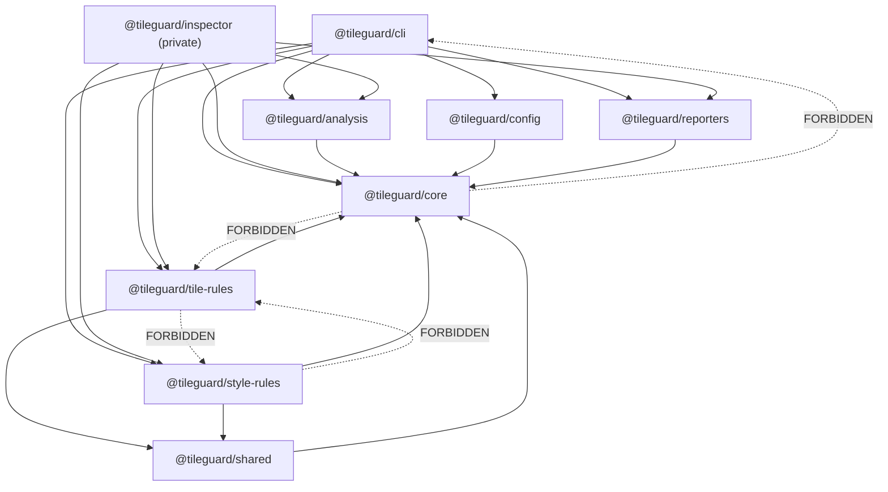

# 08 — Package Structure

## Purpose

This document defines the monorepo layout, package boundaries, dependency
rules, and build tooling for TileGuard. Package structure is an architectural
decision, not an implementation detail — it determines what can depend on
what, what ships independently, and what users need to install.

---

## Monorepo Layout

```
tileguard/
├── packages/
│   ├── core/                       ← @tileguard/core
│   │   ├── src/
│   │   │   ├── index.ts            ← Public API exports
│   │   │   ├── diagnostic.ts       ← Diagnostic, Severity, Location, ArtifactRef
│   │   │   ├── artifact.ts         ← Artifact, ArtifactProvider
│   │   │   ├── rule.ts             ← Rule, RuleMeta, RuleContext
│   │   │   ├── reporter.ts         ← Reporter, ReporterContext
│   │   │   ├── config.ts           ← TileGuardConfig, ResolvedConfig
│   │   │   ├── engine.ts           ← createEngine, Engine, RunResult
│   │   │   └── plugin.ts           ← Plugin interface
│   │   ├── tests/
│   │   ├── package.json
│   │   └── tsconfig.json
│   │
│   ├── shared/                      ← @tileguard/shared
│   │   ├── src/
│   │   │   └── index.ts            ← Shared utilities
│   │   ├── package.json
│   │   └── tsconfig.json
│   │
│   ├── tile-rules/                  ← @tileguard/tile-rules
│   │   ├── src/
│   │   │   ├── index.ts            ← Plugin export + all rules
│   │   │   ├── provider.ts         ← VectorTile artifact provider
│   │   │   ├── types.ts            ← VectorTileArtifact, VectorTileContent, etc.
│   │   │   ├── pbf-decoder.ts      ← Custom MVT/PBF decoder
│   │   │   ├── geometry.ts         ← Geometry helpers (ring area, intersection, etc.)
│   │   │   ├── browser.ts          ← Browser-compatible entry point
│   │   │   ├── browser-rules.ts    ← Browser-compatible rule bundle
│   │   │   └── rules/
│   │   │       ├── required-layers.ts
│   │   │       ├── feature-count.ts
│   │   │       ├── layer-feature-count.ts
│   │   │       ├── required-properties.ts
│   │   │       ├── coordinate-range.ts
│   │   │       ├── degenerate-geometry.ts
│   │   │       ├── unclosed-ring.ts
│   │   │       ├── zero-area-ring.ts
│   │   │       ├── self-intersection.ts
│   │   │       └── no-empty.ts
│   │   ├── tests/
│   │   ├── package.json
│   │   └── tsconfig.json
│   │
│   ├── style-rules/                 ← @tileguard/style-rules
│   │   ├── src/
│   │   │   ├── index.ts            ← Plugin export + all rules
│   │   │   ├── analysis.ts         ← Secondary ./analysis entry point
│   │   │   ├── provider.ts         ← StyleSpecification artifact provider
│   │   │   ├── types.ts            ← StyleArtifact, StyleLayer, etc.
│   │   │   ├── models/             ← StyleDocument, StyleLayer, StyleExpression, etc.
│   │   │   ├── parser/             ← StyleParser, ExpressionParser, FilterParser
│   │   │   ├── resolver/           ← SemanticResolver
│   │   │   ├── validator/          ← StyleValidator, ExpressionValidator, LayerValidator, etc.
│   │   │   ├── services/           ← StyleAnalysisEngine
│   │   │   └── rules/
│   │   │       ├── valid-json.ts
│   │   │       ├── version.ts
│   │   │       ├── sources-present.ts
│   │   │       ├── layers-present.ts
│   │   │       ├── layer-id-required.ts
│   │   │       ├── unique-layer-id.ts
│   │   │       ├── known-source.ts
│   │   │       ├── zoom-range.ts
│   │   │       └── no-deprecated-ref.ts
│   │   ├── tests/
│   │   ├── package.json
│   │   └── tsconfig.json
│   │
│   ├── config/                      ← @tileguard/config
│   │   ├── src/
│   │   │   ├── index.ts            ← Public API
│   │   │   ├── finder.ts           ← Config file discovery
│   │   │   ├── loader.ts           ← Config file loading (supports .ts via jiti)
│   │   │   └── validator.ts        ← Schema validation
│   │   ├── tests/
│   │   ├── package.json
│   │   └── tsconfig.json
│   │
│   ├── reporters/                   ← @tileguard/reporters
│   │   ├── src/
│   │   │   ├── index.ts            ← Public API
│   │   │   ├── text-reporter.ts    ← Human-readable terminal output
│   │   │   ├── json-reporter.ts    ← Structured JSON output
│   │   │   └── report/             ← Engineering report engine
│   │   │       ├── ReportEngine.ts
│   │   │       ├── ReportAssembler.ts
│   │   │       ├── ReporterRegistry.ts
│   │   │       ├── models/
│   │   │       │   └── EngineeringReport.ts
│   │   │       ├── reporters/
│   │   │       │   ├── MarkdownReporter.ts
│   │   │       │   ├── HtmlReporter.ts
│   │   │       │   └── JsonReporter.ts
│   │   │       └── utils/
│   │   │           ├── MarkdownWriter.ts
│   │   │           └── HtmlWriter.ts
│   │   ├── tests/
│   │   ├── package.json
│   │   └── tsconfig.json
│   │
│   ├── analysis/                    ← @tileguard/analysis
│   │   ├── src/
│   │   │   ├── index.ts            ← Public API
│   │   │   ├── ComparisonEngine.ts ← Tile-to-tile comparison
│   │   │   ├── RegressionEngine.ts ← Regression detection across versions
│   │   │   ├── FeatureMatcher.ts   ← Feature correspondence matching
│   │   │   ├── GeometryDiffer.ts   ← Geometry-level diffing
│   │   │   ├── PropertyDiffer.ts   ← Property-level diffing
│   │   │   ├── ConfidenceScorer.ts ← Match confidence scoring
│   │   │   ├── EvidenceBuilder.ts  ← Structured evidence for regressions
│   │   │   ├── SnapshotFactory.ts  ← Snapshot creation for baselines
│   │   │   └── models/
│   │   │       ├── comparison.ts
│   │   │       ├── regression.ts
│   │   │       └── statistics.ts
│   │   ├── tests/
│   │   ├── package.json
│   │   └── tsconfig.json
│   │
│   ├── cli/                         ← @tileguard/cli (the `tileguard` command)
│   │   ├── src/
│   │   │   ├── bin.ts              ← Binary entry point
│   │   │   ├── index.ts            ← CLI orchestration
│   │   │   ├── commands/
│   │   │   │   ├── analyze.ts      ← `tileguard analyze` (deep analysis)
│   │   │   │   ├── check.ts        ← `tileguard check` (primary validation)
│   │   │   │   ├── compare.ts      ← `tileguard compare` (tile comparison)
│   │   │   │   ├── doctor.ts       ← `tileguard doctor` (config diagnostics)
│   │   │   │   ├── init.ts         ← `tileguard init` (generate config)
│   │   │   │   ├── report.ts       ← `tileguard report` (generate reports)
│   │   │   │   ├── rules.ts        ← `tileguard rules` (list available rules)
│   │   │   │   ├── stats.ts        ← `tileguard stats` (run statistics)
│   │   │   │   ├── style.ts        ← `tileguard style` (style-specific checks)
│   │   │   │   └── version.ts      ← `tileguard version` (version info)
│   │   │   ├── config/             ← Config loading integration
│   │   │   ├── runner/             ← Command execution runners
│   │   │   ├── logging/            ← Structured logging
│   │   │   ├── output/             ← Output formatting
│   │   │   └── ...                 ← Utility modules
│   │   ├── tests/
│   │   ├── package.json
│   │   └── tsconfig.json
│   │
│   └── inspector/                   ← @tileguard/inspector (private, not published)
│       ├── src/
│       │   ├── main.tsx            ← React app entry
│       │   ├── components/         ← UI components
│       │   ├── render/             ← Canvas rendering
│       │   ├── analysis/           ← Visual analysis tools
│       │   ├── comparison/         ← Side-by-side comparison
│       │   ├── viewport/           ← Camera and viewport management
│       │   ├── interaction/        ← User interaction handling
│       │   ├── services/           ← Inspector services
│       │   ├── store/              ← State management
│       │   └── ...                 ← Additional subsystems
│       ├── tests/
│       ├── package.json
│       └── vite.config.ts
│
├── fixtures/                        ← Shared test fixtures
│   ├── good/                        ← Valid test artifacts
│   ├── bad/                         ← Known-invalid artifacts
│   ├── edge-cases/                  ← Edge case scenarios
│   ├── real-tiles/                  ← Real-world tile fixtures
│   ├── synthetic/                   ← Programmatically generated fixtures
│   └── benchmark-cache/             ← Cached tiles for benchmarks
│
├── legacy/                          ← Original JS/Python prototype (frozen)
│   ├── js/
│   └── python/
│
├── docs/
│   ├── architecture/                ← This handbook
│   └── rules/                       ← Per-rule documentation
│
├── scripts/                         ← Build & CI scripts
├── demo/                            ← Demo fixtures (FOSS4G presentation)
├── analysis/                        ← Research analysis artifacts
│
├── .github/
│   └── workflows/
│       └── tile-quality.yml
│
├── tileguard.config.mjs             ← Dogfood: TileGuard validates itself
├── biome.json                       ← Linter/formatter configuration
├── tsconfig.base.json               ← Shared TypeScript config
├── pnpm-workspace.yaml              ← Workspace definition
├── package.json                     ← Workspace root
├── README.md
├── CONTRIBUTING.md
└── LICENSE
```

---

## Package Responsibilities

| Package | npm Name | Responsibility |
|:--------|:---------|:---------------|
| `core` | `@tileguard/core` | Framework contracts: types, interfaces, engine |
| `shared` | `@tileguard/shared` | Shared utilities and helpers used across packages |
| `tile-rules` | `@tileguard/tile-rules` | VectorTile provider + 10 tile validation rules |
| `style-rules` | `@tileguard/style-rules` | StyleSpecification provider + 9 style lint rules + parser/resolver/validator subsystem |
| `config` | `@tileguard/config` | Configuration file discovery, loading, and schema validation |
| `reporters` | `@tileguard/reporters` | Output reporters: text, JSON, plus report engine (Markdown, HTML, JSON reports) |
| `analysis` | `@tileguard/analysis` | Comparison and regression analysis engine (ComparisonEngine, RegressionEngine, FeatureMatcher, GeometryDiffer) |
| `cli` | `@tileguard/cli` | CLI application: 10 commands (analyze, check, compare, doctor, init, report, rules, stats, style, version) |
| `inspector` | `@tileguard/inspector` | Private visual debugging environment (React + Canvas, not published to npm) |

### Why `cli` Is Published as `@tileguard/cli`

The CLI package is published as `@tileguard/cli` and provides the `tileguard`
binary. Users run:

```bash
npx @tileguard/cli check tile.pbf
```

Or install globally for direct access:

```bash
npm install -g @tileguard/cli
tileguard check tile.pbf
```

The CLI package depends on `@tileguard/core`, `@tileguard/config`,
`@tileguard/reporters`, `@tileguard/tile-rules`, `@tileguard/style-rules`,
and `@tileguard/analysis`. Installing it provides the full validation
toolchain.

---

## Dependency Rules
<!-- TODO: INSERT DIAGRAM 1: Monorepo Package Dependencies -->

**Image Description / Generation Prompt:** A UML Component Diagram representing the monorepo package dependency structure of TileGuard. Draw the following components as boxes: `tileguard (cli)` (at the top), `@tileguard/config` (middle-left), `@tileguard/core` (middle-right), `@tileguard/reporters` (middle-bottom), `@tileguard/tile-rules` (bottom-left), `@tileguard/style-rules` (bottom-right), and `@tileguard/shared` (bottom-middle). Draw solid arrows pointing from `tileguard (cli)` to `@tileguard/config`, `@tileguard/core`, `@tileguard/reporters`, `@tileguard/tile-rules`, and `@tileguard/style-rules`. Draw solid arrows pointing from `@tileguard/tile-rules` and `@tileguard/style-rules` to `@tileguard/core` and `@tileguard/shared`. Draw arrows pointing from `@tileguard/config` and `@tileguard/reporters` to `@tileguard/core`. Draw an arrow pointing from `@tileguard/shared` to `@tileguard/core`. Mark the arrows indicating that imports flow strictly inward, showing `@tileguard/core` as the independent kernel at the core of the dependency graph.


The dependency graph must follow the inward-pointing rule from the
[Architecture Overview](./01-overview.md):


```mermaid
graph TD
    CLI["@tileguard/cli"]
    Inspector["@tileguard/inspector (private)"]
    Analysis["@tileguard/analysis"]
    Config["@tileguard/config"]
    Reporters["@tileguard/reporters"]
    TileRules["@tileguard/tile-rules"]
    StyleRules["@tileguard/style-rules"]
    Shared["@tileguard/shared"]
    Core["@tileguard/core"]

    CLI --> Core
    CLI --> Config
    CLI --> Reporters
    CLI --> TileRules
    CLI --> StyleRules
    CLI --> Analysis
    Inspector --> Core
    Inspector --> Analysis
    Inspector --> Reporters
    Inspector --> TileRules
    Inspector --> StyleRules
    Analysis --> Core
    Config --> Core
    Reporters --> Core
    TileRules --> Core
    TileRules --> Shared
    StyleRules --> Core
    StyleRules --> Shared
    Shared --> Core
    TileRules -.->|FORBIDDEN| StyleRules
    StyleRules -.->|FORBIDDEN| TileRules
    Core -.->|FORBIDDEN| TileRules
    Core -.->|FORBIDDEN| CLI
```

**Allowed:**
- `cli` → `core`, `config`, `reporters`, `tile-rules`, `style-rules`, `analysis`
- `inspector` → `core`, `analysis`, `reporters`, `tile-rules`, `style-rules`
- `analysis` → `core`
- `config` → `core`
- `reporters` → `core`
- `tile-rules` → `core`, `shared`
- `style-rules` → `core`, `shared`
- `shared` → `core`

**Forbidden:**
- `core` → any other package (Core has zero internal dependencies)
- `tile-rules` ↔ `style-rules` (domain packages are independent)
- Any package → `cli` (CLI is a leaf consumer)

These rules are enforced by the workspace constraint check in the CI pipeline
(`scripts/check-boundaries.mjs`).

---

## External Dependencies

### Core (`@tileguard/core`)

**Zero runtime dependencies.** Core defines interfaces, types, and the engine
orchestrator. It does not need any external packages. This is intentional:
Core is the foundation that everything else depends on, so it must be as
lightweight and stable as possible.

Dev dependencies: TypeScript, Vitest (testing).

### Shared (`@tileguard/shared`)

Runtime dependencies:
- `@tileguard/core`

Dev dependencies: TypeScript.

### Tile Rules (`@tileguard/tile-rules`)

Runtime dependencies:
- `@tileguard/core`
- `@tileguard/shared`

The PBF decoder is a custom implementation (migrated from the existing
codebase). It does not depend on `@mapbox/vector-tile` or `pbf`. This
eliminates two dependencies that the current codebase lists but doesn't
actually use.

### Style Rules (`@tileguard/style-rules`)

Runtime dependencies:
- `@tileguard/core`
- `@tileguard/shared`

Exports a secondary `./analysis` entry point for style analysis services.
Includes a full parser/resolver/validator subsystem for MapLibre style specs.

### Config (`@tileguard/config`)

Runtime dependencies:
- `@tileguard/core`
- `jiti` (for loading TypeScript config files without compilation)

### Reporters (`@tileguard/reporters`)

Runtime dependencies:
- `@tileguard/core`

Provides text and JSON reporters for CLI output, plus a report engine that
generates Markdown, HTML, and JSON engineering reports.

### Analysis (`@tileguard/analysis`)

Runtime dependencies:
- `@tileguard/core`

Provides ComparisonEngine, RegressionEngine, FeatureMatcher, GeometryDiffer,
PropertyDiffer, ConfidenceScorer, EvidenceBuilder, and SnapshotFactory.

### CLI (`@tileguard/cli`)

Runtime dependencies:
- `@tileguard/core`
- `@tileguard/config`
- `@tileguard/reporters`
- `@tileguard/tile-rules`
- `@tileguard/style-rules`
- `@tileguard/analysis`
- `commander` (argument parsing)
- `fast-glob` (file discovery)

### Inspector (`@tileguard/inspector`) — Private

Not published. Runtime dependencies include React, Radix UI, Framer Motion,
and several internal packages. Uses Vite for development/build.

---

## Build Tooling

### TypeScript Configuration

A shared `tsconfig.base.json` at the workspace root defines common settings.
Each package extends it:

```jsonc
// tsconfig.base.json
{
  "compilerOptions": {
    "target": "ES2022",
    "module": "NodeNext",
    "moduleResolution": "NodeNext",
    "declaration": true,
    "declarationMap": true,
    "sourceMap": true,
    "strict": true,
    "esModuleInterop": true,
    "skipLibCheck": true,
    "forceConsistentCasingInFileNames": true,
    "isolatedModules": true,
    "verbatimModuleSyntax": true
  }
}
```

Each package's `tsconfig.json` extends this and adds its own `include`,
`outDir`, and `references`.

### Workspace Manager

pnpm workspaces (configured via `pnpm-workspace.yaml`):

```yaml
# pnpm-workspace.yaml
packages:
  - 'packages/*'
```

pnpm provides strict node_modules isolation, faster installs, and workspace
protocol (`workspace:*`) for internal dependencies.

### Testing

Vitest for all packages. It supports TypeScript natively, runs fast, and has
excellent workspace support. Each package has its own test configuration.

### Build

TypeScript compiler (`tsc`) for type checking and declaration generation.
`tsup` or `unbuild` for producing clean ESM output. The build produces:

```
packages/core/dist/
├── index.js          ← ESM entry point
├── index.d.ts        ← TypeScript declarations
├── index.d.ts.map    ← Declaration source maps
└── ...
```

Packages ship as ESM only. CommonJS is not supported. The minimum Node.js
version is 20 (current LTS).

---

## Migration Path from Current Codebase
<!-- TODO: INSERT DIAGRAM 2: CLI-to-Output Flow -->

**Image Description / Generation Prompt:** A UML Sequence Diagram visualizing the end-to-end execution pipeline of TileGuard. The actors/objects from left to right are: `User/Shell`, `cli.ts (CLI Entrypoint)`, `loadConfig() (@tileguard/config)`, `Engine (@tileguard/core)`, `RulesRunner (Execution Loop)`, and `Reporters (@tileguard/reporters)`. The execution steps flow sequentially:
1. `User/Shell` runs the CLI check command.
2. `cli.ts` invokes `loadConfig()` to find and parse configuration files.
3. `loadConfig()` returns the validated `TileGuardConfig` object to `cli.ts`.
4. `cli.ts` instantiates the `Engine` with the resolved configuration.
5. `cli.ts` calls `engine.run(sources)`.
6. The `Engine` initializes the `RulesRunner` check loop.
7. The `RulesRunner` fetches and decodes tile/style artifacts, executing matching active rules for each.
8. Rules call `context.report()` to append diagnostics back to the engine.
9. The `Engine` collects all diagnostics and invokes `reporters.report(diagnostics)`.
10. `Reporters` format the diagnostic outputs and write them to the terminal or JSON file.
11. `cli.ts` exits with code 1 if errors were found, or code 0 if none.


The existing code in `packages/js/` and `packages/python/` is moved to
`packages/legacy/` and preserved as a reference. It is not deleted — it
contains working, tested logic that the new packages will re-implement.

The migration happens incrementally:

1. Create `packages/core/` with interface definitions (no logic to migrate).
2. Create `packages/tile-rules/` and migrate `pbf-decoder.js` → `pbf-decoder.ts`,
   `geometry.js` → `geometry.ts`, then extract rules from `validate.js`.
3. Create `packages/style-rules/` and extract rules from `style-lint.js`.
4. Create `packages/cli/` and rebuild the CLI on top of the engine.
5. Once all functionality is migrated and passing, archive `packages/legacy/`.

At no point during migration should the existing CLI stop working. The legacy
code continues to function until the framework reimplementation is complete.

---

## Package Versioning

All packages share a single version number during the initial development
phase (0.x). This simplifies dependency management and avoids version
matrix complexity before the project reaches 1.0.

After 1.0, packages may version independently if needed, but keeping them
in lockstep (like Vitest's monorepo packages) is preferred for simplicity.

---

*Previous: [07 — Engine](./07-engine.md) · Next: [09 — Implementation Roadmap](./09-implementation-roadmap.md)*
