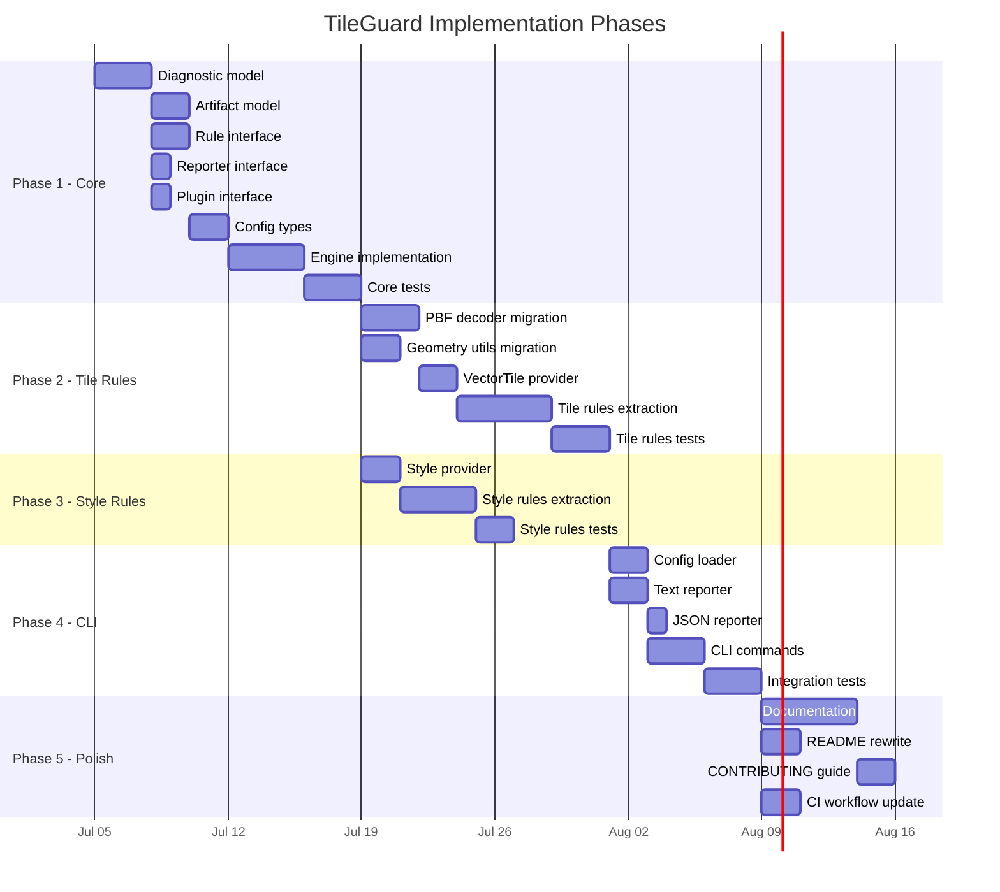

# 09 — Implementation Roadmap

## Phasing Philosophy

Implementation proceeds from the center outward, following the dependency
graph. Core is implemented first because everything depends on it. Domain
packages come next because the CLI depends on them. The CLI comes last
because it depends on everything else.

No phase begins until its dependencies are implemented, tested, and stable.
"Stable" means the interfaces are settled — the implementation may still
evolve, but the public API surface is frozen.

---

## Phase Map



---

## Phase 1: Core Package (`@tileguard/core`)

**Goal:** Implement all framework contracts and the engine orchestrator.
After this phase, the framework can load plugins, execute rules, collect
diagnostics, and invoke reporters — even if no real rules exist yet.

### Deliverables

| Deliverable | Description | Test Strategy |
|:------------|:------------|:--------------|
| `diagnostic.ts` | `Diagnostic`, `Severity`, `Location`, `ArtifactRef` types | Type tests (compilation), serialization round-trip tests |
| `artifact.ts` | `Artifact`, `ArtifactProvider` interfaces | Type tests |
| `rule.ts` | `Rule`, `RuleMeta`, `RuleContext`, `DiagnosticDescriptor` | Type tests, mock rule execution |
| `reporter.ts` | `Reporter`, `ReporterContext` interfaces | Type tests |
| `plugin.ts` | `Plugin` interface | Type tests |
| `config.ts` | `TileGuardConfig`, `ResolvedConfig`, config resolution logic | Resolution tests with various configs |
| `engine.ts` | `createEngine`, `Engine.run()`, `RunResult` | End-to-end tests with mock plugins |

### Acceptance Criteria

- [ ] A mock plugin with a trivial rule and provider can be registered.
- [ ] The engine can load a mock artifact and execute a mock rule.
- [ ] Diagnostics are collected with correct `ruleId`, `severity`, and `artifact`.
- [ ] A mock reporter receives all diagnostics after rule execution.
- [ ] Config resolution correctly merges defaults with user overrides.
- [ ] Rules configured as `'off'` are not executed.
- [ ] Severity overrides are applied to diagnostics.
- [ ] Provider failures produce diagnostics, not exceptions.
- [ ] Rule exceptions are caught and reported as diagnostics.
- [ ] All tests pass. Zero runtime dependencies.

### Implementation Notes

The engine should be implemented test-first. Write the end-to-end test
first (create engine with mock plugin, run it, assert diagnostics), then
implement until the test passes. This ensures the interfaces are practical,
not theoretical.

---

## Phase 2: Tile Rules (`@tileguard/tile-rules`)

**Goal:** Migrate the existing tile validation logic into the framework
as independent rules. After this phase, `tileguard check tile.pbf` works
end-to-end using the new architecture.

### Deliverables

| Deliverable | Source | Description |
|:------------|:-------|:------------|
| `pbf-decoder.ts` | `packages/js/src/utils/pbf-decoder.js` | TypeScript port of PBF reader and MVT decoder |
| `geometry.ts` | `packages/js/src/utils/geometry.js` | TypeScript port of geometry validation utilities |
| `provider.ts` | `packages/js/src/validate.js` (fetch/decode parts) | VectorTile artifact provider |
| `required-layers.ts` | `validateTile()` lines 42-50 | `tile/required-layers` rule |
| `feature-count.ts` | `validateTile()` lines 128-139 | `tile/feature-count` rule |
| `layer-feature-count.ts` | `validateTile()` lines 59-71 | `tile/layer-feature-count` rule |
| `required-properties.ts` | `validateTile()` lines 83-98 | `tile/required-properties` rule |
| `coordinate-range.ts` | `geometry.js` lines 29-41 | `tile/coordinate-range` rule |
| `degenerate-geometry.ts` | `geometry.js` lines 43-59 | `tile/degenerate-geometry` rule |
| `unclosed-ring.ts` | `geometry.js` lines 62-70 | `tile/unclosed-ring` rule |
| `zero-area-ring.ts` | `geometry.js` lines 72-78 | `tile/zero-area-ring` rule |
| `self-intersection.ts` | `geometry.js` lines 81-98 | `tile/self-intersection` rule |
| `no-empty.ts` | `validateTile()` lines 140-142 | `tile/no-empty` rule |

### Acceptance Criteria

- [ ] Every existing test case from `validate.test.js` has an equivalent
      test in the new test suite (coverage parity).
- [ ] The VectorTile provider correctly handles gzip, raw PBF, and error cases.
- [ ] Each rule is independently testable with a minimal fixture.
- [ ] Running all tile rules through the engine produces the same validation
      results as the legacy `validateTile()` function.
- [ ] The PBF decoder TypeScript port passes all existing decoder tests.

---

## Phase 3: Style Rules (`@tileguard/style-rules`)

**Goal:** Migrate the existing style linter logic into independent rules.

### Deliverables

| Deliverable | Source | Description |
|:------------|:-------|:------------|
| `provider.ts` | `style-lint.js` (file loading) | StyleSpecification artifact provider |
| `valid-json.ts` | `styleLint()` lines 24-35 | `style/valid-json` rule |
| `version.ts` | `styleLint()` line 39 | `style/version` rule |
| `sources-present.ts` | `styleLint()` lines 42-43 | `style/sources-present` rule |
| `layers-present.ts` | `styleLint()` lines 45-46 | `style/layers-present` rule |
| `layer-id-required.ts` | `styleLint()` line 52 | `style/layer-id-required` rule |
| `unique-layer-id.ts` | `styleLint()` line 53 | `style/unique-layer-id` rule |
| `known-source.ts` | `styleLint()` lines 55-57 | `style/known-source` rule |
| `zoom-range.ts` | `styleLint()` lines 58-60 | `style/zoom-range` rule |
| `no-deprecated-ref.ts` | `styleLint()` line 61 | `style/no-deprecated-ref` rule |

### Acceptance Criteria

- [ ] All checks from `style-lint.js` are covered by independent rules.
- [ ] Empty/placeholder style fixtures are handled gracefully.
- [ ] The JSON parsing error is correctly handled by `style/valid-json` and
      prevents other style rules from executing on the malformed artifact.

---

## Phase 4: CLI (`tileguard`)

**Goal:** Rebuild the CLI on top of the engine. After this phase, `npx tileguard`
works end-to-end with the new architecture.

### Deliverables

| Deliverable | Description |
|:------------|:------------|
| `config-loader.ts` | Find and load `tileguard.config.ts/js/json` |
| `text.ts` | Text reporter with colored terminal output |
| `json.ts` | JSON reporter |
| `check.ts` | `tileguard check <sources...>` command |
| `init.ts` | `tileguard init` command (generate starter config) |
| `bin/tileguard.ts` | CLI entry point |

### CLI Design Change

The current CLI uses subcommands (`validate`, `style-lint`, `render`). The
framework CLI should use a single primary command:

```bash
# New: unified command
tileguard check tile.pbf              # engine selects provider and rules
tileguard check style.json            # engine selects provider and rules
tileguard check tile.pbf style.json   # validates both

# Configuration init
tileguard init                        # creates tileguard.config.ts
```

The `check` command is the only validation command. The engine determines
what to do based on the artifact provider that matches each source. This is
simpler than requiring users to know which subcommand to use.

Legacy subcommands (`validate`, `style-lint`) can be kept as aliases for
backward compatibility.

### Acceptance Criteria

- [ ] `tileguard check tile.pbf` produces equivalent output to legacy CLI.
- [ ] `tileguard check style.json` produces equivalent output.
- [ ] `tileguard check tile.pbf --reporter json` produces valid JSON.
- [ ] `tileguard init` creates a working config file.
- [ ] Exit code 0 when all rules pass, exit code 1 when any error diagnostic.
- [ ] `--help` output is clear and complete.

---

## Phase 5: Polish and Documentation

**Goal:** Prepare the project for public release and FOSS4G presentation.

### Deliverables

| Deliverable | Description |
|:------------|:------------|
| README rewrite | Honest, accurate README reflecting the framework architecture |
| CONTRIBUTING.md | Development setup, testing, rule authoring guide |
| Rule documentation | Per-rule docs (auto-generated + manual descriptions) |
| CI workflow update | Update `.github/workflows/tile-quality.yml` for new package structure |
| Legacy archival | Move `packages/legacy/` to a separate branch or archive |

---

## Future Phases (Post-1.0)

These are documented for completeness but are explicitly out of scope
for the initial implementation.

| Phase | Scope |
|:------|:------|
| **Render Rules** | `@tileguard/render-rules`: Playwright-based rendering, pixelmatch comparison |
| **SARIF Reporter** | SARIF 2.1.0 output for GitHub Code Scanning |
| **GitHub Actions** | Reusable GitHub Action (`uses: tileguard/action@v1`) |
| **Watch Mode** | File watcher that re-validates on change |
| **Python Bindings** | Python SDK that shells out to the TypeScript engine |
| **Plugin Ecosystem** | Public plugin API, third-party rule packs |
| **IDE Integration** | VS Code extension, Language Server Protocol |
| **MBTiles/PMTiles** | Artifact providers for tile archives |

---

## Risk Register

| Risk | Impact | Mitigation |
|:-----|:-------|:-----------|
| Over-engineering the Core | Delays Phase 2+ | Keep Core minimal. If a concept isn't needed by Phase 2, defer it. |
| TypeScript migration introduces regressions | Loss of existing working functionality | Keep legacy code working until framework parity is achieved. |
| Geometry validation performance regression | Slower than current implementation | Benchmark migrated utils against originals. The algorithms are identical; only the language changes. |
| Config system complexity | Confusing for users | Start with the minimum: rules object + reporter. Add presets and overrides only when needed. |
| FOSS4G deadline pressure | Shortcuts in architecture | The handbook exists to prevent this. If schedule is tight, cut scope (fewer rules), not architecture. |

---

*Previous: [08 — Package Structure](./08-package-structure.md) · Back to [Handbook Index](./README.md)*
