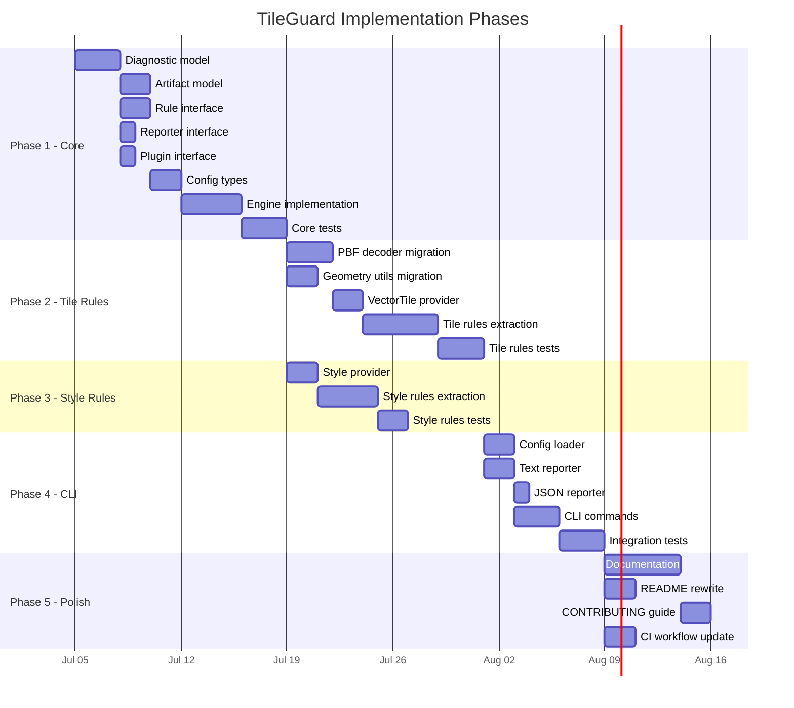

# 09 — Implementation Roadmap

## Phasing Philosophy

Implementation proceeds from the center outward, following the dependency
graph. Core is implemented first because everything depends on it. Domain
packages come next because the CLI depends on them. The CLI comes last
because it depends on everything else.

No phase begins until its dependencies are implemented, tested, and stable.
"Stable" means the interfaces are settled — the implementation may still
evolve, but the public API surface is frozen.

---

## Phase Map
<!-- TODO: INSERT DIAGRAM 2: CLI-to-Output Flow -->

**Image Description / Generation Prompt:** A UML Sequence Diagram visualizing the end-to-end execution pipeline of TileGuard. The actors/objects from left to right are: `User/Shell`, `cli.ts (CLI Entrypoint)`, `loadConfig() (@tileguard/config)`, `Engine (@tileguard/core)`, `RulesRunner (Execution Loop)`, and `Reporters (@tileguard/reporters)`. The execution steps flow sequentially:
1. `User/Shell` runs the CLI check command.
2. `cli.ts` invokes `loadConfig()` to find and parse configuration files.
3. `loadConfig()` returns the validated `TileGuardConfig` object to `cli.ts`.
4. `cli.ts` instantiates the `Engine` with the resolved configuration.
5. `cli.ts` calls `engine.run(sources)`.
6. The `Engine` initializes the `RulesRunner` check loop.
7. The `RulesRunner` fetches and decodes tile/style artifacts, executing matching active rules for each.
8. Rules call `context.report()` to append diagnostics back to the engine.
9. The `Engine` collects all diagnostics and invokes `reporters.report(diagnostics)`.
10. `Reporters` format the diagnostic outputs and write them to the terminal or JSON file.
11. `cli.ts` exits with code 1 if errors were found, or code 0 if none.




---

## Phase 1: Core Package (`@tileguard/core`)
<!-- TODO: INSERT DIAGRAM 1: Monorepo Package Dependencies -->

**Image Description / Generation Prompt:** A UML Component Diagram representing the monorepo package dependency structure of TileGuard. Draw the following components as boxes: `tileguard (cli)` (at the top), `@tileguard/config` (middle-left), `@tileguard/core` (middle-right), `@tileguard/reporters` (middle-bottom), `@tileguard/tile-rules` (bottom-left), `@tileguard/style-rules` (bottom-right), and `@tileguard/shared` (bottom-middle). Draw solid arrows pointing from `tileguard (cli)` to `@tileguard/config`, `@tileguard/core`, `@tileguard/reporters`, `@tileguard/tile-rules`, and `@tileguard/style-rules`. Draw solid arrows pointing from `@tileguard/tile-rules` and `@tileguard/style-rules` to `@tileguard/core` and `@tileguard/shared`. Draw arrows pointing from `@tileguard/config` and `@tileguard/reporters` to `@tileguard/core`. Draw an arrow pointing from `@tileguard/shared` to `@tileguard/core`. Mark the arrows indicating that imports flow strictly inward, showing `@tileguard/core` as the independent kernel at the core of the dependency graph.


**Goal:** Implement all framework contracts and the engine orchestrator.
After this phase, the framework can load plugins, execute rules, collect
diagnostics, and invoke reporters — even if no real rules exist yet.

**Phase 1 Status:** ✅ Complete — 100% test coverage as of v0.2.0.

### Deliverables

| Deliverable | Description | Test Strategy |
|:------------|:------------|:--------------|
| `diagnostic.ts` | `Diagnostic`, `Severity`, `Location`, `ArtifactRef` types | Type tests (compilation), serialization round-trip tests |
| `artifact.ts` | `Artifact`, `ArtifactProvider` interfaces | Type tests |
| `rule.ts` | `Rule`, `RuleMeta`, `RuleContext`, `DiagnosticDescriptor` | Type tests, mock rule execution |
| `reporter.ts` | `Reporter`, `ReporterContext` interfaces | Type tests |
| `plugin.ts` | `Plugin` interface | Type tests |
| `config.ts` | `TileGuardConfig`, `ResolvedConfig`, config resolution logic | Resolution tests with various configs |
| `engine.ts` | `createEngine`, `Engine.run()`, `RunResult` | End-to-end tests with mock plugins |

### Acceptance Criteria

- [ ] A mock plugin with a trivial rule and provider can be registered.
- [ ] The engine can load a mock artifact and execute a mock rule.
- [ ] Diagnostics are collected with correct `ruleId`, `severity`, and `artifact`.
- [ ] A mock reporter receives all diagnostics after rule execution.
- [ ] Config resolution correctly merges defaults with user overrides.
- [ ] Rules configured as `'off'` are not executed.
- [ ] Severity overrides are applied to diagnostics.
- [ ] Provider failures produce diagnostics, not exceptions.
- [ ] Rule exceptions are caught and reported as diagnostics.
- [ ] All tests pass. Zero runtime dependencies.

### Implementation Notes

The engine should be implemented test-first. Write the end-to-end test
first (create engine with mock plugin, run it, assert diagnostics), then
implement until the test passes. This ensures the interfaces are practical,
not theoretical.

---

## Phase 2: Tile Rules (`@tileguard/tile-rules`)

**Goal:** Migrate the existing tile validation logic into the framework
as independent rules. After this phase, `tileguard check tile.pbf` works
end-to-end using the new architecture.

**Status:** Implemented in v0.3.0 for direct `.pbf`/`.mvt` artifacts. CLI
wiring remains part of the later CLI phase.

### Deliverables

| Deliverable | Source | Description |
|:------------|:-------|:------------|
| `pbf-decoder.ts` | `packages/js/src/utils/pbf-decoder.js` | TypeScript port of PBF reader and MVT decoder |
| `geometry.ts` | `packages/js/src/utils/geometry.js` | TypeScript port of geometry validation utilities |
| `provider.ts` | `packages/js/src/validate.js` (fetch/decode parts) | VectorTile artifact provider |
| `required-layers.ts` | `validateTile()` lines 42-50 | `tile/required-layers` rule |
| `feature-count.ts` | `validateTile()` lines 128-139 | `tile/feature-count` rule |
| `layer-feature-count.ts` | `validateTile()` lines 59-71 | `tile/layer-feature-count` rule |
| `required-properties.ts` | `validateTile()` lines 83-98 | `tile/required-properties` rule |
| `coordinate-range.ts` | `geometry.js` lines 29-41 | `tile/coordinate-range` rule |
| `degenerate-geometry.ts` | `geometry.js` lines 43-59 | `tile/degenerate-geometry` rule |
| `unclosed-ring.ts` | `geometry.js` lines 62-70 | `tile/unclosed-ring` rule |
| `zero-area-ring.ts` | `geometry.js` lines 72-78 | `tile/zero-area-ring` rule |
| `self-intersection.ts` | `geometry.js` lines 81-98 | `tile/self-intersection` rule |
| `no-empty.ts` | `validateTile()` lines 140-142 | `tile/no-empty` rule |

### Acceptance Criteria

- [x] Every existing test case from `validate.test.js` has an equivalent
      test in the new test suite (coverage parity).
- [x] The VectorTile provider correctly handles gzip, raw PBF, and error cases.
- [x] Each rule is independently testable with a minimal fixture.
- [x] Running all tile rules through the engine produces the same validation
      results as the legacy `validateTile()` function.
- [x] The PBF decoder TypeScript port passes all existing decoder tests.

**Phase 2 Status:** ✅ Complete — 49/49 tests passing as of v0.3.0.

---

## Phase 3: Style Rules (`@tileguard/style-rules`)

**Goal:** Migrate the existing style linter logic into independent rules.

**Status:** Implemented in v0.3.0 for valid, invalid, and empty-placeholder
style JSON artifacts.

### Deliverables

| Deliverable | Source | Description |
|:------------|:-------|:------------|
| `provider.ts` | `style-lint.js` (file loading) | StyleSpecification artifact provider |
| `valid-json.ts` | `styleLint()` lines 24-35 | `style/valid-json` rule |
| `version.ts` | `styleLint()` line 39 | `style/version` rule |
| `sources-present.ts` | `styleLint()` lines 42-43 | `style/sources-present` rule |
| `layers-present.ts` | `styleLint()` lines 45-46 | `style/layers-present` rule |
| `layer-id-required.ts` | `styleLint()` line 52 | `style/layer-id-required` rule |
| `unique-layer-id.ts` | `styleLint()` line 53 | `style/unique-layer-id` rule |
| `known-source.ts` | `styleLint()` lines 55-57 | `style/known-source` rule |
| `zoom-range.ts` | `styleLint()` lines 58-60 | `style/zoom-range` rule |
| `no-deprecated-ref.ts` | `styleLint()` line 61 | `style/no-deprecated-ref` rule |

### Acceptance Criteria

- [x] All checks from `style-lint.js` are covered by independent rules.
- [x] Empty/placeholder style fixtures are handled gracefully.
- [x] The JSON parsing error is correctly handled by `style/valid-json` and
      prevents other style rules from executing on the malformed artifact.

**Phase 3 Status:** ✅ Complete — 33/33 tests passing as of v0.3.0.

---

## Phase 4: CLI (`tileguard`)
<!-- TODO: INSERT DIAGRAM 4: Dynamic Config Loader Evaluation -->

**Image Description / Generation Prompt:** A UML Activity Diagram illustrating the dynamic file format evaluation and loading execution paths in `loader.ts`. The process accepts an absolute file path.
1. Branch: Check the file extension.
2. If the extension is `.json`:
   - Read the file using `fs.readFileSync`.
   - Parse the contents using `JSON.parse`.
   - Validate that the parsed value is a plain object.
   - If any parsing/reading fails, catch the error, wrap it in a `ConfigLoadError` using ES2022 cause chaining, and throw.
3. If the extension is `.ts`, `.js`, or `.mjs`:
   - Load the file dynamically using `jiti`'s runtime compiler (`jiti.import`).
   - Verify that the module namespace has a `default` property (`'default' in module`).
   - Extract the default export value as the configuration object.
   - Validate that the value is a plain object.
   - If loading or validation fails, catch the error, wrap it in a `ConfigLoadError` with ES2022 cause chaining, and throw.
4. Output the loaded configuration object.

<!-- TODO: INSERT DIAGRAM 3: Upward Configuration Discovery Walk -->

**Image Description / Generation Prompt:** A control flowchart explaining the directory-proximity-first configuration discovery walk performed by `finder.ts`. Start with a node "Start at current working directory (CWD)". For each directory level:
1. Loop through the ordered list of configuration file names: `tileguard.config.ts`, `tileguard.config.js`, `tileguard.config.mjs`, then `tileguard.config.json`.
2. Decision: "Does the current file candidate exist in this directory?"
   - Yes: Immediately return the absolute path of this file (Stop).
   - No: Move to the next candidate in the priority list.
3. Once all candidates at the current directory level are exhausted:
4. Decision: "Has the traversal hit the stopAt boundary or the file system root?"
   - Yes: Stop and return `undefined` (no configuration found).
   - No: Move up to the parent directory (`dir = parent`) and repeat the search for candidates.
This flowchart must emphasize that directory level proximity is checked completely before moving up a directory, meaning a `.json` file at a lower directory level will be found instead of a `.ts` file at a higher parent level.


**Goal:** Rebuild the CLI on top of the engine. After this phase, `npx tileguard`
works end-to-end with the new architecture.

**Phase 4 Status:** ⏳ In Progress — configuration loading and reporters are complete as of v0.5.0; CLI commands and integration tests are pending.

### Deliverables

| Deliverable | Description |
|:------------|:------------|
| `config-loader.ts` | Find and load `tileguard.config.ts/js/json` |
| `text.ts` | Text reporter with colored terminal output |
| `json.ts` | JSON reporter |
| `check.ts` | `tileguard check <sources...>` command |
| `init.ts` | `tileguard init` command (generate starter config) |
| `bin/tileguard.ts` | CLI entry point |

### CLI Design Change

The current CLI uses subcommands (`validate`, `style-lint`, `render`). The
framework CLI should use a single primary command:

```bash
# New: unified command
tileguard check tile.pbf              # engine selects provider and rules
tileguard check style.json            # engine selects provider and rules
tileguard check tile.pbf style.json   # validates both

# Configuration init
tileguard init                        # creates tileguard.config.ts
```

The `check` command is the only validation command. The engine determines
what to do based on the artifact provider that matches each source. This is
simpler than requiring users to know which subcommand to use.

Legacy subcommands (`validate`, `style-lint`) can be kept as aliases for
backward compatibility.

### Acceptance Criteria

- [ ] `tileguard check tile.pbf` produces equivalent output to legacy CLI.
- [ ] `tileguard check style.json` produces equivalent output.
- [ ] `tileguard check tile.pbf --reporter json` produces valid JSON.
- [ ] `tileguard init` creates a working config file.
- [ ] Exit code 0 when all rules pass, exit code 1 when any error diagnostic.
- [ ] `--help` output is clear and complete.

---

## Phase 5: Polish and Documentation

**Goal:** Prepare the project for public release and FOSS4G presentation.

**Phase 5 Status:** ⏳ In Progress — docs, README, CONTRIBUTING, rules reference, and migration coverage are complete; CI workflow and legacy archival are pending.

### Deliverables

| Deliverable | Status | Description |
|:------------|:-------|:------------|
| README rewrite | ✅ Done | Accurate README reflecting the framework architecture |
| CONTRIBUTING.md | ✅ Done | Development setup, testing, rule authoring guide |
| Rule documentation | ✅ Done | `docs/rules/` — per-rule reference for all 19 rules |
| CHANGELOG.md | ✅ Done | Root `CHANGELOG.md` following Keep a Changelog format |
| MIGRATION_COVERAGE.md | ✅ Done | `docs/engineering/MIGRATION_COVERAGE.md` — legacy → framework mapping |
| CI workflow update | ⏳ Pending | Update `.github/workflows/` for new package structure |
| Legacy archival | ⏳ Pending | Archive `packages/legacy/` or move to separate branch |

---

## Future Phases (Post-1.0)

These are documented for completeness but are explicitly out of scope
for the initial implementation.

| Phase | Scope |
|:------|:------|
| **Render Rules** | `@tileguard/render-rules`: Playwright-based rendering, pixelmatch comparison |
| **SARIF Reporter** | SARIF 2.1.0 output for GitHub Code Scanning |
| **GitHub Actions** | Reusable GitHub Action (`uses: tileguard/action@v1`) |
| **Watch Mode** | File watcher that re-validates on change |
| **Python Bindings** | Python SDK that shells out to the TypeScript engine |
| **Plugin Ecosystem** | Public plugin API, third-party rule packs |
| **IDE Integration** | VS Code extension, Language Server Protocol |
| **MBTiles/PMTiles** | Artifact providers for tile archives |

---

## Risk Register

| Risk | Impact | Mitigation |
|:-----|:-------|:-----------|
| Over-engineering the Core | Delays Phase 2+ | Keep Core minimal. If a concept isn't needed by Phase 2, defer it. |
| TypeScript migration introduces regressions | Loss of existing working functionality | Keep legacy code working until framework parity is achieved. |
| Geometry validation performance regression | Slower than current implementation | Benchmark migrated utils against originals. The algorithms are identical; only the language changes. |
| Config system complexity | Confusing for users | Start with the minimum: rules object + reporter. Add presets and overrides only when needed. |
| FOSS4G deadline pressure | Shortcuts in architecture | The handbook exists to prevent this. If schedule is tight, cut scope (fewer rules), not architecture. |

---

*Previous: [08 — Package Structure](./08-package-structure.md) · Back to [Handbook Index](./README.md)*
