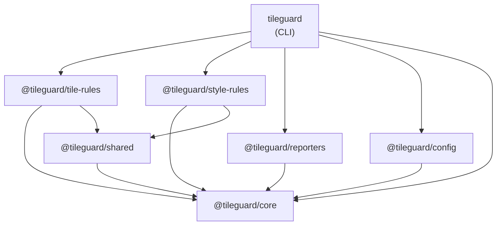
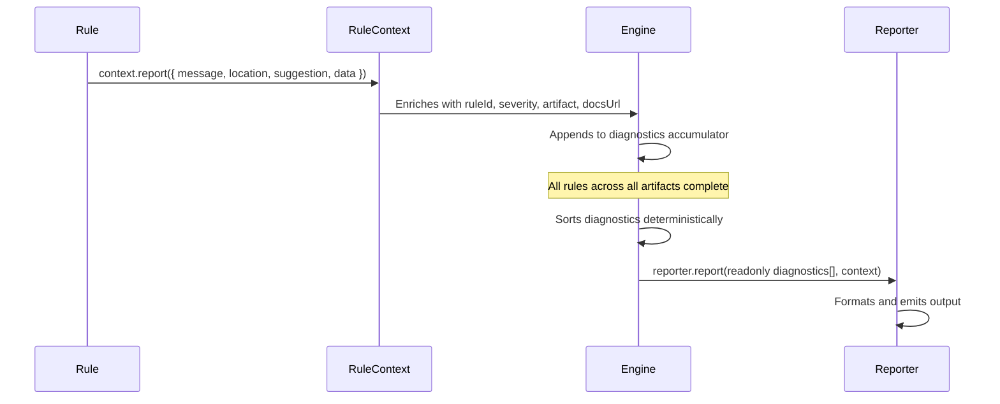
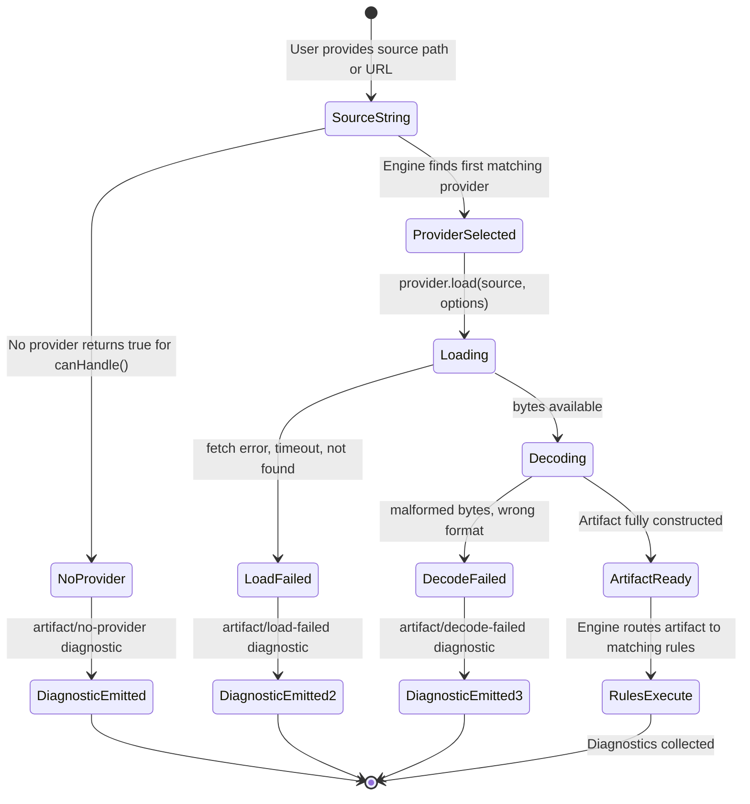
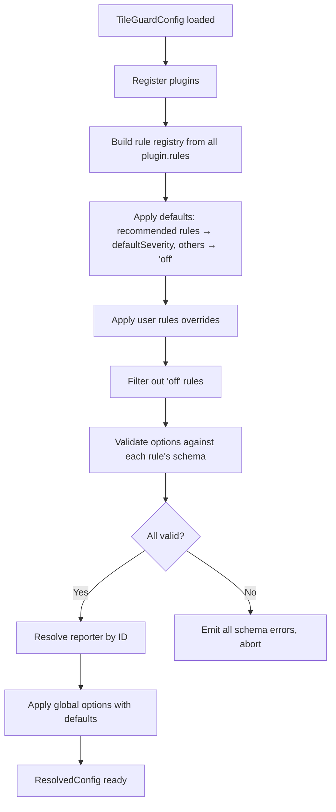
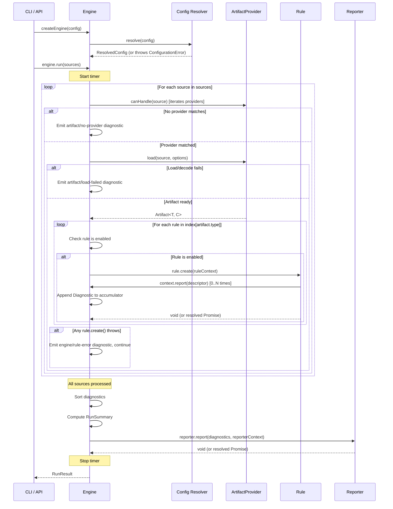

# CORE_CONTRACTS.md — TileGuard Framework Contracts

**Document status:** Authoritative  
**Package:** `@tileguard/core`  
**Last updated:** 2026-07-02  
**Supersedes:** Sections of `01-overview.md` through `07-engine.md` where they overlap

---

## Purpose of This Document

This document is the single authoritative specification for every public interface that exists inside `@tileguard/core`. It is a **framework contract**, not implementation notes.

Every future package — `@tileguard/tile-rules`, `@tileguard/style-rules`, `@tileguard/reporters`, `@tileguard/config`, `tileguard` (CLI), future plugins, and future language bindings — depends on the abstractions defined here. Those abstractions must therefore be correct, complete, and stable before implementation begins.

The goal is that, after this document is reviewed, implementing `@tileguard/core` becomes a straightforward translation of the documented contracts into TypeScript. No major architectural decisions should remain unresolved.

---

## Table of Contents

1. [Philosophy of Core](#1-philosophy-of-core)
2. [Dependency Rules](#2-dependency-rules)
3. [Diagnostic Contract](#3-diagnostic-contract)
4. [Artifact Contract](#4-artifact-contract)
5. [Rule Contract](#5-rule-contract)
6. [Plugin Contract](#6-plugin-contract)
7. [Reporter Contract](#7-reporter-contract)
8. [Configuration Contract](#8-configuration-contract)
9. [Engine Contract](#9-engine-contract)
10. [Package Boundaries](#10-package-boundaries)
11. [Design Principles](#11-design-principles)
12. [Extension Guidelines](#12-extension-guidelines)
13. [Alternatives Considered](#13-alternatives-considered)
14. [Future Evolution](#14-future-evolution)

---

## 1. Philosophy of Core

### What Core Is

`@tileguard/core` is the framework kernel. It defines the contracts that every other TileGuard component depends on — the shapes of data, the protocols of communication, the guarantees of behavior. It is the stable center of the dependency graph.

Core contains **framework abstractions only**. It provides a vocabulary for talking about validation — what a finding is, what an artifact is, what a rule is, what a reporter does, how they are orchestrated — without knowing anything about the domain those concepts will be applied to.

### What Core Is Not

Core contains **zero geospatial knowledge**. It must never import, reference, or encode knowledge about any of the following:

| Domain | Examples |
|:-------|:---------|
| Map rendering | MapLibre, Mapbox GL, WebGL, canvas rendering |
| Tile formats | Vector tiles, PBF, MVT, MBTiles, PMTiles |
| Geospatial data formats | GeoJSON, GeoParquet, Shapefile, FlatGeobuf, COG |
| Geometry concepts | coordinates, rings, polygons, self-intersections |
| Style systems | MapLibre style spec, Mapbox style spec |
| Geospatial tools | QGIS, Planetiler, OpenMapTiles, tippecanoe |
| Rendering engines | WebGL, Cairo, Skia |
| Projection systems | WGS84, EPSG codes, proj4 |

If a concept requires knowing that a tile contains layers, or that a polygon ring must be closed, or that a style must have a version field — that concept belongs in a domain package, not in Core.

### The Vocabulary Core Does Own

Core owns only the abstract framework concepts:

| Concept | What it represents |
|:--------|:------------------|
| `Diagnostic` | A single, structured validation finding |
| `Severity` | How serious a finding is: error, warning, or info |
| `Location` | A structured pointer into an artifact |
| `ArtifactRef` | A serializable identifier for an artifact |
| `Artifact<T, C>` | A decoded, in-memory object ready for rule inspection |
| `ArtifactProvider` | A component that loads and decodes artifacts |
| `Rule<C>` | A component that inspects an artifact and emits diagnostics |
| `RuleMeta` | Metadata about a rule |
| `RuleContext<C>` | The interface a rule uses during execution |
| `DiagnosticDescriptor` | What a rule provides when calling `context.report()` |
| `Plugin` | A bundle of providers and rules contributed by one package |
| `Reporter` | A component that transforms diagnostics into output |
| `ReporterContext` | Run metadata available to reporters |
| `TileGuardConfig` | The user-facing configuration type |
| `ResolvedConfig` | The fully merged configuration used by the engine |
| `RuleConfig` | A single rule's configuration entry |
| `Override` | A path-scoped configuration block |
| `Engine` | The orchestrator that connects all components |
| `RunResult` | The output of a completed engine run |
| `RunSummary` | Aggregate statistics from a run |

### Why This Separation Matters

Every framework that has ever grown to serve a community has needed to maintain backward compatibility across its core abstractions. The history of software is littered with frameworks that tangled domain concepts into their kernel, then paid the price when the domain evolved.

ESLint tangled JavaScript syntax assumptions into its rule API. When ES modules arrived, the rule API needed surgery. When TypeScript support became critical, the complexity compounded. ESLint's flat config migration (v9, 2023) was partly motivated by the need to remove implicit JavaScript-centric assumptions from the configuration system.

TileGuard's domain — geospatial data — is particularly prone to evolution. New tile formats emerge (PMTiles replaced MBTiles for many use cases). New geometry encodings appear (FlatGeobuf for streaming). New style systems evolve (MapLibre's expression language changes with every version). New cloud-native raster formats gain adoption (COG, GeoParquet).

A Core that knows about any of these is a Core that must change every time the geospatial ecosystem evolves. A Core that knows only about rules, artifacts, diagnostics, reporters, and engines is a Core that remains stable across all of it.

The concrete test: **if adding support for GeoJSON validation requires changing a single line in `@tileguard/core`, the Core boundary is in the wrong place.**

---

## 2. Dependency Rules

### The Dependency Graph

All dependencies in the TileGuard monorepo point inward. Outer packages depend on inner packages. Inner packages never depend on outer packages.



### Allowed Dependencies

| Package | May depend on |
|:--------|:-------------|
| `@tileguard/core` | Nothing (zero runtime dependencies) |
| `@tileguard/shared` | `@tileguard/core` |
| `@tileguard/reporters` | `@tileguard/core` |
| `@tileguard/config` | `@tileguard/core` |
| `@tileguard/tile-rules` | `@tileguard/core`, `@tileguard/shared` |
| `@tileguard/style-rules` | `@tileguard/core`, `@tileguard/shared` |
| `tileguard` (CLI) | All of the above |

### Forbidden Dependencies

| Dependency | Why forbidden |
|:-----------|:-------------|
| `@tileguard/core` → anything else | Core is the innermost ring. Any outward dependency would break the graph and create circularity risk |
| `@tileguard/tile-rules` ↔ `@tileguard/style-rules` | Domain packages are independent. A project using only tile validation must not load style linting code |
| `@tileguard/shared` → any domain package | Shared utilities may not depend on domain packages |
| Any package → `tileguard` (CLI) | The CLI is a leaf consumer. Nothing should depend on it |

### Why Inward Dependencies

The inward dependency rule ensures:

1. **Core is replaceable.** No existing package constrains Core's implementation. Core's only contract is its public interface.
2. **Domain packages are independent.** Installing `@tileguard/tile-rules` does not install `@tileguard/style-rules`. Users pay only for what they use.
3. **No circular dependencies.** Circular dependencies are impossible when all edges point in one direction. Circular dependencies cause initialization order problems, make code harder to reason about, and prevent tree-shaking.
4. **Testability.** Core can be tested with no dependencies. Domain packages can be tested against Core without loading any other domain package.

### Enforcement

Dependency rules should be enforced statically. A workspace lint script should verify that no `package.json` in the monorepo declares a dependency that violates the above graph. This check runs in CI and catches violations before they are merged.

---

## 3. Diagnostic Contract

### Why Diagnostics Are the Universal Language

A TileGuard run involves components that know nothing about each other. A tile validation rule knows nothing about SARIF output format. A SARIF reporter knows nothing about polygon geometry. They communicate through one shared currency: the `Diagnostic`.

Every validation finding — whether produced by a geometry rule, a style lint rule, or an artifact loading failure — is represented as a `Diagnostic`. Every reporter — whether it writes terminal text, structured JSON, or SARIF — consumes `Diagnostic` values. No component needs to understand any other component's internal representation.

This is the same insight that makes HTTP successful as an application protocol: components that know only the shared data format can interoperate without knowing each other's implementation.

### The Core Type

```typescript
/**
 * A Diagnostic is a structured, immutable record describing one validation
 * finding. It is the universal interface between rules and reporters.
 *
 * Diagnostics are value objects: they carry no behavior, hold no references
 * to mutable state, and can be serialized to JSON without loss of information.
 *
 * Diagnostics are created by rules (via context.report()), enriched by the
 * engine (ruleId, severity, artifact, docsUrl), and consumed by reporters.
 * No component modifies a Diagnostic after it is created.
 */
interface Diagnostic {
  /**
   * The unique ID of the rule that produced this diagnostic.
   * Uses the namespaced format: "category/rule-name".
   *
   * Examples:
   *   "tile/required-layers"
   *   "style/known-source"
   *   "render/pixel-drift"
   *   "artifact/load-failed"
   *
   * Invariant: ruleId must match the id of a registered rule, or be a
   * framework-internal rule ID prefixed with "artifact/" or "engine/".
   */
  readonly ruleId: string;

  /**
   * How serious this finding is.
   * Set by the engine from the rule's resolved configuration.
   * Never set by the rule directly.
   */
  readonly severity: Severity;

  /**
   * Human-readable description of the finding.
   *
   * Requirements:
   * - Complete sentence, beginning with a capital letter.
   * - Includes the specific value that caused the finding quoted in double quotes.
   * - Readable without additional context.
   * - Does not include the rule ID or severity (reported separately).
   * - Does not suggest a fix (use the suggestion field for that).
   *
   * Good:  'Required layer "buildings" is not present in the tile.'
   * Bad:   'Missing layer'                 (too vague, no context)
   * Bad:   'ERROR: tile/required-layers'   (duplicates other fields)
   * Bad:   'Add the buildings layer.'      (that belongs in suggestion)
   */
  readonly message: string;

  /**
   * A lightweight reference to the artifact being validated.
   * Does not contain the artifact content — only enough to identify it.
   * Serializable. Reporters use this to group diagnostics by source.
   */
  readonly artifact: ArtifactRef;

  /**
   * Optional. A structured pointer into the artifact indicating where
   * the problem was found.
   *
   * The meaning of specific fields depends on the artifact type.
   * Reporters should render whichever fields are present and ignore absent ones.
   */
  readonly location?: Location;

  /**
   * Optional. An actionable suggestion for resolving the finding.
   *
   * Requirements:
   * - Actionable: tells the user what to do, not just what is wrong.
   * - Specific: references the exact thing that needs to change.
   * - Does not repeat the message.
   *
   * Good:  'Add a "buildings" layer to your Planetiler configuration.'
   * Bad:   'Fix the missing layer.'   (not actionable)
   * Bad:   'See the docs.'            (not specific)
   */
  readonly suggestion?: string;

  /**
   * Optional. URL to the rule's documentation page.
   * Set automatically by the engine from rule.meta.docsUrl.
   * Rules must not set this directly.
   */
  readonly docsUrl?: string;

  /**
   * Optional. Rule-specific structured data for richer reporter output.
   *
   * Must be JSON-serializable (no functions, class instances, Buffers,
   * circular references). The shape is defined by each rule's documentation.
   *
   * The framework does not validate data's shape. Rules own their data schema.
   *
   * Example (tile/required-layers):
   *   { requiredLayer: "buildings", availableLayers: ["water", "roads"] }
   */
  readonly data?: Record<string, unknown>;
}
```

### Severity

```typescript
/**
 * The three severity levels, ordered by seriousness.
 *
 * 'error'   — A defect. The run should fail. Process exits with code 1.
 * 'warning' — A potential problem. The run passes (exit 0) but should
 *             be investigated.
 * 'info'    — An observation. Purely informational. Never causes failure.
 */
type Severity = 'error' | 'warning' | 'info';
```

Three levels are the correct number. Two levels force informational observations into warnings, training users to ignore them. Four or more levels create subjective distinctions that rule authors apply inconsistently. Three levels — failure, caution, observation — cover all practical use cases without ambiguity.

### ArtifactRef

```typescript
/**
 * A serializable, lightweight identifier for an artifact.
 *
 * Separate from Artifact<T,C> so that Diagnostics remain small and
 * fully JSON-serializable. Embedding the full decoded artifact in every
 * diagnostic would cause memory pressure and serialization failures.
 */
interface ArtifactRef {
  /** The artifact type discriminant. Example: "VectorTile". */
  readonly type: string;

  /**
   * The source identifier.
   * For files: the file path. For URLs: the full URL.
   * For tile archives: archive path + tile coordinates.
   * Used as the primary identity for grouping and deduplication.
   */
  readonly source: string;

  /**
   * Optional human-readable label for output when the source path
   * is too long or uninformative.
   */
  readonly label?: string;
}
```

### Location

```typescript
/**
 * A structured pointer into a specific position within an artifact.
 *
 * All fields are optional. A diagnostic includes whichever subset
 * of fields meaningfully identifies the problem location.
 * Reporters render present fields and ignore absent ones.
 *
 * Design rationale: flat record over discriminated union.
 * See Section 13 (Alternatives Considered) for full justification.
 */
interface Location {
  /** Layer name within a vector tile. */
  readonly layer?: string;

  /** Feature index within a layer (0-indexed). */
  readonly featureIndex?: number;

  /** Geometry part index within a feature (0-indexed). */
  readonly partIndex?: number;

  /**
   * JSON path within a style specification.
   * Example: "layers[3].paint.fill-color"
   */
  readonly jsonPath?: string;

  /** Source file line number (1-indexed). */
  readonly line?: number;

  /** Source file column number (1-indexed). */
  readonly column?: number;

  /** Pixel region for render diagnostics. Origin is top-left. */
  readonly region?: {
    readonly x: number;
    readonly y: number;
    readonly width: number;
    readonly height: number;
  };
}
```

### DiagnosticDescriptor

The type that rules pass to `context.report()`. The engine constructs the full `Diagnostic` from this plus context it already holds.

```typescript
/**
 * The subset of Diagnostic fields that a rule provides when reporting.
 * The engine fills in: ruleId, severity, artifact, docsUrl.
 * The rule provides: message, location, suggestion, data.
 */
interface DiagnosticDescriptor {
  message: string;
  location?: Location;
  suggestion?: string;
  data?: Record<string, unknown>;
}
```

### Diagnostic Lifecycle



**Creation:** Rules call `context.report(descriptor)`. The `RuleContext` fills in the framework-level fields and delivers a complete `Diagnostic` to the engine's accumulator.

**Ordering:** After all rules complete, the engine sorts diagnostics: by artifact source (alphabetical) → severity (error, warning, info) → rule ID (alphabetical) → location fields. This ordering is deterministic regardless of rule execution order.

**Immutability:** Diagnostics are immutable after creation. `Readonly<Diagnostic>` is used throughout. No component may mutate a diagnostic.

**Serialization contract:** All `Diagnostic` values must survive `JSON.stringify()` without data loss. Rules are responsible for ensuring their `data` field contains only JSON-safe values.

### Diagnostic Identity

Two diagnostics represent the same finding if they share `ruleId`, `artifact.source`, and the same populated `location` fields. Used for deduplication in reporters, baseline comparison in watch mode, and SARIF fingerprinting.

### Worked Example

```json
{
  "ruleId": "tile/required-layers",
  "severity": "error",
  "message": "Required layer \"buildings\" is not present in the tile.",
  "artifact": {
    "type": "VectorTile",
    "source": "./tiles/14/8741/5321.pbf"
  },
  "location": { "layer": "buildings" },
  "suggestion": "Add a \"buildings\" layer to your Planetiler configuration.",
  "docsUrl": "https://tileguard.dev/rules/tile/required-layers",
  "data": {
    "requiredLayer": "buildings",
    "availableLayers": ["water", "roads", "landuse"]
  }
}
```

---

## 4. Artifact Contract

### Purpose

Artifacts are the things TileGuard validates. Core's artifact contract defines what an artifact is in the abstract — a typed, decoded, immutable in-memory value — without saying anything about what the content of any specific artifact looks like. Domain packages extend these abstractions with concrete types.

### Artifact

```typescript
/**
 * An Artifact is a decoded, in-memory representation of something that
 * rules can validate. It is created by an ArtifactProvider and consumed
 * by the Rule Engine.
 *
 * The generic parameters let domain packages define concrete artifact types
 * while Core remains domain-agnostic:
 *
 *   T — the type discriminant string (e.g., "VectorTile")
 *   C — the content shape (e.g., VectorTileContent)
 *
 * Core only ever holds Artifact<string, unknown>. Domain packages narrow
 * these generics to their specific types.
 */
interface Artifact<T extends string = string, C = unknown> {
  /**
   * The type discriminant. Used by the engine to index which rules
   * match this artifact.
   *
   * Must be stable across versions of a domain package. Changing a
   * type discriminant is a breaking change.
   *
   * Naming convention: PascalCase, descriptive noun.
   * Examples: "VectorTile", "StyleSpecification", "RenderSnapshot",
   *           "GeoJSON", "PMTilesArchive".
   */
  readonly type: T;

  /**
   * A lightweight reference to this artifact's source.
   * Used to populate the artifact field of all diagnostics produced
   * while validating this artifact.
   */
  readonly ref: ArtifactRef;

  /**
   * The fully decoded content of the artifact.
   *
   * The shape depends entirely on the type. For VectorTile: an object
   * with layers, features, and geometry. For StyleSpecification: a
   * parsed JSON style object. For RenderSnapshot: a pixel buffer.
   *
   * Invariant: content is complete at the time the Artifact is created.
   * Rules must not need to perform additional I/O to access content.
   *
   * Invariant: content is read-only. Rules must not mutate content.
   */
  readonly content: C;

  /**
   * Optional metadata attached by the provider during loading.
   *
   * Providers may attach information discovered during the load pipeline:
   * file size, compression type, HTTP response headers, tile coordinates,
   * etc. Rules and reporters may use this but must not depend on specific
   * keys being present.
   *
   * Must be JSON-serializable.
   */
  readonly metadata?: Record<string, unknown>;
}
```

### Concrete Artifact Types (defined in domain packages)

Core does not know these types. They are documented here to illustrate how the generic is used.

```typescript
// Defined in @tileguard/tile-rules — NOT in @tileguard/core
type VectorTileArtifact = Artifact<'VectorTile', VectorTileContent>;

// Defined in @tileguard/style-rules — NOT in @tileguard/core
type StyleArtifact = Artifact<'StyleSpecification', StyleSpecificationContent>;

// Defined in a future @tileguard/render-rules — NOT in @tileguard/core
type RenderSnapshotArtifact = Artifact<'RenderSnapshot', RenderSnapshotContent>;
```

### ArtifactProvider

```typescript
/**
 * An ArtifactProvider loads artifacts from sources. It encapsulates the
 * full load pipeline: source detection → byte fetching → format detection
 * → decoding → Artifact creation.
 *
 * Providers are contributed by domain packages via the Plugin interface.
 * Core does not know about any specific provider implementation.
 */
interface ArtifactProvider {
  /**
   * A unique, stable identifier for this provider.
   * Used in configuration, error messages, and provider selection logs.
   *
   * Convention: kebab-case, matches the domain package's artifact type
   * in lowercase. Examples: "vector-tile", "style-specification".
   */
  readonly id: string;

  /**
   * The artifact type discriminants this provider can produce.
   * The engine uses this for informational purposes and logging.
   *
   * A provider may produce multiple artifact types if it handles a
   * container format (e.g., an MBTiles provider might produce VectorTile
   * artifacts for each tile within the archive).
   */
  readonly artifactTypes: readonly string[];

  /**
   * Returns true if this provider can handle the given source string.
   *
   * The engine calls canHandle() for each registered provider in
   * registration order. The first provider that returns true is used.
   *
   * Implementations should be fast (simple pattern matching) and
   * must be synchronous. canHandle() must not perform I/O.
   *
   * canHandle() must be conservative: if in doubt, return false.
   * A false negative causes an "artifact/no-provider" diagnostic.
   * A false positive causes a load failure diagnostic. False negatives
   * are easier for users to diagnose.
   */
  canHandle(source: string): boolean;

  /**
   * Loads and fully decodes an artifact from the given source.
   *
   * Returns a complete Artifact ready for rule execution.
   *
   * Error contract: load() must not throw exceptions for expected
   * failure modes (file not found, network timeout, malformed data,
   * unsupported format). These are operational failures that the engine
   * handles by emitting an "artifact/load-failed" diagnostic.
   *
   * load() may throw for programmer errors (null source, invalid options
   * types). These indicate bugs in the caller, not in the artifact.
   */
  load(source: string, options?: ProviderOptions): Promise<Artifact>;
}

/**
 * Options passed to a provider's load() method.
 * Providers may ignore options they do not support.
 */
interface ProviderOptions {
  /** HTTP request timeout in milliseconds. Default: 30000. */
  timeout?: number;

  /** Additional HTTP headers for remote artifact loading. */
  headers?: Record<string, string>;
}
```

### Artifact Lifecycle



### Ownership and Immutability

An `Artifact` is owned by the engine from the moment it is returned by `provider.load()`. The rule engine passes references to the same artifact object to all matching rules. Rules must not mutate the artifact in any way. `Readonly<Artifact>` is used at the rule interface boundary to communicate this intent.

Providers must not retain mutable references to content they place inside an artifact. Once `load()` resolves, the artifact's content must be considered transferred to the engine.

### Caching

The engine loads each source once and reuses the resulting artifact for all matching rules within a single run. Providers must not assume they will be called more than once per source per run, and they must not assume caching behavior across runs. If a provider performs expensive decoding, it may maintain an internal cache keyed by source, but this is an implementation detail invisible to the framework.

### Why Providers Own Both Fetching and Decoding

A two-stage pipeline (fetcher → decoder) is more composable: the same MVT decoder could handle both `.pbf` files and MBTiles entries. However, it creates a coordination problem: who decides which decoder matches which bytes? The source knows the content type (from file extension or HTTP headers), but in a separated architecture that information would need to be plumbed through an intermediate format-detection layer.

The single-provider approach is simpler: each provider is authoritative over its full pipeline. If two providers share decoder logic, that logic lives in `@tileguard/shared` as a utility — the separation is an implementation detail, not a framework boundary.

---

## 5. Rule Contract

### Purpose

Rules are the primary extension point of the TileGuard framework. Every validation concern — from required layer presence to polygon ring closure to style version correctness — is a separate rule. The rule contract defines what a rule is, what guarantees it must uphold, and how the engine interacts with it.

### Rule

```typescript
/**
 * A Rule is a plain object that encapsulates one validation concern.
 *
 * Rules are values, not classes. No constructor, no inheritance, no
 * abstract base class. This keeps rules simple, testable, and approachable.
 *
 * The generic parameter C is the shape of the rule's configuration options
 * as the user specifies them. C = unknown for rules with no options.
 */
interface Rule<C = unknown> {
  /**
   * The rule's unique identifier.
   * Format: "category/rule-name" (kebab-case throughout).
   *
   * Category groups related rules by domain:
   *   tile/     — vector tile structure and content rules
   *   style/    — MapLibre style specification rules
   *   render/   — render regression and pixel comparison rules
   *   artifact/ — framework-internal: load failures, decode errors
   *   engine/   — framework-internal: rule execution errors
   *
   * The category is the domain package's namespace. Third-party packages
   * choose a unique prefix (e.g., "myorg/some-rule").
   *
   * Invariant: ruleId must be unique across all registered rules.
   * Invariant: ruleId must be stable. Changing it is a breaking change
   * (users reference rule IDs in configuration and ignore lists).
   */
  readonly id: string;

  /** Metadata about the rule. See RuleMeta. */
  readonly meta: RuleMeta;

  /**
   * The artifact types this rule can validate.
   * The engine uses this to skip rules that don't apply to an artifact.
   *
   * Must match the type discriminant strings used by ArtifactProviders.
   * A rule that validates VectorTile artifacts declares:
   *   artifactTypes: ['VectorTile']
   *
   * A rule that validates both tiles and styles (rare) declares:
   *   artifactTypes: ['VectorTile', 'StyleSpecification']
   */
  readonly artifactTypes: readonly string[];

  /**
   * Optional. JSON Schema describing the shape of this rule's options.
   *
   * If provided, the engine validates the user's rule configuration
   * against this schema before invoking the rule. Invalid options
   * produce a configuration error, not a runtime crash.
   *
   * Must be a valid JSON Schema object (draft-07 compatible).
   */
  readonly schema?: object;

  /**
   * The validation function.
   *
   * Called by the engine once per artifact per run (if the rule is enabled
   * and the artifact type matches). The rule inspects context.artifact and
   * calls context.report() for each finding. It returns void (or a Promise
   * that resolves to void).
   *
   * MUST be pure:
   * - No console.log, process.stdout, or any formatted output
   * - No file system reads or writes
   * - No network requests
   * - No mutation of context.artifact or any shared state
   * - No throwing exceptions for expected conditions (use context.report())
   * - Deterministic: same inputs always produce the same diagnostics
   *
   * MAY be async if the validation logic requires it (e.g., computing a
   * hash, decompressing a nested structure). Keep async rules rare.
   */
  create(context: RuleContext<C>): void | Promise<void>;
}
```

### RuleMeta

```typescript
/**
 * Metadata about a rule. Used for: documentation generation, help output,
 * diagnostic enrichment (docsUrl), and preset construction (recommended).
 */
interface RuleMeta {
  /**
   * Human-readable description of what this rule checks.
   * Complete sentence. Begins with a verb.
   *
   * Example: "Ensures that all required layers are present in the tile."
   * Example: "Validates that polygon rings are properly closed."
   */
  readonly description: string;

  /**
   * The default severity when the user has not configured this rule.
   *
   * Most rules default to 'error'. Rules that check style or convention
   * (rather than hard validity) may default to 'warning'.
   * Purely informational rules default to 'info'.
   */
  readonly defaultSeverity: Severity;

  /**
   * URL to this rule's documentation page.
   * The engine copies this to every Diagnostic produced by this rule.
   *
   * Convention: https://tileguard.dev/rules/{ruleId}
   * Example:    https://tileguard.dev/rules/tile/required-layers
   */
  readonly docsUrl?: string;

  /**
   * Whether this rule is part of the "recommended" preset.
   *
   * Recommended rules are enabled by default when a plugin is loaded
   * without explicit rule configuration. Non-recommended rules default
   * to 'off' and must be explicitly enabled.
   *
   * Default: false
   */
  readonly recommended?: boolean;

  /**
   * Whether this rule supports fix suggestions (future feature).
   * Currently informational only. Default: false.
   */
  readonly hasSuggestions?: boolean;

  /**
   * The semantic version string when this rule was introduced.
   * Used in documentation and change logs.
   * Example: "1.0.0"
   */
  readonly since?: string;
}
```

### RuleContext

```typescript
/**
 * The context object passed to a rule's create() function.
 *
 * The context is the rule's entire interface with the framework.
 * Rules should not access anything outside this object: no globals,
 * no module-level state, no imported singletons.
 */
interface RuleContext<C = unknown> {
  /**
   * The artifact being validated.
   *
   * Typed as Readonly<Artifact> at the Core level. Domain packages
   * provide type-narrowed versions (e.g., Readonly<VectorTileArtifact>)
   * at the point where the rule is defined.
   *
   * Rules must not mutate this value.
   */
  readonly artifact: Readonly<Artifact>;

  /**
   * The rule's configuration options, validated against rule.schema.
   *
   * If the rule has no schema, this is undefined.
   * If the user has not provided options, this is undefined (the rule
   * should use sensible defaults from within its create() function).
   *
   * Rules must not mutate this value.
   */
  readonly options: Readonly<C> | undefined;

  /**
   * Emits one diagnostic finding.
   *
   * This is the ONLY mechanism rules use to produce output.
   * The engine fills in ruleId, severity, artifact, and docsUrl.
   * The rule provides message, location, suggestion, and data.
   *
   * May be called zero or more times per rule invocation.
   * Each call produces exactly one Diagnostic in the engine's accumulator.
   * Multiple calls are valid (a rule may find multiple problems).
   *
   * Calling report() is synchronous and immediate. The diagnostic is
   * captured by the engine before report() returns.
   */
  report(descriptor: DiagnosticDescriptor): void;
}
```

### Why `context.report()` Instead of Return Values

Rules could alternatively return `Diagnostic[]` from `create()`. The callback pattern is chosen instead for three reasons:

1. **Automatic enrichment.** The context fills in `ruleId`, `severity`, `artifact`, and `docsUrl` automatically, eliminating boilerplate that would otherwise appear in every rule. Rules only provide the domain-specific parts.

2. **Future streaming.** Rules that call `report()` as they find problems are compatible with future streaming reporters that display results in real time. Rules that accumulate and return an array are not.

3. **Familiar pattern.** The `context.report()` pattern is identical to ESLint's rule API, familiar to millions of developers.

### Rule Granularity

Each rule validates **exactly one concern**. A single concern means a user can disable or tune it independently.

The existing prototype has a single `GEOMETRY_INVALID` error code that wraps coordinate range errors, degenerate geometries, unclosed rings, zero-area rings, and self-intersections. In the framework, each becomes a separate rule. This lets users disable `tile/self-intersection` (expensive, sometimes false-positive) while keeping `tile/unclosed-ring` enabled.

The cost is more files and more boilerplate (~20 lines per rule). This cost is accepted. Configurability and clarity are more valuable than fewer files.

### Rule Purity Contract

Rules are pure functions of `(artifact, options) → Diagnostics`. They must:

- Produce the same diagnostics for the same inputs on every invocation.
- Not call `console.log()`, `process.stdout.write()`, or any output function.
- Not read or write files.
- Not make network requests.
- Not mutate `context.artifact` or `context.options`.
- Not maintain mutable module-level state between invocations.
- Not throw exceptions for conditions that can be represented as a diagnostic.

Rules that violate the purity contract are bugs in the domain package, not in Core. The engine does not enforce purity at runtime (there is no sandbox). Rule authors are responsible for upholding these constraints.

### Rule Example

```typescript
// @tileguard/tile-rules/src/rules/required-layers.ts

interface RequiredLayersOptions {
  /** Layer names that must be present in the tile. */
  layers: string[];
}

export const requiredLayersRule: Rule<RequiredLayersOptions> = {
  id: 'tile/required-layers',
  meta: {
    description: 'Ensures that all required layers are present in the tile.',
    defaultSeverity: 'error',
    recommended: true,
    docsUrl: 'https://tileguard.dev/rules/tile/required-layers',
    since: '1.0.0',
  },
  artifactTypes: ['VectorTile'],
  schema: {
    type: 'object',
    properties: {
      layers: {
        type: 'array',
        items: { type: 'string' },
        minItems: 1,
        description: 'Layer names that must be present.',
      },
    },
    required: ['layers'],
    additionalProperties: false,
  },

  create(context) {
    // Rules narrow the artifact type themselves.
    // The cast is safe because the engine only calls this rule
    // when artifact.type === 'VectorTile'.
    const tile = context.artifact as VectorTileArtifact;
    const required = context.options?.layers ?? [];
    const available = Object.keys(tile.content.layers);

    for (const layer of required) {
      if (!(layer in tile.content.layers)) {
        context.report({
          message: `Required layer "${layer}" is not present in the tile.`,
          location: { layer },
          suggestion: `Add a "${layer}" layer to your tile generation pipeline.`,
          data: { requiredLayer: layer, availableLayers: available },
        });
      }
    }
  },
};
```

### Rule ID Naming Convention

| Category | Domain |
|:---------|:-------|
| `tile/` | Vector tile structure and content |
| `style/` | MapLibre style specification |
| `render/` | Render regression and pixel comparison |
| `artifact/` | Framework-internal: loading and decoding failures |
| `engine/` | Framework-internal: rule execution errors |

Third-party packages prefix with their own namespace: `myorg/custom-rule`. This prevents collisions between community packages.

Rule names within a category use kebab-case and describe the invariant being checked as a noun phrase: `required-layers`, `coordinate-range`, `known-source`, `zoom-range`.

---

## 6. Plugin Contract

### Purpose

A Plugin is the unit of framework extension. It bundles everything a domain package contributes to the framework: artifact providers, rules, and (in the future) configuration contributions. Plugins are the seam between `@tileguard/core` and every domain package.

### Plugin Interface

```typescript
/**
 * A Plugin is a plain object that registers a domain package's contributions
 * with the TileGuard framework. It is the only integration point between
 * a domain package and the engine.
 *
 * Plugins are registered during engine construction via the config.plugins
 * array. The engine extracts providers and rules from each plugin and
 * indexes them for efficient use during execution.
 */
interface Plugin {
  /**
   * A unique identifier for this plugin.
   * Convention: matches the npm package name without the @tileguard/ scope.
   * Examples: "tile-rules", "style-rules", "myorg-custom-rules"
   *
   * Used in error messages and configuration tooling.
   */
  readonly id: string;

  /**
   * Human-readable name for display in output and documentation.
   * Example: "TileGuard Tile Rules"
   */
  readonly name?: string;

  /**
   * Optional. Semantic version of the plugin package.
   * Included in SARIF output and diagnostic metadata.
   */
  readonly version?: string;

  /**
   * The artifact providers contributed by this plugin.
   *
   * Each provider handles the full load pipeline for one or more
   * artifact types. The engine registers all providers and uses them
   * for source selection during a run.
   *
   * May be empty or omitted for plugins that contribute only rules
   * (e.g., a rules-only third-party package that relies on the tile
   * provider from @tileguard/tile-rules).
   */
  readonly providers?: readonly ArtifactProvider[];

  /**
   * The rules contributed by this plugin.
   *
   * All rules are registered with the engine and indexed by artifact type.
   * Rules are enabled or disabled based on the resolved configuration.
   *
   * May be empty or omitted for plugins that contribute only providers
   * (uncommon, but valid for specialized loaders).
   */
  readonly rules?: readonly Rule[];
}
```

### Plugin Registration

Plugins are declared in `tileguard.config.ts` and passed to the engine at construction time:

```typescript
import { tilePlugin } from '@tileguard/tile-rules';
import { stylePlugin } from '@tileguard/style-rules';

export default {
  plugins: [tilePlugin, stylePlugin],
  rules: { /* ... */ },
};
```

The engine processes plugins in registration order. If two plugins contribute a provider with the same `canHandle()` match for a source, the first registered provider wins. If two plugins contribute rules with the same `id`, the engine reports a configuration error.

### Plugin Discovery

TileGuard uses **explicit registration**, not file-system discovery. Users import the plugin and pass it to the config. There is no convention-based auto-discovery (no scanning of `node_modules` for packages named `tileguard-plugin-*`).

Explicit registration is type-safe, tree-shakeable, and predictable. Auto-discovery creates implicit dependencies and makes it difficult to reason about which plugins are active. ESLint's flat config moved away from implicit plugin loading for exactly these reasons.

### Rule Namespacing and Conflicts

A plugin's rules are registered globally. The `rule.id` is the unique key. If two plugins attempt to register a rule with the same ID, the engine emits a startup error listing the conflict.

Rule IDs include a namespace prefix (`tile/`, `style/`) that is owned by the respective domain package. Third-party plugins must use a unique prefix to avoid collisions. There is no formal registry; collision avoidance is by convention.

### Future Plugin Capabilities

The `Plugin` interface may be extended in future versions to support:

- **Configuration contributions**: plugins contributing their own config schema fields
- **Reporter contributions**: plugins registering custom reporters
- **Preset contributions**: plugins exporting named configurations

These capabilities will be added as optional fields. Existing plugins that do not declare these fields continue to work without modification.

---

## 7. Reporter Contract

### Purpose

Reporters transform the collection of diagnostics from a completed run into output. Text on a terminal, JSON in a file, SARIF for GitHub Code Scanning, workflow commands for CI annotations — all are reporters. The Reporter contract defines what a reporter must do and what it must never do.

### Reporter Interface

```typescript
/**
 * A Reporter transforms a completed list of diagnostics into output.
 *
 * Reporters are invoked once per engine run, after all rules have
 * finished executing and the diagnostic list is complete and sorted.
 *
 * Reporters are plain objects with a report() method. No base class,
 * no inheritance, no constructor injection.
 */
interface Reporter {
  /**
   * A unique identifier for this reporter.
   * Used in configuration and CLI flags.
   * Examples: "text", "json", "sarif", "github"
   *
   * Convention: lowercase, hyphen-separated if multiple words.
   */
  readonly id: string;

  /**
   * Transforms diagnostics into formatted output.
   *
   * @param diagnostics — All diagnostics from the run, sorted and immutable.
   * @param context — Run metadata (timing, source count, rule count, config).
   *
   * The reporter decides output destination: stdout, stderr, a file, an
   * API call. The engine does not constrain or capture reporter output.
   *
   * May be async if the reporter writes to a file or makes an API call.
   *
   * MUST NOT:
   * - Modify any diagnostic.
   * - Run any validation logic.
   * - Access the filesystem except to write output.
   * - Make network requests except to deliver results.
   * - Throw exceptions for expected conditions (format errors, missing
   *   output path, etc.) — these should be logged and handled gracefully.
   */
  report(
    diagnostics: readonly Diagnostic[],
    context: ReporterContext,
  ): void | Promise<void>;
}

/**
 * Metadata about the completed run, provided to reporters for
 * enriching their output.
 */
interface ReporterContext {
  /** Wall-clock duration of the entire run in milliseconds. */
  readonly duration: number;

  /** The source strings that were processed during the run. */
  readonly sources: readonly string[];

  /** The total number of rules that were executed (across all artifacts). */
  readonly ruleCount: number;

  /** The number of artifacts successfully loaded. */
  readonly artifactCount: number;

  /**
   * The resolved configuration used for this run.
   * Available to reporters that include config metadata in output (SARIF).
   * Reporters must not mutate this.
   */
  readonly config: Readonly<ResolvedConfig>;
}
```

### Reporter Responsibilities

A reporter is responsible for exactly one thing: presenting diagnostics. Its job is to take the sorted array of findings and express them in a specific format. Nothing else.

A reporter must never:
- Run any validation logic (no checking artifact content)
- Emit diagnostics (no calling context.report() equivalents)
- Modify the diagnostic array
- Access artifact content
- Know anything about rules beyond what is expressed in the Diagnostic type

These prohibitions maintain the clean separation that makes the system extensible: a new reporter works immediately with any existing set of rules; a new rule works immediately with any existing reporter.

### Single Invocation Contract

Reporters receive all diagnostics in one call, after the run is complete. This is deliberate. Reporters that group by file, sort by severity, include summary statistics, or produce SARIF artifacts all require seeing the full dataset before producing output.

If a future streaming use case emerges (live output in watch mode), the Reporter interface will be extended with an optional `reportIncremental(diagnostic: Diagnostic): void` method. Existing reporters that do not implement this method continue to work in batch mode. This extension is additive and backward-compatible.

### Built-in Reporters (implemented in `@tileguard/reporters`, not in Core)

| ID | Format | Primary use |
|:---|:-------|:------------|
| `text` | Colored terminal output | Developer workflow, default |
| `json` | Structured JSON to stdout | CI integration, scripting |
| `sarif` | SARIF 2.1.0 | GitHub Code Scanning, IDE integration |

Core defines the Reporter interface. The built-in implementations live in `@tileguard/reporters`. The CLI registers them. This keeps Core free of output format knowledge.

### Why Reporters Never Know About Rules

A reporter that contains conditional logic for specific rules (`if (d.ruleId === 'tile/required-layers') { ... }`) couples the output format to the validation domain. This would mean:

- Adding a new domain package requires updating every reporter.
- Testing reporters requires setting up domain-specific test data.
- The text reporter knows about tile layers and style sources.

The Diagnostic type is carefully designed to carry all the information any reporter needs — message, location, severity, suggestion, data — without any reporter needing to import from a domain package.

---

## 8. Configuration Contract

### Purpose

The configuration contract defines how users customize TileGuard's behavior per-project, how that configuration is loaded and resolved, and what guarantees the resolved configuration provides to the engine.

### TileGuardConfig (user-facing)

```typescript
/**
 * The user-facing configuration type.
 *
 * This is the shape of the object exported from tileguard.config.ts.
 * All fields are optional. An empty config object is valid and causes the
 * engine to run all recommended rules at their default severities.
 */
interface TileGuardConfig {
  /**
   * Plugins to register with the engine.
   *
   * Each plugin contributes providers and rules. Plugins are processed
   * in order. No plugins = no rules = no diagnostics (valid for testing).
   *
   * Example: [tilePlugin, stylePlugin]
   */
  plugins?: Plugin[];

  /**
   * Rule configuration.
   *
   * Keys are rule IDs. Values are a severity string, 'off', or a
   * [severity, options] tuple.
   *
   * Overrides the rule's meta.defaultSeverity.
   * 'off' disables the rule entirely (it will not be executed).
   *
   * Example:
   *   {
   *     'tile/required-layers': ['error', { layers: ['water', 'roads'] }],
   *     'tile/self-intersection': 'warning',
   *     'tile/no-empty': 'off',
   *   }
   */
  rules?: Record<string, RuleConfig>;

  /**
   * The reporter to use for this run.
   *
   * A string ID selects the reporter with no custom options.
   * A [id, options] tuple selects the reporter with custom options.
   *
   * Default: 'text'
   */
  reporter?: string | [string, Record<string, unknown>];

  /**
   * Path-specific rule overrides.
   *
   * Each override applies additional or different rule configurations
   * to artifacts whose source matches one or more glob patterns.
   *
   * Overrides are merged on top of the base rules configuration.
   * Later overrides in the array take precedence over earlier ones.
   *
   * Example:
   *   overrides: [
   *     {
   *       files: ['fixtures/experimental/**'],
   *       rules: { 'tile/self-intersection': 'off' },
   *     },
   *   ]
   */
  overrides?: Override[];

  /** Global options for the engine and providers. */
  options?: GlobalOptions;
}

/**
 * A single rule's configuration entry.
 *
 * Severity string: use the rule with this severity and no custom options.
 * 'off': disable the rule. It will not execute.
 * [severity, options]: use the rule with this severity and these options.
 *   Options are validated against the rule's schema before execution.
 */
type RuleConfig =
  | Severity
  | 'off'
  | readonly [Severity, unknown];

/** Path-scoped rule configuration override. */
interface Override {
  /**
   * Glob patterns matched against artifact source strings.
   * Supports *, **, and ? path wildcards.
   * Example: ['fixtures/experimental/**', '**/*.test.pbf']
   */
  files: string[];

  /** Rule configuration applied to artifacts whose source matches. */
  rules?: Record<string, RuleConfig>;
}

/** Global options affecting the engine and all providers. */
interface GlobalOptions {
  /** HTTP timeout for remote artifact loading, in milliseconds. Default: 30000. */
  timeout?: number;

  /**
   * Maximum total diagnostics to collect before stopping, including
   * infrastructure failures and the engine/max-diagnostics notice.
   * Prevents runaway output on pathological artifacts.
   * Default: 1000.
   */
  maxDiagnostics?: number;
}
```

### ResolvedConfig (engine-internal)

```typescript
/**
 * The fully resolved configuration used by the engine.
 *
 * Produced by the configuration resolver from a TileGuardConfig.
 * All optional fields have been filled with defaults.
 * All rule schemas have been validated.
 * All plugins have been processed.
 */
interface ResolvedConfig {
  /**
   * All registered rules, keyed by rule ID, with resolved severities
   * and validated options. Rules with severity 'off' are absent from
   * this map (they are filtered out during resolution).
   */
  readonly rules: ReadonlyMap<string, ResolvedRuleConfig>;

  /** All registered artifact providers, in registration order. */
  readonly providers: readonly ArtifactProvider[];

  /** The reporter instance to use for this run. */
  readonly reporter: Reporter;

  /** Resolved global options (all fields present, defaults applied). */
  readonly options: Required<GlobalOptions>;

  /** Compiled path overrides, evaluated per source in declaration order. */
  readonly overrides: readonly ResolvedOverride[];
}

interface ResolvedRuleConfig {
  /** The rule object. */
  readonly rule: Rule;

  /** The resolved severity (after applying user override). */
  readonly severity: Severity;

  /** The validated options to pass to the rule's context. undefined if none. */
  readonly options: unknown;
}

interface ResolvedOverride {
  /** Compiled OR-matcher for the override's file patterns. */
  readonly matches: (source: string) => boolean;

  /** Rule deltas applied when matches(source) is true. */
  readonly rules: ReadonlyMap<string, ResolvedRuleOverride>;
}

interface ResolvedRuleOverride {
  readonly rule: Rule;
  readonly severity: Severity | 'off';
  readonly options: unknown;
}
```

### Configuration Resolution Algorithm

The resolver produces a `ResolvedConfig` from a `TileGuardConfig`. This happens once at the start of each run.



**Step 1 — Register plugins.** All providers and rules from `config.plugins` are registered. A duplicate `rule.id` across plugins is a startup error.

**Step 2 — Build rule registry.** Index all rules by ID.

**Step 3 — Apply defaults.** For each registered rule: if `meta.recommended === true`, default severity = `meta.defaultSeverity`; otherwise, default = `'off'`.

**Step 4 — Apply user overrides.** Merge `config.rules` entries on top of defaults. `'off'` disables the rule.

**Step 5 — Filter disabled rules.** Remove all `'off'` rules from the map.

**Step 6 — Validate options.** For each remaining rule with user-provided options and a defined `schema`, validate options against the schema. Report all validation errors before aborting (show the user all problems at once, not just the first).

**Step 7 — Resolve reporter.** Look up the reporter by ID from the registered reporters. If the ID is unknown, report a configuration error.

**Step 8 — Apply global option defaults.** Fill in `timeout: 30000`, `maxDiagnostics: 1000` where not specified.

### Override Resolution

When the engine loads an artifact, it checks the artifact's source against all `config.overrides[].files` glob patterns. Overrides that match are applied on top of the base rule configuration, in declaration order. Later overrides take precedence over earlier ones.

Override patterns are compiled at startup, then matched and merged per source before rule dispatch. The built-in matcher supports `*`, `**`, and `?`. A matching override may disable an enabled base rule or enable a rule that is otherwise off. Later matching overrides take precedence over earlier ones.

### Flat Configuration Invariants

- There is exactly one config file per project.
- There is no directory-level cascading.
- There is no `extends` keyword in the config type.
- Sharing configuration between projects is accomplished through plain JavaScript object spreading.
- All configuration is expressed in a single `TileGuardConfig` value.

See [ADR-005](./adr/005-flat-configuration.md) for the full rationale.

---

## 9. Engine Contract

### Purpose

The Engine is the orchestrator. It accepts a configuration and a list of sources, then drives the full validation pipeline: load artifacts, execute rules, collect diagnostics, invoke the reporter. The Engine contract defines its interface, the exact sequence of events, and the guarantees it provides to callers.

### Engine Interface

```typescript
/**
 * Creates a configured Engine instance.
 *
 * The engine resolves configuration immediately on construction:
 * plugins are registered, rules are indexed, defaults are applied.
 * Any configuration errors (unknown plugin, duplicate rule ID, invalid
 * schema) are thrown synchronously from this call.
 *
 * Throws: ConfigurationError if the config is invalid.
 */
function createEngine(config: TileGuardConfig): Engine;

/**
 * An Engine executes a complete validation run.
 */
interface Engine {
  /**
   * Validates one or more artifact sources.
   *
   * Returns a RunResult containing all diagnostics and summary statistics.
   *
   * Guarantees:
   * - Never throws for expected failure modes (missing file, rule exception,
   *   unknown source). All failures produce diagnostics.
   * - Always resolves (never hangs indefinitely) given bounded input.
   * - Diagnostic array is sorted deterministically.
   * - reporter.report() is called exactly once per run() invocation.
   * - run() is safe to call multiple times on the same engine instance.
   *
   * @param sources — File paths, URLs, or source strings. May be empty
   *                  (produces a run with zero diagnostics).
   */
  run(sources: string[]): Promise<RunResult>;
}
```

### RunResult

```typescript
/**
 * The output of a completed engine run.
 */
interface RunResult {
  /**
   * All diagnostics produced during the run, sorted deterministically.
   *
   * Includes infrastructure diagnostics (artifact/load-failed, etc.)
   * and rule diagnostics.
   */
  readonly diagnostics: readonly Diagnostic[];

  /** Aggregate statistics about the run. */
  readonly summary: RunSummary;
}

interface RunSummary {
  /** Count of diagnostics with severity 'error'. */
  readonly errors: number;
  /** Count of diagnostics with severity 'warning'. */
  readonly warnings: number;
  /** Count of diagnostics with severity 'info'. */
  readonly infos: number;

  /** Number of sources provided to run(). */
  readonly sourceCount: number;
  /** Number of artifacts successfully loaded. */
  readonly artifactCount: number;
  /** Number of individual rule invocations (across all artifacts). */
  readonly ruleExecutions: number;

  /** Wall-clock duration of run() in milliseconds. */
  readonly duration: number;

  /**
   * True if the run produced zero error-severity diagnostics.
   * This is the value callers (CLI) use to determine exit code.
   */
  readonly pass: boolean;
}
```

### Full Execution Sequence



### Stage-by-Stage Specification

**Stage 0 — Construction.** `createEngine(config)` resolves configuration synchronously. If configuration is invalid, a `ConfigurationError` is thrown immediately — this is the only exception `createEngine` raises. After successful construction, the engine holds a `ResolvedConfig` and is ready for `run()`.

**Stage 1 — Source iteration.** `run(sources)` iterates sources in the order provided. Processing is sequential in the initial implementation. Each source is processed independently; a failure on one source does not abort processing of subsequent sources.

**Stage 2 — Provider selection.** For each source, the engine iterates registered providers and calls `canHandle(source)` until one returns true. If no provider matches, the engine appends an `artifact/no-provider` diagnostic and moves to the next source.

**Stage 3 — Artifact loading.** The matched provider's `load()` method is called. If it rejects or throws, the engine catches the error, creates an `artifact/load-failed` diagnostic with the error message in `data`, and moves to the next source.

**Stage 4 — Rule selection.** The engine looks up `resolvedConfig.rules` filtered to rules whose `artifactTypes` contains `artifact.type`. This lookup is O(1) via the pre-built index.

**Stage 5 — Rule execution.** For each matching rule, the engine creates a `RuleContext` with the artifact and the rule's resolved options. It calls `rule.create(context)` and awaits the result if it returns a Promise. `context.report()` appends diagnostics immediately.

If `rule.create()` throws or rejects, the engine catches the error and appends an `engine/rule-error` diagnostic. It then continues with the next rule. A bug in one rule must not prevent other rules from executing.

**Stage 6 — Sorting.** After all rules have completed for all sources, the engine sorts the full diagnostic accumulator: by `artifact.source` alphabetically, then `severity` (error → warning → info), then `ruleId` alphabetically, then `location` fields in order (layer → featureIndex → partIndex).

**Stage 7 — Reporting.** The engine constructs a `ReporterContext` and calls `reporter.report(diagnostics, reporterContext)`. The sorted, immutable diagnostic array is passed by reference. The reporter is awaited.

**Stage 8 — Result.** The engine computes `RunSummary` and returns `RunResult`. The `pass` field is `true` if and only if `summary.errors === 0`.

### What the Engine Does Not Do

The engine must never:

- Know anything about specific artifact types (VectorTile, StyleSpecification, etc.)
- Know anything about specific rules or rule categories
- Know anything about specific reporters or output formats
- Access the filesystem directly (providers access files; the engine calls providers)
- Make network requests directly
- Mutate any Diagnostic after it is created
- Share state between `run()` invocations (each run is independent)

### Concurrency Model

The initial implementation is fully sequential: one source at a time, one rule at a time per source. This is the simplest correct model.

The architecture is designed for parallelism without requiring interface changes:

- **Source loading** can be parallelized: `await Promise.all(sources.map(load))`. Each load is independent.
- **Rule execution** within one artifact can be parallelized: all rules for one artifact are stateless and share no mutable state.
- **Reporting** must remain sequential.

Parallelism is not in scope for v1.0. It should be introduced only when driven by measured performance data.

### Error Categories

| Category | Example | Engine Response |
|:---------|:--------|:----------------|
| **Validation finding** | Missing layer, unclosed ring | Normal diagnostic via `context.report()` |
| **Infrastructure failure** | File not found, network timeout | `artifact/load-failed` diagnostic |
| **No provider** | Unknown file extension | `artifact/no-provider` diagnostic |
| **Rule bug** | `rule.create()` throws | `engine/rule-error` diagnostic, run continues |
| **Configuration error** | Invalid schema, duplicate rule ID | `ConfigurationError` thrown from `createEngine()` |

The first four categories produce diagnostics. Only configuration errors result in thrown exceptions, and those occur synchronously during construction — before any validation begins.

### Programmatic API Example

```typescript
import { createEngine } from '@tileguard/core';
import { tilePlugin } from '@tileguard/tile-rules';
import { stylePlugin } from '@tileguard/style-rules';

const engine = createEngine({
  plugins: [tilePlugin, stylePlugin],
  rules: {
    'tile/required-layers': ['error', { layers: ['water', 'roads', 'buildings'] }],
    'tile/self-intersection': 'warning',
  },
  reporter: 'json',
});

const result = await engine.run([
  './tiles/14/8741/5321.pbf',
  './styles/production.json',
]);

console.log(result.summary.pass);       // true → exit 0, false → exit 1
console.log(result.summary.errors);     // number of error diagnostics
console.log(result.diagnostics.length); // total findings
```

---

## 10. Package Boundaries

Each package in the TileGuard monorepo owns a distinct responsibility. These boundaries are not arbitrary — they reflect the dependency rules, the separation of domain knowledge from framework abstractions, and the principle that users should pay only for what they use.

### `@tileguard/core`

**Owns:** Framework contracts only. Types, interfaces, and the engine implementation. No geospatial knowledge. No domain-specific code.

**Does not own:** Any specific rule, any specific reporter implementation, any specific artifact provider, CLI argument parsing, config file loading.

**Must be:** Zero runtime dependencies. Installable standalone. Usable as the only dependency when writing rules or reporters.

**Concrete files:**
```
src/
├── diagnostic.ts       — Diagnostic, Severity, Location, ArtifactRef, DiagnosticDescriptor
├── artifact.ts         — Artifact<T,C>, ArtifactRef, ArtifactProvider, ProviderOptions
├── rule.ts             — Rule<C>, RuleMeta, RuleContext<C>
├── plugin.ts           — Plugin
├── reporter.ts         — Reporter, ReporterContext
├── config.ts           — TileGuardConfig, ResolvedConfig, RuleConfig, Override, GlobalOptions
├── engine.ts           — createEngine(), Engine, RunResult, RunSummary
└── index.ts            — Public re-exports of all the above
```

### `@tileguard/shared`

**Owns:** Utilities used by multiple domain packages that are not domain-specific enough to belong in any single package.

**Does not own:** Any rules, any providers, any reporters, any CLI logic.

**Examples of valid contents:**
- Glob pattern matching helpers
- Schema validation utilities (wrapping a JSON Schema validator)
- Common test helpers for writing rule tests
- File type detection utilities (checking magic bytes)

**Examples of invalid contents:**
- Geometry algorithms (these belong in `@tileguard/tile-rules`, not shared)
- Style parsing utilities (these belong in `@tileguard/style-rules`)
- Reporter formatting helpers (these belong in `@tileguard/reporters`)

The test for `@tileguard/shared` content: would two or more domain packages duplicate this exact logic if `shared` did not exist? If yes, it belongs in shared. If only one package needs it, it stays in that package.

### `@tileguard/tile-rules`

**Owns:** Everything related to vector tile artifacts.

| Component | Description |
|:----------|:------------|
| `VectorTileArtifact` type | The concrete `Artifact<'VectorTile', VectorTileContent>` type |
| `TileProvider` | Loads `.pbf` files, handles gzip decompression, decodes MVT |
| `tilePlugin` | The plugin object bundling the provider and all tile rules |
| Tile rules | `tile/required-layers`, `tile/feature-count`, `tile/layer-feature-count`, `tile/required-properties`, `tile/coordinate-range`, `tile/degenerate-geometry`, `tile/unclosed-ring`, `tile/zero-area-ring`, `tile/self-intersection`, `tile/no-empty`, etc. |
| PBF decoder | Ported from `legacy/js/src/utils/pbf-decoder.js` |
| Geometry utilities | Ported from `legacy/js/src/utils/geometry.js` |

**Does not own:** Any style rules, any render rules, any reporter implementations.

**Key invariant:** Installing `@tileguard/tile-rules` must not pull in any MapLibre, Mapbox, or style-spec dependencies.

### `@tileguard/style-rules`

**Owns:** Everything related to MapLibre style specification artifacts.

| Component | Description |
|:----------|:------------|
| `StyleArtifact` type | The concrete `Artifact<'StyleSpecification', StyleSpecificationContent>` type |
| `StyleProvider` | Loads `.json` style files |
| `stylePlugin` | The plugin object bundling the provider and all style rules |
| Style rules | `style/valid-json`, `style/version`, `style/sources-present`, `style/layers-present`, `style/layer-id-required`, `style/unique-layer-id`, `style/known-source`, `style/zoom-range`, `style/no-deprecated-ref`, etc. |

**Does not own:** Any tile rules, any render rules, any reporter implementations.

**Key invariant:** Installing `@tileguard/style-rules` must not pull in `@tileguard/tile-rules`.

### `@tileguard/reporters`

**Owns:** The built-in reporter implementations.

| Component | Description |
|:----------|:------------|
| `textReporter` | Colored terminal output (default reporter) |
| `jsonReporter` | Structured JSON output to stdout or file |
| `sarifReporter` | SARIF 2.1.0 output (future) |

**Does not own:** Any validation logic, any artifact types, any rules.

**Key invariant:** Reporters depend only on `@tileguard/core` for the `Diagnostic`, `Reporter`, and `ReporterContext` types. They know nothing about domain packages.

### `@tileguard/config`

**Owns:** Configuration file discovery and loading.

| Component | Description |
|:----------|:------------|
| Config file resolver | Find `tileguard.config.ts/js/json` from CWD upward |
| TypeScript config loader | Execute `tileguard.config.ts` and extract the default export |
| Config validator | Validate config shape before passing to the engine |

**Does not own:** Configuration resolution logic (that is in `@tileguard/core`'s engine). Config loading produces a `TileGuardConfig`; the engine resolves it to a `ResolvedConfig`.

### `tileguard` (CLI)

**Owns:** Everything that makes TileGuard usable as a command-line tool.

| Component | Description |
|:----------|:------------|
| CLI entry point | `bin/tileguard.ts` |
| `check` command | Parse args, load config, create engine, run, exit |
| `init` command | Generate a starter `tileguard.config.ts` |
| Default plugins | Bundles tile-rules and style-rules for the zero-config experience |
| Built-in reporters | Registers text and json reporters by default |

**Does not own:** Any validation logic, any artifact types. The CLI is a thin wiring layer over the engine.

**Key invariant:** The CLI is a leaf consumer. No other package depends on it.

### Why These Boundaries

**Separation of domain from framework:** Core must not know about tiles or styles. This keeps Core stable as the geospatial ecosystem evolves.

**Independent installability:** A Python script that needs only to invoke TileGuard via its CLI and parse JSON output installs `tileguard`. A custom Node.js integration that uses only tile rules installs `@tileguard/core` and `@tileguard/tile-rules`, with no style-linting code pulled in.

**Testability:** Each boundary is a testable unit. Core can be tested with mock rules and mock providers. Domain packages can be tested against Core with no CLI involved. The CLI can be tested as an integration test over the full stack.

**Contribution pathways:** The boundary makes contribution scope obvious. Adding a new tile rule requires only reading `@tileguard/core` (the interfaces) and `@tileguard/tile-rules` (the existing rules for reference). Nothing else.

---

## 11. Design Principles

These principles govern every architectural decision in TileGuard. When two approaches conflict, the earlier principle takes precedence.

### 1. Core owns abstractions. Domain packages own behavior.

Core defines what a rule, artifact, diagnostic, and reporter are. Domain packages define what specific rules, artifacts, and reporters do. If a new concept requires adding geospatial knowledge to Core's source files, the boundary is in the wrong place.

*Applied when:* Deciding whether to put a new type or function in `@tileguard/core` or in a domain package.

### 2. Dependencies point inward.

Every import in the monorepo points toward Core. No package in an inner ring imports from an outer ring. Core imports nothing from the monorepo. This is not a guideline — it is an enforced invariant with a CI check.

*Applied when:* Deciding where a shared utility belongs.

### 3. Rules are pure functions of (artifact, options) → Diagnostics.

A rule given the same artifact and options must produce the same diagnostics every time. No side effects, no console output, no I/O, no shared mutable state. Purity enables independent testing, parallel execution (future), and reliable CI behavior.

*Applied when:* Reviewing a new rule for correctness.

### 4. Diagnostics are the universal language.

Every validation result is a `Diagnostic`. No component communicates findings through any other mechanism. This means every reporter works with every rule and every rule works with every reporter, without any component knowing about any other.

*Applied when:* Designing how a new kind of finding should be represented.

### 5. Rules never know reporters. Reporters never know rules.

A rule must not import from `@tileguard/reporters`. A reporter must not import from `@tileguard/tile-rules` or `@tileguard/style-rules`. The Diagnostic type is the only channel between them.

*Applied when:* Reviewing imports in rule or reporter files.

### 6. Providers create artifacts. Rules only consume them.

An artifact is created exactly once per source per run, by a provider. After creation, it is read-only. Rules never create, modify, or re-decode artifacts. This separation means providers can be tested independently of any rule, and rules can be tested with hand-constructed artifacts without any provider involved.

*Applied when:* Deciding whether decoding logic belongs in a provider or a rule.

### 7. Rules never perform I/O.

Rules must not read files, make network requests, or access any external resource. All data a rule needs is in `context.artifact` and `context.options`. This makes rules testable as pure functions, safe to run in restricted environments, and free of network-related failure modes.

*Applied when:* Reviewing a new rule for side effects.

### 8. Diagnostics are immutable after creation.

Once a Diagnostic is created by the engine from a `DiagnosticDescriptor`, it is never modified. No component downstream of the engine (reporters, the caller) may change any field. Immutability enables safe sharing across reporters, reliable snapshot testing, and correct SARIF fingerprinting.

*Applied when:* Considering whether a reporter should annotate or enrich diagnostics.

### 9. Configuration is resolved once.

The configuration resolver runs exactly once per `createEngine()` call, before any artifact is loaded. The resulting `ResolvedConfig` is used for the entire run without re-reading the config file or re-evaluating schemas. Path override matchers are compiled during this resolution step; their already-resolved rule deltas are merged per source during dispatch. Deterministic runs require deterministic configuration.

*Applied when:* Considering whether to re-read config between artifacts.

### 10. Prefer extension over modification.

New validation capabilities are added by writing new rules and registering them in a plugin. New output formats are added by writing a new reporter and registering it in the config. Neither requires changing Core, the engine, existing rules, or existing reporters. Core's contract is the stable API; everything else extends it.

*Applied when:* Choosing between adding a parameter to an existing interface versus defining a new extension point.

### 11. Explicit over implicit.

Plugins are explicitly imported and registered. Rules are explicitly listed in configuration. No magic convention-based loading, no ambient global state, no implicit defaults that vary by environment. Explicit systems are easier to reason about, debug, and document.

*Applied when:* Designing any discoverability or registration mechanism.

### 12. Fail loudly for programmer errors, gracefully for operational failures.

A missing file is an operational failure — it produces a diagnostic and the run continues. A null rule ID is a programmer error — it throws at construction time. Configuration validation errors throw synchronously from `createEngine()`. Runtime artifact failures produce diagnostics. The distinction: if a user action can cause the failure, produce a diagnostic; if only a bug can cause the failure, throw loudly.

*Applied when:* Deciding whether an error condition should throw or produce a diagnostic.

---

## 12. Extension Guidelines

This section describes how to extend the framework for the four most common extension scenarios without touching `@tileguard/core`.

### Adding a New Rule Package

A new rule package contributes a plugin with providers and rules. It depends on `@tileguard/core` only.

```
my-package/
├── src/
│   ├── index.ts          — exports myPlugin
│   ├── provider.ts       — MyArtifactProvider
│   ├── types.ts          — MyArtifact type definition
│   └── rules/
│       ├── rule-one.ts
│       └── rule-two.ts
└── package.json          — { "dependencies": { "@tileguard/core": "workspace:*" } }
```

**Step 1:** Define the artifact type by narrowing the `Artifact` generic:

```typescript
// types.ts
import type { Artifact } from '@tileguard/core';

interface MyContent { /* ... */ }
export type MyArtifact = Artifact<'MyFormat', MyContent>;
```

**Step 2:** Implement an `ArtifactProvider`:

```typescript
// provider.ts
import type { ArtifactProvider } from '@tileguard/core';

export const myProvider: ArtifactProvider = {
  id: 'my-format',
  artifactTypes: ['MyFormat'],
  canHandle: (source) => source.endsWith('.myext'),
  async load(source) {
    const content = /* decode source */;
    return { type: 'MyFormat', ref: { type: 'MyFormat', source }, content };
  },
};
```

**Step 3:** Write rules:

```typescript
// rules/rule-one.ts
import type { Rule } from '@tileguard/core';
import type { MyArtifact } from '../types.js';

export const ruleOne: Rule = {
  id: 'myformat/rule-one',
  meta: { description: '...', defaultSeverity: 'error', recommended: true },
  artifactTypes: ['MyFormat'],
  create(context) {
    const artifact = context.artifact as MyArtifact;
    // ... inspect artifact.content, call context.report() for findings
  },
};
```

**Step 4:** Export the plugin:

```typescript
// index.ts
import { myProvider } from './provider.js';
import { ruleOne } from './rules/rule-one.js';

export const myPlugin = {
  id: 'my-format',
  providers: [myProvider],
  rules: [ruleOne],
};
```

**Step 5:** Users register it:

```typescript
// tileguard.config.ts
import { myPlugin } from 'tileguard-my-format';
export default { plugins: [myPlugin] };
```

Core is never modified. The engine automatically handles the new artifact type and rules.

### Adding a New Artifact Provider

If an existing domain package needs to support loading from a new source type (e.g., loading vector tiles from a PMTiles archive instead of individual `.pbf` files), add a new provider to the domain package's plugin:

```typescript
// @tileguard/tile-rules/src/providers/pmtiles-provider.ts
import type { ArtifactProvider } from '@tileguard/core';

export const pmtilesProvider: ArtifactProvider = {
  id: 'pmtiles',
  artifactTypes: ['VectorTile'],
  canHandle: (source) => source.endsWith('.pmtiles') || source.includes('.pmtiles/'),
  async load(source) {
    const [archivePath, z, x, y] = parsePMTilesSource(source);
    const bytes = await readTileFromArchive(archivePath, z, x, y);
    return decodeMVT(bytes, source);
  },
};

// Register in tilePlugin:
export const tilePlugin = {
  id: 'tile-rules',
  providers: [vectorTileProvider, pmtilesProvider],  // add here
  rules: [...],
};
```

Core and the engine are never modified. The new provider is discovered through the plugin's `providers` array.

### Adding a New Reporter

A new reporter depends only on `@tileguard/core` for the `Diagnostic` and `Reporter` types.

```typescript
// @tileguard/reporters/src/github.ts
import type { Reporter } from '@tileguard/core';

export const githubReporter: Reporter = {
  id: 'github',
  report(diagnostics, context) {
    for (const d of diagnostics) {
      const level = d.severity === 'error' ? 'error' : 'warning';
      const loc = d.location?.line ? `,line=${d.location.line}` : '';
      const src = d.artifact.source;
      process.stdout.write(`::${level} file=${src}${loc}::${d.message}\n`);
    }
  },
};
```

Users register it in config:

```typescript
export default {
  plugins: [...],
  reporter: 'github',
  // Engine must be told about the reporter — future: plugin.reporters field
};
```

Currently reporters are registered through the CLI's built-in registry. When the Plugin interface is extended with a `reporters` field, domain packages will be able to contribute reporters through the same plugin mechanism.

### Writing a Future Language Binding

A Python or Rust binding does not need to re-implement the Core contracts in another language. The recommended approach is:

1. The TypeScript engine runs as a subprocess (CLI).
2. The binding invokes `tileguard check ... --reporter json`.
3. The binding parses the JSON output into language-native types that mirror the `Diagnostic` interface.

The `Diagnostic` type's JSON-serializability guarantee (Section 3) is the enabling contract for this pattern. The JSON reporter output maps 1:1 to the TypeScript `Diagnostic` interface.

For tighter integration (e.g., a Python SDK that embeds TileGuard without subprocess overhead), a WASM build of the engine is the long-term path. Core's zero-dependency requirement makes WASM compilation straightforward.

---

## 13. Alternatives Considered

This section records significant design decisions that were deliberated and the reasons the chosen approach was preferred. These records exist to prevent future contributors from re-litigating settled decisions without new information.

### 13.1 Visitor Pattern vs. Direct Artifact Access

**Alternative:** Rules subscribe to traversal events (`onLayer`, `onFeature`, `onGeometry`) and the engine calls them during artifact traversal, similar to ESLint's AST visitor pattern.

**Chosen:** Direct artifact access. Rules receive the full artifact and traverse it themselves.

**Rationale:**

Vector tile artifacts have a shallow, predictable hierarchy (Tile → Layers → Features → Geometry). The visitor abstraction adds indirection without simplifying traversal. Many tile rules need cross-feature context (total feature count across all layers, set of all layer names) that is incompatible with a per-node visitor model, which would require state accumulation across calls.

Style specifications are even flatter (a single JSON object). A visitor over style JSON would be trivial and add no value.

Direct access lets rules control their own traversal, which means they can short-circuit (exit early on first finding), skip irrelevant features (non-polygon features in a ring-closure rule), and read multiple levels simultaneously.

See [ADR-004](./adr/004-direct-artifact-access.md) for the full analysis.

**When to revisit:** If the number of rules exceeds ~50 and profiling shows significant performance loss due to redundant traversal.

---

### 13.2 Structured Diagnostics vs. Unstructured Strings

**Alternative:** Rules return strings or simple `{ code, message }` objects. Each domain module has its own result type.

**Chosen:** A single, structured `Diagnostic` type with `ruleId`, `severity`, `artifact`, `location`, `suggestion`, `docsUrl`, and `data`.

**Rationale:**

Unstructured strings cannot be sorted, filtered, deduplicated, or mapped to SARIF without parsing. Per-module result types require every reporter to understand every module type, creating a coupling matrix that grows with the number of modules. The structured `Diagnostic` is the only interface reporters need; it decouples validation from presentation completely.

See [ADR-003](./adr/003-diagnostic-as-contract.md).

---

### 13.3 Discriminated Union vs. Flat Record for Location

**Alternative:**
```typescript
type Location =
  | { type: 'tile'; layer: string; featureIndex?: number }
  | { type: 'style'; jsonPath: string; line?: number }
  | { type: 'render'; region: PixelRegion };
```

**Chosen:** Flat record with all optional fields.

**Rationale:**

The discriminated union is more type-safe but creates an extensibility problem: adding a new artifact type (GeoJSON, PMTiles, COG) requires adding a new variant to the union, which is a Core change. It also prevents diagnostics whose location spans multiple domains (a style layer referencing a tile source involves both a JSON path and a layer name).

The flat record lets reporters render present fields without caring about artifact types. New location fields for new artifact types are added as optional fields — backward-compatible, no Core change required.

The cost (wider type, no type-level exhaustiveness) is accepted as a pragmatic trade-off.

---

### 13.4 Single Invocation vs. Streaming Reporters

**Alternative:** Reporters receive diagnostics one at a time as rules produce them, via an event emitter or async iterator.

**Chosen:** Single batch invocation after all rules complete.

**Rationale:**

Grouped output (by file, by severity), summary statistics (total counts, duration), and SARIF generation all require seeing the full diagnostic set before producing output. A streaming reporter that wants to group by file would have to buffer all diagnostics anyway — identical to batch invocation with more complexity.

Deterministic output requires sorting the full set, which cannot be done until collection is complete.

If streaming becomes necessary (watch mode, very large runs), `reporter.reportIncremental()` can be added as an optional method without breaking the existing interface.

---

### 13.5 Flat Configuration vs. Cascading Configuration

**Alternative:** Config files at any directory level, merging with precedence rules, with an `extends` keyword for inheritance.

**Chosen:** One config file per project, with `overrides` for path-specific rules.

**Rationale:**

ESLint's decade-long cascading config system ended in a breaking migration (v9 flat config) motivated by persistent user confusion. The core issues were: unexpected configs inherited from parent directories, non-obvious merge semantics, and `extends` chains that were hard to debug.

TileGuard learns from this. One file, one location, no cascading. Sharing configuration between projects uses JavaScript object spreading, which is a standard language feature without special semantics.

See [ADR-005](./adr/005-flat-configuration.md).

---

### 13.6 Rule-Based Architecture vs. Procedural Validators

**Alternative:** A single `validateTile()` function with all checks inline, or a plugin-based system where plugins contribute monolithic validator functions.

**Chosen:** Fine-grained individual rules, each validating exactly one concern.

**Rationale:**

Monolithic validators cannot be configured at the level of individual checks. A user who wants to disable self-intersection detection (expensive, sometimes false-positive) but keep all other geometry checks cannot do so if all geometry checks live in one function. Fine-grained rules enable per-rule severity, per-rule options, and independent disable.

Fine-grained rules are independently testable with minimal fixtures, independently documentable with their own docs pages, and independently citable in diagnostic output (each finding points to one specific rule).

See [ADR-002](./adr/002-rule-based-architecture.md).

---

### 13.7 Two-Stage Provider (Fetcher + Decoder) vs. Single Provider

**Alternative:** Separate `Source` (handles I/O) and `Decoder` (handles format parsing), composed by the engine.

**Chosen:** Single `ArtifactProvider` handling both fetch and decode.

**Rationale:**

The two-stage design requires a format-detection layer between source and decoder (who decides which decoder to use for bytes from an MBTiles archive?). This introduces a coordination problem that requires the engine to understand format signatures or requires the source to annotate its output with a content-type — neither of which keeps the engine domain-agnostic.

The single-provider approach is simpler: each provider is authoritative over its pipeline. Shared decoder logic (e.g., the MVT decoder used by both the `.pbf` provider and a future MBTiles provider) lives in `@tileguard/shared` as a utility.

---

## 14. Future Evolution

This section describes how the Core contracts support future capabilities without requiring breaking changes.

### Render Validation

A `@tileguard/render-rules` package will introduce a `RenderSnapshotArtifact` type. The artifact's `content` will contain pixel buffer data. Rules will compare pixels against reference images using perceptual diff algorithms.

**Core impact:** None. Core is already generic over artifact content. The render package creates a new `Artifact<'RenderSnapshot', RenderSnapshotContent>` and a new provider. No Core interface changes.

### PMTiles and MBTiles

A PMTiles provider will be added to `@tileguard/tile-rules`. It will load tiles from a PMTiles archive and produce `VectorTileArtifact` values with source strings like `archive.pmtiles/14/8741/5321`.

**Core impact:** None. The `ArtifactRef.source` field is a string; its format is defined by the provider, not Core.

### GeoJSON and GeoParquet

New domain packages (`@tileguard/geojson-rules`, `@tileguard/geoparquet-rules`) add new artifact types, providers, and rules.

**Core impact:** None. `Artifact<T, C>` is generic. The engine's provider selection and rule dispatch work for any type discriminant string.

### IDE Integration and Language Server Protocol (LSP)

An IDE extension calls `engine.run()` programmatically and maps `Diagnostic` values to LSP `Diagnostic` objects:

```typescript
// Diagnostic → LSP Diagnostic mapping
function toLsp(d: TileGuardDiagnostic): LspDiagnostic {
  return {
    severity: d.severity === 'error' ? DiagnosticSeverity.Error : DiagnosticSeverity.Warning,
    range: toRange(d.location),
    message: d.message,
    source: d.ruleId,
    code: d.ruleId,
    codeDescription: d.docsUrl ? { href: d.docsUrl } : undefined,
  };
}
```

**Core impact:** None. The programmatic API (`createEngine` → `engine.run()`) is already sufficient. The `Diagnostic` structure maps cleanly to LSP.

### Watch Mode

A watch mode monitors files for changes and re-runs validation on changed files. It calls `engine.run([changedFile])` on each change.

If live streaming output is needed during a watch session, the Reporter interface can be extended with an optional `reportIncremental(diagnostic: Diagnostic): void` method:

```typescript
// Extended Reporter — backward-compatible addition
interface Reporter {
  id: string;
  report(diagnostics: readonly Diagnostic[], context: ReporterContext): void | Promise<void>;
  reportIncremental?(diagnostic: Diagnostic): void; // optional, for streaming
}
```

Existing reporters that do not implement `reportIncremental` continue to work in batch mode. The engine calls `reportIncremental` if present, falls back to `report` otherwise.

**Core impact:** Additive optional method on `Reporter`. Existing reporters unaffected.

### Parallel Execution

The engine's sequential model can be replaced with a parallel model without changing any external interface:

```typescript
// Current (sequential)
for (const source of sources) {
  const artifact = await provider.load(source);
  for (const rule of matchingRules) {
    await rule.create(context);
  }
}

// Future (parallel sources, sequential rules per artifact)
const artifacts = await Promise.all(sources.map(s => provider.load(s)));
for (const artifact of artifacts) {
  const contexts = matchingRules.map(r => createContext(artifact, r));
  await Promise.all(contexts.map(ctx => ctx.rule.create(ctx)));
}
```

**Core impact:** None. The `Engine` interface exposes only `run(sources): Promise<RunResult>`. The internal concurrency model is an implementation detail.

### Distributed Execution

For large tile sets (millions of tiles), the engine could distribute rule execution across worker threads or processes. Each worker runs a subset of sources and returns a partial `Diagnostic[]`. The orchestrator merges and sorts them.

**Core impact:** None. The partition-merge pattern operates within the existing interface. The `RunResult` structure is unchanged.

### Python and Rust Bindings

Short term: subprocess + JSON reporter (`tileguard check ... --reporter json`). The JSON output maps 1:1 to `Diagnostic`.

Long term: WASM compilation of Core and domain packages. Core's zero runtime dependencies make WASM compilation straightforward. No native modules or platform-specific code in the dependency graph.

**Core impact:** The zero-dependency requirement on Core is the enabling constraint. It must be maintained.

### Cloud-Optimized GeoTIFF (COG) Validation

A future `@tileguard/cog-rules` package validates COG files — tiling structure, overview levels, compression settings, georeferencing.

**Core impact:** None. A new `Artifact<'COG', COGContent>` type, a new provider, new rules, a new plugin. The framework machinery is identical.

### Compatibility Promise

The Core contract is the stability guarantee. Within a major version:

- All interfaces in `@tileguard/core` are backward-compatible.
- New optional fields may be added to any interface.
- No existing required field will be removed or renamed.
- `createEngine()` will continue to accept any `TileGuardConfig` valid under the current schema.

Breaking changes to Core require a major version bump and a migration guide.

---

## Reference: Complete Type Summary

All types defined in `@tileguard/core`, collected for quick reference.

```typescript
// ── Diagnostics ──────────────────────────────────────────────────────────────

type Severity = 'error' | 'warning' | 'info';

interface ArtifactRef {
  readonly type: string;
  readonly source: string;
  readonly label?: string;
}

interface Location {
  readonly layer?: string;
  readonly featureIndex?: number;
  readonly partIndex?: number;
  readonly jsonPath?: string;
  readonly line?: number;
  readonly column?: number;
  readonly region?: { readonly x: number; readonly y: number; readonly width: number; readonly height: number };
}

interface Diagnostic {
  readonly ruleId: string;
  readonly severity: Severity;
  readonly message: string;
  readonly artifact: ArtifactRef;
  readonly location?: Location;
  readonly suggestion?: string;
  readonly docsUrl?: string;
  readonly data?: Record<string, unknown>;
}

interface DiagnosticDescriptor {
  message: string;
  location?: Location;
  suggestion?: string;
  data?: Record<string, unknown>;
}

// ── Artifacts ─────────────────────────────────────────────────────────────────

interface Artifact<T extends string = string, C = unknown> {
  readonly type: T;
  readonly ref: ArtifactRef;
  readonly content: C;
  readonly metadata?: Record<string, unknown>;
}

interface ProviderOptions {
  timeout?: number;
  headers?: Record<string, string>;
}

interface ArtifactProvider {
  readonly id: string;
  readonly artifactTypes: readonly string[];
  canHandle(source: string): boolean;
  load(source: string, options?: ProviderOptions): Promise<Artifact>;
}

// ── Rules ─────────────────────────────────────────────────────────────────────

interface RuleMeta {
  readonly description: string;
  readonly defaultSeverity: Severity;
  readonly docsUrl?: string;
  readonly recommended?: boolean;
  readonly hasSuggestions?: boolean;
  readonly since?: string;
}

interface RuleContext<C = unknown> {
  readonly artifact: Readonly<Artifact>;
  readonly options: Readonly<C> | undefined;
  report(descriptor: DiagnosticDescriptor): void;
}

interface Rule<C = unknown> {
  readonly id: string;
  readonly meta: RuleMeta;
  readonly artifactTypes: readonly string[];
  readonly schema?: object;
  create(context: RuleContext<C>): void | Promise<void>;
}

// ── Plugin ────────────────────────────────────────────────────────────────────

interface Plugin {
  readonly id: string;
  readonly name?: string;
  readonly version?: string;
  readonly providers?: readonly ArtifactProvider[];
  readonly rules?: readonly Rule[];
}

// ── Reporter ──────────────────────────────────────────────────────────────────

interface ReporterContext {
  readonly duration: number;
  readonly sources: readonly string[];
  readonly ruleCount: number;
  readonly artifactCount: number;
  readonly config: Readonly<ResolvedConfig>;
}

interface Reporter {
  readonly id: string;
  report(diagnostics: readonly Diagnostic[], context: ReporterContext): void | Promise<void>;
}

// ── Configuration ─────────────────────────────────────────────────────────────

type RuleConfig = Severity | 'off' | readonly [Severity, unknown];

interface Override {
  files: string[];
  rules?: Record<string, RuleConfig>;
}

interface GlobalOptions {
  timeout?: number;
  maxDiagnostics?: number;
}

interface TileGuardConfig {
  plugins?: Plugin[];
  rules?: Record<string, RuleConfig>;
  reporter?: string | [string, Record<string, unknown>];
  overrides?: Override[];
  options?: GlobalOptions;
}

interface ResolvedRuleConfig {
  readonly rule: Rule;
  readonly severity: Severity;
  readonly options: unknown;
}

interface ResolvedConfig {
  readonly rules: ReadonlyMap<string, ResolvedRuleConfig>;
  readonly providers: readonly ArtifactProvider[];
  readonly reporter: Reporter;
  readonly options: Required<GlobalOptions>;
}

// ── Engine ────────────────────────────────────────────────────────────────────

interface RunSummary {
  readonly errors: number;
  readonly warnings: number;
  readonly infos: number;
  readonly sourceCount: number;
  readonly artifactCount: number;
  readonly ruleExecutions: number;
  readonly duration: number;
  readonly pass: boolean;
}

interface RunResult {
  readonly diagnostics: readonly Diagnostic[];
  readonly summary: RunSummary;
}

interface Engine {
  run(sources: string[]): Promise<RunResult>;
}

declare function createEngine(config: TileGuardConfig): Engine;
```

---

*This document is part of the [TileGuard Architecture Handbook](./README.md).*  
*See also: [ADR Index](./adr/) · [Implementation Roadmap](./09-implementation-roadmap.md) · [Migration Plan](../engineering/MIGRATION_PLAN.md)*
