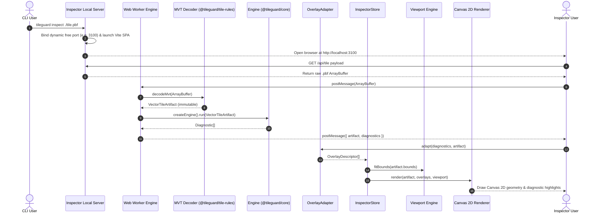

# ADR-008: TileGuard Inspector — Visual Debugging Environment Architecture

## Status

**Accepted** — 2026-07-23

## Context

TileGuard Phases 1 and 2 delivered a rule-based validation engine that answers *"is this tile valid?"* with structured, machine-readable diagnostics. Diagnostics like `"self-intersecting polygon at ring index 3"` are precise but not immediately actionable: a developer reading that output cannot determine which part of a complex 400 KB tile produced it without a separate visualization tool.

The existing diagnostic model identifies problems correctly. What is missing is a way to *see* them — to understand why a ring is considered self-intersecting, where a coordinate-range violation is located in the tile grid, or which specific features triggered a given rule.

Manual investigation using third-party tools (MapLibre, QGIS, tile-decode CLIs) is fragmented: each tool has its own data model, decoding assumptions, and visual conventions. There is no single surface that shows decoded tile geometry, overlaid diagnostics, and feature metadata together in one interaction loop.

**TileGuard Inspector** addresses this gap. It is a browser-based visual debugging environment launched via `tileguard inspect <file>` that renders the exact decoded MVT geometry, overlays the diagnostics produced by the TileGuard engine, and enables interactive exploration at the feature and vertex level. The Inspector answers *"why did this fail"* without requiring the developer to leave the TileGuard workflow.

---

## Architectural Principles

1. **Single Source of Truth:** Geometry is decoded exactly once by `@tileguard/tile-rules` and shared immutably throughout the system.
2. **Strict Separation of Concerns:** Rendering never validates; validation never renders.
3. **Extensibility by Composition:** New validation rules extend the `OverlayStrategy` registry without modifying the rendering engine.
4. **Immutable Data Flow:** Geometry and diagnostics remain immutable after decoding and engine execution.
5. **Testability First:** All subsystems (`Viewport`, `Renderer`, `OverlayAdapter`, `HitTester`) are independently unit-testable without DOM or browser dependencies.
6. **Performance by Design:** Interactive performance ($60\text{ FPS}$ pan/zoom, $< 50\text{ ms}$ selection response) is an upfront requirement, not a post-hoc optimization.

---

## Runtime Execution Pipeline & Sequence Diagram

The end-to-end data flow transforms a raw vector tile payload into an interactive diagnostic visualization:



---

## Subsystem Architecture & Interface Contracts

The architecture is decomposed into five independent subsystems, each with a single well-defined responsibility:

```text
packages/inspector/
└── src/
    ├── viewport/      # Subsystem 1: Coordinate transformation matrix
    ├── renderer/      # Subsystem 2: Canvas 2D rendering engine
    ├── overlay/       # Subsystem 3: Rule strategy registry & adapters
    ├── hittest/       # Subsystem 4: Point/Line/Polygon hit-testing
    └── store/         # Subsystem 5: Reactive state machine
```

### Subsystem 1: Viewport & Matrix Transform Engine
*Location:* `src/viewport/viewport.ts`

Manages mapping between MVT coordinate space (0–4096 integer grid) and screen pixel space. Operates via 2×3 affine transform matrices without DOM dependencies.

```typescript
export interface ViewportState {
  readonly zoom: number;
  readonly panX: number;
  readonly panY: number;
  readonly extent: number;
}

export interface Viewport {
  getState(): ViewportState;
  tileToScreen(point: Point2D): Point2D;
  screenToTile(point: Point2D): Point2D;
  fitBounds(bounds: BoundingBox2D, padding?: number): void;
  pan(deltaX: number, deltaY: number): void;
  zoomAt(factor: number, screenCenter: Point2D): void;
}
```

### Subsystem 2: Canvas 2D Rendering Engine
*Location:* `src/renderer/`

Implements the drawing routines for all MVT geometry types (Point, MultiPoint, LineString, MultiLineString, Polygon, MultiPolygon) and `OverlayDescriptor` highlights against the Viewport transform. Uses `evenodd` fill rules for interior polygon ring hole subtraction.

```typescript
export interface RenderOptions {
  readonly showTileExtent: boolean;
  readonly showBufferGrid: boolean;
  readonly showVertices: boolean;
  readonly showVertexNumbers: boolean;
  readonly selectedFeatureIndex?: number;
  readonly activeOverlayId?: string;
}

export interface Renderer {
  attachCanvas(canvas: HTMLCanvasElement): void;
  render(artifact: VectorTileArtifact, overlays: OverlayDescriptor[], options: RenderOptions): void;
  resize(width: number, height: number): void;
}
```

### Subsystem 3: Diagnostic Overlay System & Plugin Extension Contract
*Location:* `src/overlay/`

Bridges validation diagnostics and rendering visuals. Rules register an `OverlayStrategy` that generates generic `OverlayDescriptor` targets without writing custom canvas rendering code.

```typescript
export type OverlayKind =
  | 'point-marker'       // Highlights a single coordinate vertex
  | 'segment-highlight'  // Highlights line segments
  | 'ring-highlight'     // Highlights an entire polygon ring
  | 'bbox-highlight'     // Highlights a bounding box region
  | 'region-fill';       // Shades an enclosed polygon region

export interface OverlayTarget {
  readonly layer: string;
  readonly featureIndex: number;
  readonly partIndex?: number;
  readonly pointIndex?: number;
  readonly pointIndex2?: number;
}

export interface OverlayDescriptor {
  readonly diagnosticId: string;
  readonly ruleId: string;
  readonly severity: 'error' | 'warning' | 'info';
  readonly kind: OverlayKind;
  readonly targets: OverlayTarget[];
  readonly label: string;
}

/** Extension Contract for Plugin Authors */
export interface OverlayStrategy {
  readonly ruleId: string;
  createOverlay(diagnostic: Diagnostic, artifact: VectorTileArtifact): OverlayDescriptor;
}

export interface OverlayAdapter {
  registerStrategy(strategy: OverlayStrategy): void;
  adapt(diagnostics: Diagnostic[], artifact: VectorTileArtifact): OverlayDescriptor[];
}
```

### Subsystem 4: Hit-Tester Engine
*Location:* `src/hittest/hit-tester.ts`

Calculates feature interactions in 0–4096 tile grid space using ray-casting (polygons), segment distance (linestrings), and vertex proximity (points).

```typescript
export interface HitTestResult {
  readonly layerName: string;
  readonly featureIndex: number;
  readonly distance: number;
}

export interface HitTester {
  hitTest(screenPoint: Point2D, artifact: VectorTileArtifact, viewport: Viewport): HitTestResult | null;
}
```

### Subsystem 5: Inspector Store (State Machine)
*Location:* `src/store/inspector-store.ts`

Manages state lifecycle and derived view models:

```text
Uninitialized → Loading → Loaded → Disposed
                       → Empty
                       → Error
```

```typescript
export interface InspectorState {
  readonly lifecycle: 'uninitialized' | 'loading' | 'loaded' | 'empty' | 'error' | 'disposed';
  readonly error?: Error;
  readonly artifact: VectorTileArtifact | null;
  readonly diagnostics: Diagnostic[];
  readonly overlays: OverlayDescriptor[];
  readonly selectedFeatureIndex: number | null;
  readonly selectedDiagnosticId: string | null;
  readonly activeLayerFilter: string | null;
  readonly activeRuleFilter: string | null;
  readonly renderOptions: RenderOptions;
}
```

---

## Interaction Ownership & Subsystem Responsibility Matrix

| Interaction Event | Trigger Source | Subsystem Owner | State Mutation & Execution Flow |
| :--- | :--- | :--- | :--- |
| **Pan / Zoom** | Mouse Wheel / Drag / Touch | `Viewport` | `Viewport` updates matrix $\rightarrow$ Dispatches `requestAnimationFrame` render to `Renderer`. |
| **Hover Feature** | Pointer Move over Canvas | `HitTester` | `HitTester.hitTest()` calculates feature index $\rightarrow$ `InspectorStore` updates hover state $\rightarrow$ Canvas renders hover reticle. |
| **Select Feature** | Canvas Pointer Click | `HitTester` & `InspectorStore` | `HitTester` locates feature $\rightarrow$ `InspectorStore` updates `selectedFeatureIndex` $\rightarrow$ `FeaturePanel` renders metadata. |
| **Select Diagnostic** | Sidebar Diagnostic Item Click | `InspectorStore` & `Viewport` | `InspectorStore` selects `diagnosticId` $\rightarrow$ `Viewport.fitBounds()` target $\rightarrow$ `Renderer` draws active overlay. |
| **Filter Layer / Rule** | Filter Select Dropdowns | `InspectorStore` | `InspectorStore` filters active `OverlayDescriptor[]` $\rightarrow$ Canvas triggers clean redraw. |

---

## Concurrency & Performance Engineering Strategies

1. **Web Worker Offloading:** Tile protobuf decoding (`@tileguard/tile-rules`) and validation engine execution (`@tileguard/core`) execute inside a dedicated Web Worker thread. The main UI thread handles React presentation and $60\text{ FPS}$ Canvas rendering without blocking during tile loads.
2. **Spatial Grid Binning for Hit-Testing:** Features are indexed into a uniform spatial grid ($16 \times 16$ tile cell bins) during artifact loading. Hit-testing queries inspect only candidate features within the cursor's local grid cell, reducing hit-test complexity from $O(N)$ to $O(1)$ average time.
3. **Viewport Bounding-Box Culling:** Before drawing feature geometry, `Renderer` compares feature bounding boxes against the current screen viewport bounds in tile grid space. Off-screen features skip canvas path generation entirely.
4. **Render Batching & OffscreenCanvas:** Redraw dispatches are batched into a single `requestAnimationFrame` loop. Heavy background layers render to an `OffscreenCanvas` buffer, blitting directly to the main canvas during continuous panning.
5. **Path Batching for Points and Segments:** Point geometries and line segments are drawn using batched single-path `stroke()` / `fill()` calls to minimize WebGL/Canvas context draw call overhead.

---

## Failure Modes & Error Recovery Architecture

| Failure Scenario | Trigger Condition | System Response & UI Mitigation |
| :--- | :--- | :--- |
| **Corrupt `.pbf` Buffer** | Malformed protobuf structure or invalid MVT header. | Decoder catches exception $\rightarrow$ Store transitions to `Error` state $\rightarrow$ Render error banner with exact byte offset traceback. |
| **Oversized Tile Payload** | Tile payload $> 50\text{ MB}$ or $> 50,000$ features. | Worker enforces memory boundary $\rightarrow$ Store emits warning banner $\rightarrow$ Enables spatial viewport culling and disables vertex label rendering automatically. |
| **Unsupported Geometry** | Feature with unknown geometry enum type. | Renderer skips feature gracefully $\rightarrow$ Emits `info` diagnostic listing skipped feature index. |
| **Malformed Diagnostic** | Rule emits diagnostic with missing target indices. | `OverlayAdapter` falls back to `bbox-highlight` using feature extent. |
| **Renderer Init Failure** | WebGL/Canvas 2D context creation failure or browser crash. | Store catches context loss $\rightarrow$ Displays fallback static text summary and diagnostic list. |
| **Browser Memory Exceeded** | Out-of-memory browser heap limit reached. | Web Worker catches allocation failure $\rightarrow$ Frees decoded buffers and alerts user to reload tile. |

---

## Alternatives Considered & Rationale

1. **MapLibre GL JS as Renderer (Rejected):** MapLibre renders styled cartography (paint properties, zoom filters), whereas Inspector must render raw, unstyled MVT coordinate geometry (including off-screen/clipped geometries and coordinate range violations).
2. **SVG-based Renderer (Rejected):** SVG creates a DOM element per feature, degrading at $> 5,000$ features ($> 100,000$ DOM nodes for dense urban tiles). Canvas 2D scales effortlessly without DOM overhead.
3. **Electron Desktop App (Rejected):** Electron adds a 150 MB binary dependency. Local HTTP server + static Vite browser launch provides identical user experience without installation friction.
4. **Terminal UI (TUI) (Rejected):** Terminal UIs cannot render 2D pixel geometry required to explain self-intersecting rings or coordinate range breaches.

---

---

## Dependency Inversion & Monorepo Boundary Graph

The Inspector consumes existing TileGuard packages as pure dependencies. It does not modify
them, and they do not depend on it. The dependency graph flows strictly inward toward
`@tileguard/core`:

```
tileguard (CLI)
  └── @tileguard/inspector     ← Phase 3 (this package)
        ├── @tileguard/core        (Diagnostic, Artifact, Rule, Engine)
        ├── @tileguard/tile-rules  (MVT decoder + 10 tile rules)
        ├── @tileguard/style-rules (Style provider + 9 style rules)
        └── @tileguard/reporters   (text / json reporters)

@tileguard/tile-rules   → @tileguard/core, @tileguard/shared
@tileguard/style-rules  → @tileguard/core, @tileguard/shared
@tileguard/reporters    → @tileguard/core
@tileguard/core         → (zero runtime dependencies)
```

**Invariant:** `@tileguard/inspector` is the only package that depends on all four
domain packages simultaneously. No existing package gains a dependency on the Inspector.
This keeps the existing packages independently installable and their test suites isolated.

The Inspector resolves workspace packages directly to their TypeScript sources (not `dist/`)
via Vite aliases in `vite.config.ts` and matching `paths` entries in `tsconfig.json`. This
means the Inspector always builds against the latest in-tree code without requiring a
separate build step for each dependency.

---

## VectorTileArtifact Immutability Guarantee

The `VectorTileArtifact` produced by `@tileguard/tile-rules` is the single source of truth
for all decoded geometry. Once created, it is **never mutated** by any subsystem.

| Subsystem | Access Mode | Permitted Operations |
| :--- | :--- | :--- |
| `Engine (@tileguard/core)` | Read-only | Run rules, produce `Diagnostic[]` |
| `Renderer (CanvasRenderer)` | Read-only | Iterate features, project coordinates, draw |
| `OverlayAdapter` | Read-only | Map diagnostic indices to feature geometry |
| `HitTester` | Read-only | Query feature geometry for hit detection |
| `InspectorStore` | Owns reference | Holds `artifact` in a `loaded` state — never modifies it |

Implementation enforcement:

1. The `VectorTileArtifact` type uses `readonly` on all fields and nested arrays.
2. The `InspectorStore` transitions from `Loading` to `Loaded` in a single atomic assignment —
   the artifact is never partially constructed or incrementally updated.
3. No subsystem receives a mutable reference. Subsystem functions that accept the artifact
   always use `Readonly<VectorTileArtifact>` or equivalent read-only parameter types.
4. Geometry arrays decoded from the protobuf are frozen (`Object.freeze`) before being
   passed to the store, preventing accidental mutation by rendering code.

---

## Renderer/Validator Decoupling Invariant

This is the central correctness invariant of the Inspector architecture:

> **The renderer never validates. The validator never renders.**

Both the `Renderer` and the validation engine (`@tileguard/core` + rules) consume the
**identical, read-only** `VectorTileArtifact`. They never communicate with each other
directly.

```
VectorTileArtifact (immutable)
  │
  ├──► Engine (@tileguard/core)   ──► Diagnostic[]
  │                                        │
  │                                        ▼
  │                                  OverlayAdapter  ──► OverlayDescriptor[]
  │                                                              │
  └──► Renderer (CanvasRenderer) ◄────────────────────────────────
```

**Concrete enforcement rules:**

1. No `import` from `@tileguard/core`, `@tileguard/tile-rules`, or `@tileguard/style-rules`
   may appear inside `src/renderer/`. The renderer knows nothing about rules.
2. No `import` from `src/renderer/` may appear inside any rule package. Rules know nothing
   about canvas drawing.
3. The `OverlayAdapter` is the **only** component that bridges the two sides. It translates
   `Diagnostic` objects (validation output) into `OverlayDescriptor` objects (rendering input).
   It does not draw anything and does not validate anything.
4. `OverlayDescriptor` contains only geometric targets (layer name, feature index, ring index,
   vertex index) and a severity level — it contains no rule logic and no canvas drawing code.

This invariant ensures:
- Adding a new validation rule requires only a new `OverlayStrategy` — no renderer changes.
- Switching the rendering backend (Canvas 2D → WebGL → SVG) requires only a new `Renderer`
  implementation — no rule or diagnostic changes.
- The rendering engine is independently testable with synthetic `OverlayDescriptor` arrays
  without ever running validation logic.

---

## OverlayStrategy Extensibility Contract

The `OverlayStrategy` interface is the extension point for new validation rules. Rule authors
implement one strategy per rule ID to connect their diagnostics to the Inspector's visual model.

```typescript
/** Extension contract for connecting a validation rule to the Inspector. */
export interface OverlayStrategy {
  /** Rule ID this strategy handles, e.g. "tile/self-intersection". */
  readonly ruleId: string;

  /**
   * Convert a single Diagnostic into zero or more OverlayDescriptors.
   *
   * Constraints:
   *   - Must be a pure function (no I/O, no side effects).
   *   - Must not access the Renderer or canvas context.
   *   - Must return [] (empty array) for diagnostics it cannot handle,
   *     rather than throwing.
   *   - Target indices (featureIndex, ring index, vertex index) must be
   *     valid indices into the VectorTileArtifact — the OverlayAdapter
   *     validates these at registration time in debug builds.
   *   - `artifact` is always the immutable tile that produced the diagnostic;
   *     strategies may read geometry from it to compute precise targets
   *     (e.g. intersection coordinates, bounding boxes, ring vertices).
   */
  toDescriptors(diagnostic: Diagnostic, artifact: VectorTileArtifact): OverlayDescriptor[];
}
```

**Built-in Phase 3 strategies** (registered by `createDefaultOverlayAdapter()`):

| Rule ID | Strategy File | Overlay Kind |
| :--- | :--- | :--- |
| `tile/coordinate-range` | `strategies/coordinate-range.ts` | `point-marker` + `bbox-highlight` |
| `tile/self-intersection` | `strategies/self-intersection.ts` | `segment-highlight` + `region-fill` |
| `tile/zero-area-ring` | `strategies/zero-area-ring.ts` | `ring-highlight` |
| `tile/degenerate-geometry` | `strategies/degenerate-geometry.ts` | `segment-highlight` |
| `tile/unclosed-ring` | `strategies/unclosed-ring.ts` | `ring-highlight` + `point-marker` |
| `tile/no-empty` | `strategies/no-empty.ts` | `bbox-highlight` |

**Adding a strategy for a new rule** requires only:

```typescript
import { myNewRuleStrategy } from './strategies/my-new-rule.ts';
adapter.register(myNewRuleStrategy);
```

No changes to the `OverlayAdapter`, `Renderer`, or any existing strategy are needed. The
`OverlayAdapter` dispatches by `ruleId` — unknown rule IDs produce no descriptors
(graceful degradation), so a missing strategy never crashes the Inspector.

---

*ADR-008 Architecture Version: 2.1 · Established: 2026-07-23 · Updated: 2026-07-22*
